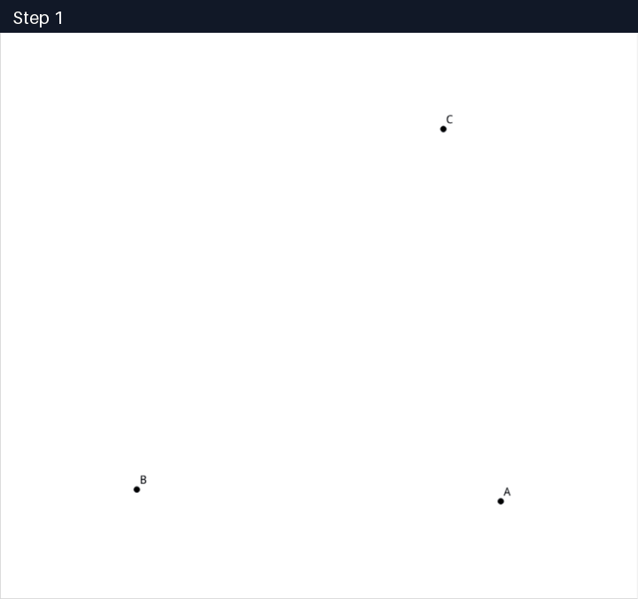
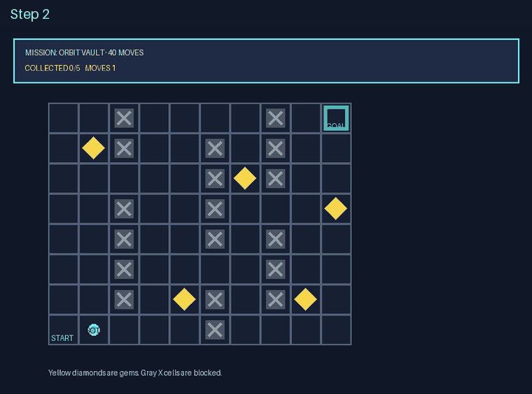

# DataFlow-MM-Agent

[English](README.md) | **简体中文**

`dataflow-mm-agent` 让多模态 Agent 能够在多种视觉环境中交互，并将每次运行
返回为结构化的 `Trajectory`。它可以用于验证 Agent 与环境之间的交互，也可以
合成以图像为依据的轨迹数据，用于评测、监督微调和强化学习。目前规范化支持的
内容类型是文本和图像；相关契约在设计上允许未来加入更多模态，而不要求所有 Env
都必须是有状态的。

这是一个建立在 **DataFlow-MM** 之上的扩展包；它已经声明了
`open-dataflow-mm` 依赖，`pip` 会在安装时自动处理。

Python 包：`dataflow_mm_agent` · Python `>=3.10` · Apache-2.0

<table>
  <tr>
    <td align="center" width="50%">
      <a href="examples/showcases/01_geometry_proof.md"></a><br>
      <sub>自主构图并证明一道奥林匹克几何题</sub>
    </td>
    <td align="center" width="50%">
      <a href="examples/showcases/02_pixel_game.md"></a><br>
      <sub>在确定性步数预算内收集五颗宝石</sub>
    </td>
  </tr>
</table>

## 这个包可以做什么？

1. **基于图像的数学推理**——
   [观看 Agent 构图并证明一道奥林匹克几何题](examples/showcases/01_geometry_proof.md)。
2. **平面游戏中的视觉规划**——
   [查看 Pyxel Agent 如何在步数限制内收集五颗宝石](examples/showcases/02_pixel_game.md)。
3. **可编辑视觉复刻**——
   [根据三页参考图复刻一份可编辑的 PowerPoint](examples/showcases/03_pptx.md)。
4. **从文档合成流程图**——
   [将两页事故响应手册转化为可编辑的操作流程图](examples/showcases/04_diagram.md)。
5. **为什么需要确定性 Verifier**——
   [查看一条获得 Judge 1.0 分、却没有通过精确状态验证的轨迹](examples/showcases/05_why_deterministic_verifier.md)。


[Showcase 索引](examples/showcases/README.md)。

## 安装

### 环境要求

- Conda，可以使用 Miniconda 或 Anaconda
- 安装时可以访问网络，以便解析并下载 Python 依赖

具体视觉 Env 可能还需要浏览器、渲染、游戏或 Office 相关依赖；这些依赖属于
对应的 Env 集成，不属于本核心包。

### 推荐方式：下载 ZIP 后安装

1. 在 GitHub 仓库页面选择 **Code → Download ZIP**。
2. 解压下载的文件，并在解压后的目录中打开终端；该目录应当包含
   `pyproject.toml`。
3. 创建并激活推荐的 Conda 环境：

```bash
conda create -n dataflow-mm-agent python=3.12 pip -y
conda activate dataflow-mm-agent
```

4. 更新打包工具，然后安装解压后的包：

```bash
python -m pip install --upgrade pip
python -m pip install .
```

`pip` 会自动安装 `dataflow-mm-agent`、作为基础的 DataFlow-MM
（`open-dataflow-mm`）以及其他已声明的 Python 依赖。

5. 验证安装结果：

```bash
python -c "import dataflow_mm_agent as d; print(d.__version__)"
```

该命令应当输出已安装的包版本。以后升级时，重新下载并解压新版 ZIP，激活同一个
Conda 环境，然后在新目录中运行 `python -m pip install --upgrade .` 即可。

### 配置模型后端

安装本身不需要 API key，但运行真实 rollout 时需要。
`create_model_serving_from_env()` 会从当前进程的环境变量中读取配置。

使用 OpenAI-compatible 接口：

```bash
export SERVING_BACKEND=openai
export MODEL=your-model-name
export API_URL=https://your-endpoint.example/v1
export DF_API_KEY=your-api-key
```

使用 Gemini API：

```bash
export SERVING_BACKEND=gemini
export MODEL=your-gemini-model
export GEMINI_API_KEY=your-api-key
```

在 Windows PowerShell 中，使用 `$env:` 设置同样的变量，例如：

```powershell
$env:SERVING_BACKEND = "gemini"
$env:MODEL = "your-gemini-model"
$env:GEMINI_API_KEY = "your-api-key"
```

请通过 shell 或密钥管理服务设置这些变量，不要把实际值提交到仓库。Gemini 的
`API_URL` 可以省略，此时会使用 Google Generative Language API 的默认地址。

### 开发模式安装

如果需要直接修改源码，可以使用 test extra 进行可编辑安装：

```bash
python -m pip install -e ".[test]"
```

远程 MCP adapter 可以保持得很轻，因为工具及其集成专属依赖运行在上游 MCP
server 中。

## 最小 Rollout 示例

```python
from dataflow_mm_agent import AgentRollout, Message, RolloutConfig, Task
from dataflow_mm_agent.serving import create_model_serving_from_env

task = Task(
    task_id="draw-001",
    env_id="my_visual_env",
    messages=(Message.text("user", "Create the requested diagram."),),
)

serving = create_model_serving_from_env()
trajectory = AgentRollout(
    serving=serving,
    config=RolloutConfig(max_steps=32),
).run(task)

print(trajectory.termination_reason)
print(trajectory.steps[-1].action)
```

`Task` 可以复用：一个任务可以产生多条 trajectory。它的 `messages` 可以包含
文本和任意数量的图片。`Scenario` 是可选的私有运行时输入，并不是每个任务都
必须套用的包装层。`judge_ref` 是可选的公开评分范围与任务专用评判标准；省略
时 Judge 使用内置通用 rubric。

## 多模态任务

```python
from pathlib import Path

from dataflow_mm_agent import ImageContent, Message, Task, TextContent

reference = ImageContent.from_bytes(
    Path("reference.png").read_bytes(),
    "image/png",
    detail="original",
)
task = Task(
    task_id="reconstruct-001",
    env_id="diagram",
    messages=(Message.of(
        "user",
        (TextContent("Reconstruct this as an editable diagram."), reference),
    ),),
)
```

图片在 rollout、Refine、Judge 和 trajectory 存储的整个流程中始终是一等内容块，
不会被转换成文本占位符。

物化 JSON task store 可以用受目录约束且带 SHA-256 的 `text_ref` 保存 JSON
之外的来源文档（仅支持 UTF-8 `text/plain` 或 `text/markdown`，上限 512 KiB）。
store 会在 rollout 前把它解析为普通 `TextContent`，就像把 `image_ref` 解析成
内联 `ImageContent`；路径缺失、越界或哈希不符会直接拒绝任务，不会交给模型自行
联网补资源。

## Trajectory 数据流

DataFlow-MM-Agent 沿用 DataFlow 的可组合算子风格，同时将生成、重放和质量评估
作为彼此独立的关注点：

- **Generate** 运行共享的多模态工具循环，并记录尚未评分的 trajectory。
- **ReplayVerify** 在全新的 Env 中重放已存储的动作；如果任务配置了确定性
  verifier，还会独立执行该 verifier。
- **Judge** 解析 Task 的可选 `judge_ref`（缺省时注入通用 rubric），逐项评分，
  将各项按配置范围归一化后取算术平均作为 `traj_overall`。所有环境使用统一的
  rationale + scores 输出协议；任务特有评分标准只写在 task rubric 中。Judge
  不能代替精确的状态验证。序列化后超过 16,000 字符的 rubric 会逐 criterion
  分片评判，每个分片仍注入完整 task rubric；组合 verdict 解析失败时也走同一条
  全有或全无的分片回退路径，避免用残缺标准计算均分。
- **Refine** 接收原始任务消息、视觉观察和失败诊断，并产生一条新 trajectory，
  而不是修改原 trajectory。对于有状态的视觉产物，它可以先在新 workspace 中
  重放原 trajectory 的 `finish` 前动作，恢复成品后再追加最新诊断，让模型只做
  局部续写与修复。
- **Filter 和 Select** 保留符合流程质量与多样性要求的 trajectory。

开放式创作任务不需要虚构一个 verifier。它们的 ReplayVerify 状态为
`not_applicable`，由 Judge 评估渲染结果及其生成过程。

## 轻量级 Env 设计

一个 Env 只需要提供工具目录和调用分发器：

```python
from dataflow_mm_agent import TextContent, ToolResult, ToolSpec
from dataflow_mm_agent.env import register_env


class EchoEnv:
    def tools(self):
        return (ToolSpec(
            name="echo",
            description="Echo one string.",
            operation_type="query",
            input_schema={
                "type": "object",
                "properties": {"text": {"type": "string"}},
                "required": ["text"],
                "additionalProperties": False,
            },
        ),)

    def call(self, tool_name, args):
        if tool_name != "echo":
            return ToolResult.failure("unknown_tool", tool_name)
        return ToolResult.success((TextContent(args["text"]),))


def register():
    register_env(
        "echo",
        EchoEnv,
        description="A stateless echo service.",
        modalities=("text",),
    )
```

下面就是完整的强制接口：

```python
def tools(self) -> Sequence[ToolSpec]: ...
def call(self, tool_name: str, args: Mapping[str, Any]) -> ToolResult: ...
```

有状态 Env 可以额外实现 `start(init, workspace)` 和 `close()`，但不需要实现
task provider、Scenario、snapshot 或 verifier。Runner 会提供 `finish`；Env
不得自行注册 finish 工具。

### 接入 MCP

一个 MCP server 可以通过薄 adapter 接入：

1. 将 `list_tools()` 的结果映射成 `ToolSpec`；
2. 将 `call_tool()` 的内容和错误映射成 `ToolResult`；
3. 使用 `register_env` 注册 adapter factory。

不需要框架专属的 task/verifier bundle。无状态 MCP adapter 可以只实现
`tools()` 和 `call()`；如有需要，会话启动和清理可以使用可选的生命周期 hook。
包中附带的 [`create-env` workspace skill](dataflow_mm_agent/skills/create-env/SKILL.md)
给出了 adapter 工作流和验证要求。

## 核心契约

```text
Task ──> AgentRollout ──> Trajectory
 │           │
 │           └── fresh Env selected by task.env_id
 │
 └── optional Scenario(init)

Trajectory + TaskResolver + optional VerifierResolver
                              └──> ReplayVerify ──> ReplayVerification
```

- Runner 始终接收一个 `Task`；Task 与其 trajectories 是一对多关系。
- 只有当私有初始化数据必须进入新 Env 时，才需要 `Scenario`。
- Registry 负责 Env factory 和面向求解器的元数据，不负责存储任务。
- Verification 独立解析，不会强制要求 Scenario。
- `Trajectory` 保存动作和观察，不保存 verifier 分数或私有 Scenario 数据。

## 仓库结构

```text
dataflow-mm-agent/
├── dataflow_mm_agent/
│   ├── contracts/          # Task、Env、消息、工具和 trajectory
│   ├── env/                # registry、plugin 和进程隔离 adapter
│   ├── runtime_components/ # rollout、工具循环、finish 和 ReplayVerify
│   ├── operators/          # Generate、Judge、Refine、Filter 和 Select
│   ├── serving/            # OpenAI-compatible 与 Gemini 多模态 serving
│   ├── skills/create-env/  # 用于 Env 和 MCP 接入的 workspace skill
│   └── storage/            # task 与 trajectory store
├── examples/showcases/     # GitHub 原生 trajectory 演示
├── LICENSE
└── pyproject.toml
```

具体 Env 位于核心发行包之外，因此安装一个集成不会迫使
`dataflow-mm-agent` 同时安装所有渲染或游戏依赖。如果某个集成需要独立的解释器
或依赖边界，可以使用本包提供的进程代理。

## 进一步阅读

- [创建 Env 或 MCP adapter](dataflow_mm_agent/skills/create-env/SKILL.md)
- [Env 契约与包结构](dataflow_mm_agent/skills/create-env/references/contracts-and-layout.md)
- [Task 生成](dataflow_mm_agent/skills/create-env/references/task-generation.md)
- [验证策略](dataflow_mm_agent/skills/create-env/references/validation.md)
- [Showcase 索引](examples/showcases/README.md)
