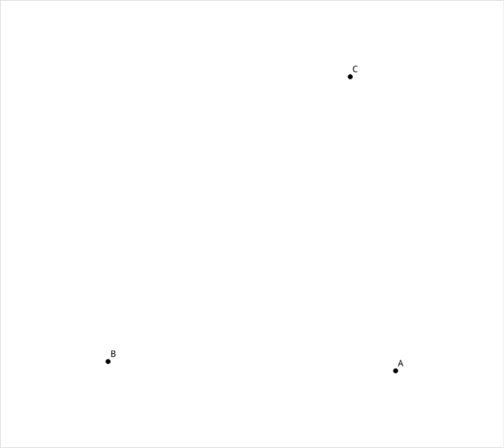
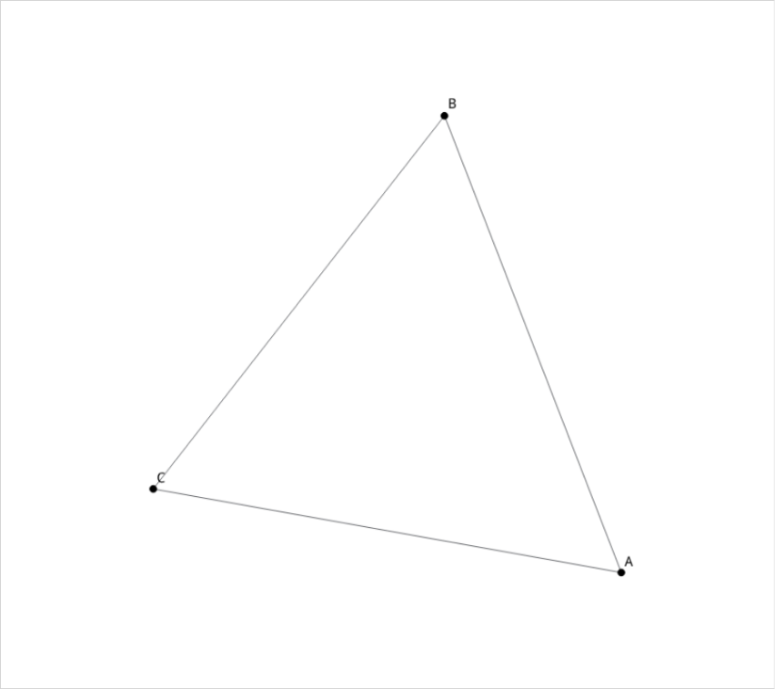
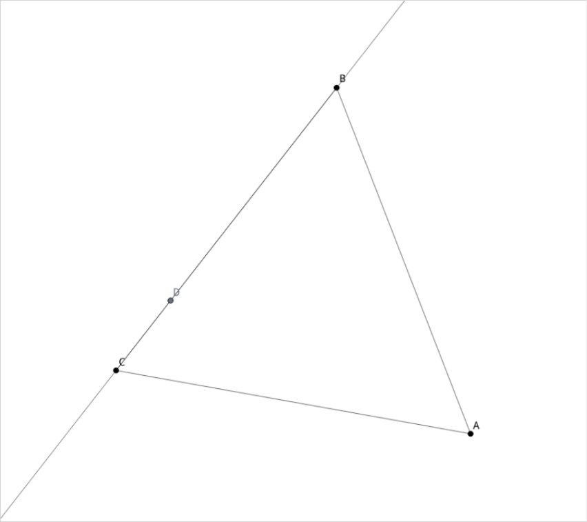
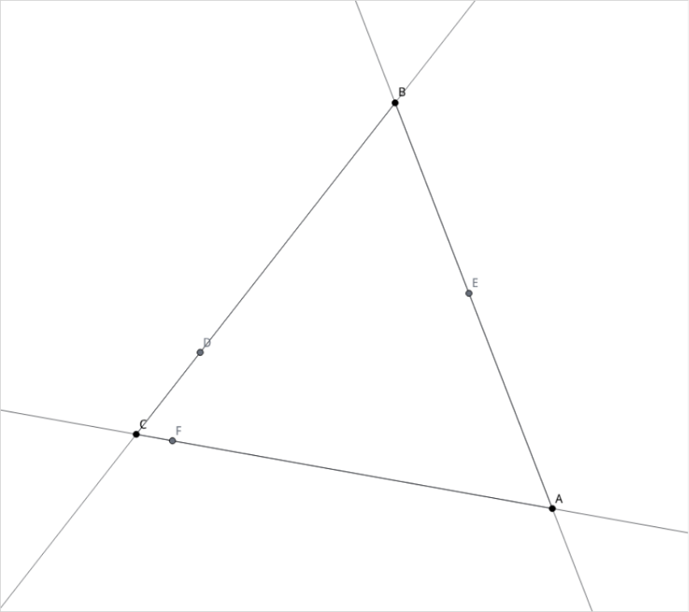
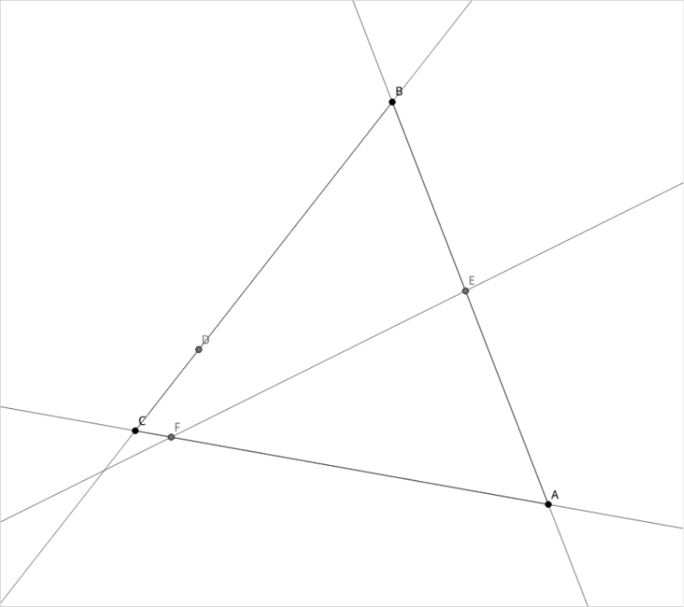
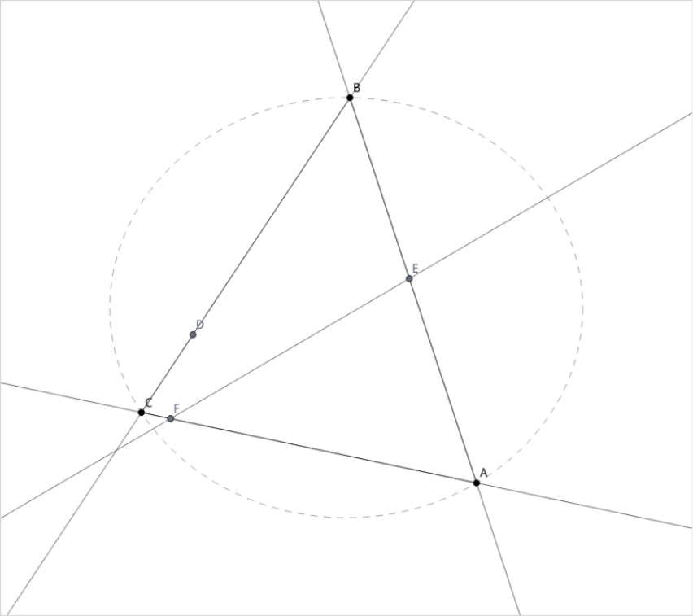

# Image-grounded olympiad geometry

[← All showcases](README.md)

The agent starts from independent points, progressively constructs the diagram, reasons over fresh renders, and finishes with a proof.

| Env | Task | Branch | Steps | ReplayVerify | Judge |
| --- | --- | --- | ---: | --- | ---: |
| `geometry_proof` | `task0004` | initial | 12 | passed · reward 1.0 | 1.00 |

## Task

> 在锐角三角形 ABC 中，AD⊥BC，垂足为 D。从 D 分别向边 AB、AC 作垂线，垂足分别为 E、F。证明：直线 EF 平行于三角形 ABC 外接圆在点 A 处的切线。题目不附图；请自行构图并检查图形，必要时添加辅助线，然后给出完整证明。绘图方式与证明路线由你决定。

[Open compact trajectory JSON](trajectories/geometry_proof.json).

## Visual checkpoints

<table>
  <tr>
    <td align="center" width="50%"> Step 1</td>
    <td align="center" width="50%"> Step 2</td>
  </tr>
  <tr>
    <td align="center" width="50%"> Step 4</td>
    <td align="center" width="50%"> Step 8</td>
  </tr>
  <tr>
    <td align="center" width="50%"> Step 9</td>
    <td align="center" width="50%"> Step 10</td>
  </tr>
  <tr>
    <td align="center" width="50%"> Step 11</td>
    <td width="50%"></td>
  </tr>
</table>

## Trajectory

Action mix: `draw_line` × 4, `construct_projection` × 3, `initialize_configuration` × 1, `draw_triangle` × 1, `construct_circumcircle` × 1, `construct_tangent` × 1, `finish` × 1.

<code>01 · initialize_configuration</code> — Initialize the configuration with free points A, B, C forming an acute triangle ABC.

**Reasoning**

Initialize the configuration with free points A, B, C forming an acute triangle ABC.

**Arguments**

<pre><code>{
  &quot;entities&quot;: [
    {
      &quot;definition&quot;: {
        &quot;args&quot;: {},
        &quot;op&quot;: &quot;free_point&quot;
      },
      &quot;id&quot;: &quot;A&quot;,
      &quot;kind&quot;: &quot;point&quot;,
      &quot;label_visible&quot;: true,
      &quot;role&quot;: &quot;given&quot;,
      &quot;visible&quot;: true
    },
    {
      &quot;definition&quot;: {
        &quot;args&quot;: {},
        &quot;op&quot;: &quot;free_point&quot;
      },
      &quot;id&quot;: &quot;B&quot;,
      &quot;kind&quot;: &quot;point&quot;,
      &quot;label_visible&quot;: true,
      &quot;role&quot;: &quot;given&quot;,
      &quot;visible&quot;: true
    },
    {
      &quot;definition&quot;: {
        &quot;args&quot;: {},
        &quot;op&quot;: &quot;free_point&quot;
      },
      &quot;id&quot;: &quot;C&quot;,
      &quot;kind&quot;: &quot;point&quot;,
      &quot;label_visible&quot;: true,
      &quot;role&quot;: &quot;given&quot;,
      &quot;visible&quot;: true
    }
  ],
  &quot;givens&quot;: [
    {
      &quot;id&quot;: &quot;acute_A&quot;,
      &quot;objects&quot;: [
        &quot;B&quot;,
        &quot;A&quot;,
        &quot;C&quot;
      ],
      &quot;relation&quot;: &quot;angle_class&quot;,
      &quot;source&quot;: &quot;text&quot;,
      &quot;value&quot;: &quot;acute&quot;
    },
    {
      &quot;id&quot;: &quot;acute_B&quot;,
      &quot;objects&quot;: [
        &quot;A&quot;,
        &quot;B&quot;,
        &quot;C&quot;
      ],
      &quot;relation&quot;: &quot;angle_class&quot;,
      &quot;source&quot;: &quot;text&quot;,
      &quot;value&quot;: &quot;acute&quot;
    },
    {
      &quot;id&quot;: &quot;acute_C&quot;,
      &quot;objects&quot;: [
        &quot;A&quot;,
        &quot;C&quot;,
        &quot;B&quot;
      ],
      &quot;relation&quot;: &quot;angle_class&quot;,
      &quot;source&quot;: &quot;text&quot;,
      &quot;value&quot;: &quot;acute&quot;
    }
  ]
}</code></pre>

**Observation**

<pre><code>{&quot;action&quot;: &quot;initialize_configuration&quot;, &quot;created&quot;: [{&quot;name&quot;: &quot;A&quot;, &quot;type&quot;: &quot;point&quot;}, {&quot;name&quot;: &quot;B&quot;, &quot;type&quot;: &quot;point&quot;}, {&quot;name&quot;: &quot;C&quot;, &quot;type&quot;: &quot;point&quot;}], &quot;current_givens&quot;: [{&quot;id&quot;: &quot;acute_A&quot;, &quot;objects&quot;: [&quot;B&quot;, &quot;A&quot;, &quot;C&quot;], &quot;relation&quot;: &quot;angle_class&quot;, &quot;value&quot;: &quot;acute&quot;}, {&quot;id&quot;: &quot;acute_B&quot;, &quot;objects&quot;: [&quot;A&quot;, &quot;B&quot;, &quot;C&quot;], &quot;relation&quot;: &quot;angle_class&quot;, &quot;value&quot;: &quot;acute&quot;}, {&quot;id&quot;: &quot;acute_C&quot;, &quot;objects&quot;: [&quot;A&quot;, &quot;C&quot;, &quot;B&quot;], &quot;relation&quot;: &quot;angle_class&quot;, &quot;value&quot;: &quot;acute&quot;}], &quot;deleted&quot;: [], &quot;givens_note&quot;: &quot;Only the listed conditions currently affect private realization; compare them with every condition in the Task before proving.&quot;, &quot;success&quot;: true, &quot;updated&quot;: []}</code></pre>

<code>02 · draw_triangle</code> — Create triangle ABC.

**Reasoning**

Create triangle ABC.

**Arguments**

<pre><code>{
  &quot;name&quot;: &quot;t_ABC&quot;,
  &quot;vertices&quot;: [
    &quot;A&quot;,
    &quot;B&quot;,
    &quot;C&quot;
  ]
}</code></pre>

**Observation**

<pre><code>{&quot;action&quot;: &quot;draw_triangle&quot;, &quot;created&quot;: [{&quot;name&quot;: &quot;t_ABC&quot;, &quot;type&quot;: &quot;triangle&quot;}], &quot;deleted&quot;: [], &quot;success&quot;: true, &quot;updated&quot;: []}</code></pre>

<code>03 · draw_line</code> — Draw line BC.

**Reasoning**

Draw line BC.

**Arguments**

<pre><code>{
  &quot;name&quot;: &quot;line_BC&quot;,
  &quot;point1&quot;: &quot;B&quot;,
  &quot;point2&quot;: &quot;C&quot;
}</code></pre>

**Observation**

<pre><code>{&quot;action&quot;: &quot;draw_line&quot;, &quot;created&quot;: [{&quot;name&quot;: &quot;line_BC&quot;, &quot;type&quot;: &quot;line&quot;}], &quot;deleted&quot;: [], &quot;success&quot;: true, &quot;updated&quot;: []}</code></pre>

<code>04 · construct_projection</code> — Construct projection D of A onto BC.

**Reasoning**

Construct projection D of A onto BC.

**Arguments**

<pre><code>{
  &quot;line&quot;: &quot;line_BC&quot;,
  &quot;name&quot;: &quot;D&quot;,
  &quot;point&quot;: &quot;A&quot;
}</code></pre>

**Observation**

<pre><code>{&quot;action&quot;: &quot;construct_projection&quot;, &quot;created&quot;: [{&quot;name&quot;: &quot;D&quot;, &quot;type&quot;: &quot;point&quot;}], &quot;deleted&quot;: [], &quot;success&quot;: true, &quot;updated&quot;: []}</code></pre>

<code>05 · draw_line</code> — Draw line AB and line AC.

**Reasoning**

Draw line AB and line AC.

**Arguments**

<pre><code>{
  &quot;name&quot;: &quot;line_AB&quot;,
  &quot;point1&quot;: &quot;A&quot;,
  &quot;point2&quot;: &quot;B&quot;
}</code></pre>

**Observation**

<pre><code>{&quot;action&quot;: &quot;draw_line&quot;, &quot;created&quot;: [{&quot;name&quot;: &quot;line_AB&quot;, &quot;type&quot;: &quot;line&quot;}], &quot;deleted&quot;: [], &quot;success&quot;: true, &quot;updated&quot;: []}</code></pre>

<code>06 · draw_line</code> — Draw line AC.

**Reasoning**

Draw line AC.

**Arguments**

<pre><code>{
  &quot;name&quot;: &quot;line_AC&quot;,
  &quot;point1&quot;: &quot;A&quot;,
  &quot;point2&quot;: &quot;C&quot;
}</code></pre>

**Observation**

<pre><code>{&quot;action&quot;: &quot;draw_line&quot;, &quot;created&quot;: [{&quot;name&quot;: &quot;line_AC&quot;, &quot;type&quot;: &quot;line&quot;}], &quot;deleted&quot;: [], &quot;success&quot;: true, &quot;updated&quot;: []}</code></pre>

<code>07 · construct_projection</code> — Construct perpendicular projection E of D onto AB.

**Reasoning**

Construct perpendicular projection E of D onto AB.

**Arguments**

<pre><code>{
  &quot;line&quot;: &quot;line_AB&quot;,
  &quot;name&quot;: &quot;E&quot;,
  &quot;point&quot;: &quot;D&quot;
}</code></pre>

**Observation**

<pre><code>{&quot;action&quot;: &quot;construct_projection&quot;, &quot;created&quot;: [{&quot;name&quot;: &quot;E&quot;, &quot;type&quot;: &quot;point&quot;}], &quot;deleted&quot;: [], &quot;success&quot;: true, &quot;updated&quot;: []}</code></pre>

<code>08 · construct_projection</code> — Construct perpendicular projection F of D onto AC.

**Reasoning**

Construct perpendicular projection F of D onto AC.

**Arguments**

<pre><code>{
  &quot;line&quot;: &quot;line_AC&quot;,
  &quot;name&quot;: &quot;F&quot;,
  &quot;point&quot;: &quot;D&quot;
}</code></pre>

**Observation**

<pre><code>{&quot;action&quot;: &quot;construct_projection&quot;, &quot;created&quot;: [{&quot;name&quot;: &quot;F&quot;, &quot;type&quot;: &quot;point&quot;}], &quot;deleted&quot;: [], &quot;success&quot;: true, &quot;updated&quot;: []}</code></pre>

<code>09 · draw_line</code> — Draw line EF.

**Reasoning**

Draw line EF.

**Arguments**

<pre><code>{
  &quot;name&quot;: &quot;line_EF&quot;,
  &quot;point1&quot;: &quot;E&quot;,
  &quot;point2&quot;: &quot;F&quot;
}</code></pre>

**Observation**

<pre><code>{&quot;action&quot;: &quot;draw_line&quot;, &quot;created&quot;: [{&quot;name&quot;: &quot;line_EF&quot;, &quot;type&quot;: &quot;line&quot;}], &quot;deleted&quot;: [], &quot;success&quot;: true, &quot;updated&quot;: []}</code></pre>

<code>10 · construct_circumcircle</code> — Construct circumcircle of ABC.

**Reasoning**

Construct circumcircle of ABC.

**Arguments**

<pre><code>{
  &quot;name&quot;: &quot;circle_ABC&quot;,
  &quot;triangle&quot;: &quot;t_ABC&quot;
}</code></pre>

**Observation**

<pre><code>{&quot;action&quot;: &quot;construct_circumcircle&quot;, &quot;created&quot;: [{&quot;name&quot;: &quot;circle_ABC&quot;, &quot;type&quot;: &quot;circle&quot;}], &quot;deleted&quot;: [], &quot;success&quot;: true, &quot;updated&quot;: []}</code></pre>

<code>11 · construct_tangent</code> — Construct tangent line AT to circle_ABC at A.

**Reasoning**

Construct tangent line AT to circle_ABC at A.

**Arguments**

<pre><code>{
  &quot;circle&quot;: &quot;circle_ABC&quot;,
  &quot;name&quot;: &quot;tangent_A&quot;,
  &quot;point&quot;: &quot;A&quot;,
  &quot;selector&quot;: &quot;only&quot;
}</code></pre>

**Observation**

<pre><code>{&quot;action&quot;: &quot;construct_tangent&quot;, &quot;created&quot;: [{&quot;name&quot;: &quot;tangent_A&quot;, &quot;type&quot;: &quot;line&quot;}], &quot;deleted&quot;: [], &quot;success&quot;: true, &quot;updated&quot;: []}</code></pre>

<code>12 · finish</code> — Sending pure JSON response without any markdown outside JSON.

**Reasoning**

Sending pure JSON response without any markdown outside JSON.

**Arguments**

<pre><code>{
  &quot;answer&quot;: &quot;### 证明过程\n\n**1. 四边形 AEDF 共圆**\n由题意，$DE \\perp AB$ 于 $E$，$DF \\perp AC$ 于 $F$，所以：\n$$\\angle AED = 90^\\circ, \\quad \\angle AFD = 90^\\circ$$\n因此 $\\angle AED + \\angle AFD = 180^\\circ$，顶点 $A, E, D, F$ 四点共圆（且 $AD$ 为该圆的直径）。\n\n**2. 角度等量代换**\n在四边形 $AEDF$ 的外接圆中，同弧 $AF$ 所对的圆周角相等：\n$$\\angle AEF = \\angle ADF$$\n因为 $AD \\perp BC$，在直角三角形 $ADC$ 中有 $\\angle ADC = 90^\\circ$；又因为 $DF \\perp AC$，所以在直角三角形 $DFC$ 中 $\\angle FDC + \\angle C = 90^\\circ$。\n由此可得：\n$$\\angle ADF = 90^\\circ - \\angle FDC = \\angle C$$\n故：\n$$\\angle AEF = \\angle C$$\n\n**3. 切线与弦切角**\n设直线 $l$ 为三角形 $ABC$ 外接圆在点 $A$ 处的切线。\n由弦切角定理，切线 $l$ 与边 $AB$ 所夹的角等于边 $AB$ 所对的圆周角 $\\angle C$，即：\n$$\\angle (l, AB) = \\angle C$$\n\n**4. 结论**\n结合上述结论：\n$$\\angle AEF = \\angle (l, AB) = \\angle C$$\n由内错角相等，可得直线 $EF$ 平行于三角形 $ABC$ 外接圆在点 $A$ 处的切线 $l$。\n\n$\\blacksquare$&quot;
}</code></pre>

## Final answer

### 证明过程

**1. 四边形 AEDF 共圆**
由题意，$DE \perp AB$ 于 $E$，$DF \perp AC$ 于 $F$，所以：
$$\angle AED = 90^\circ, \quad \angle AFD = 90^\circ$$
因此 $\angle AED + \angle AFD = 180^\circ$，顶点 $A, E, D, F$ 四点共圆（且 $AD$ 为该圆的直径）。

**2. 角度等量代换**
在四边形 $AEDF$ 的外接圆中，同弧 $AF$ 所对的圆周角相等：
$$\angle AEF = \angle ADF$$
因为 $AD \perp BC$，在直角三角形 $ADC$ 中有 $\angle ADC = 90^\circ$；又因为 $DF \perp AC$，所以在直角三角形 $DFC$ 中 $\angle FDC + \angle C = 90^\circ$。
由此可得：
$$\angle ADF = 90^\circ - \angle FDC = \angle C$$
故：
$$\angle AEF = \angle C$$

**3. 切线与弦切角**
设直线 $l$ 为三角形 $ABC$ 外接圆在点 $A$ 处的切线。
由弦切角定理，切线 $l$ 与边 $AB$ 所夹的角等于边 $AB$ 所对的圆周角 $\angle C$，即：
$$\angle (l, AB) = \angle C$$

**4. 结论**
结合上述结论：
$$\angle AEF = \angle (l, AB) = \angle C$$
由内错角相等，可得直线 $EF$ 平行于三角形 $ABC$ 外接圆在点 $A$ 处的切线 $l$。

$\blacksquare$

## Evaluation

- ReplayVerify: **passed · reward 1.0**
- Judge: **1.00**
- Replay detail: proof=pass (no formal goal required); objects=pass; object_kinds=pass; operations=pass; operation_counts=pass; events=pass; initialized=pass; givens=pass; policy=pass; completion=pass

Judge rationale

Agent 的作图与证明过程完整且严密：
1. 首先正确初始化了锐角三角形 ABC 的顶点及锐角约束，并依次绘制了三角形 ABC、边 BC/AB/AC。
2. 作出了 A 到 BC 的垂足 D，以及 D 到 AB、AC 的垂足 E 与 F。
3. 连结了直线 EF、构造了 ABC 的外接圆以及过点 A 的切线，满足题目要求的所有几何要素。
4. 最终给出了完整、严谨的欧氏几何证明：证明 AEDF 四点共圆，导出 ∠AEF = ∠ADF = ∠C；结合弦切角定理知切线与 AB 的夹角等于 ∠C，从而证明了直线 EF 平行于点 A 处的切线。
5. 全程未依赖任何非法或隐式求解工具，步骤简洁高效无浪费。

