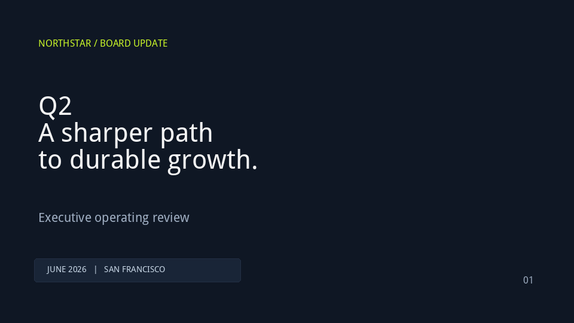
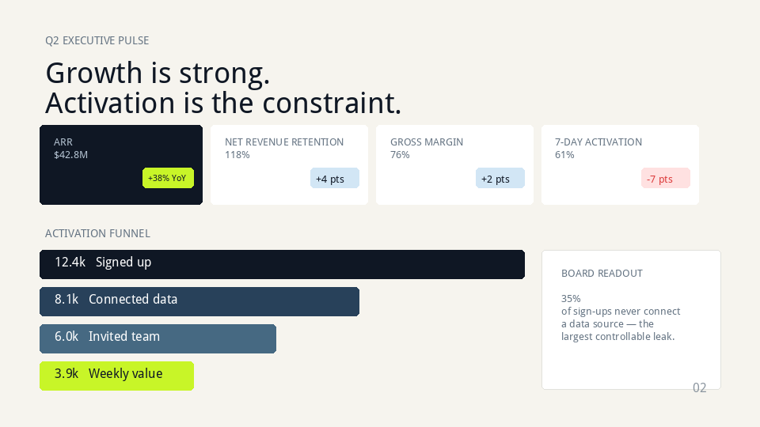
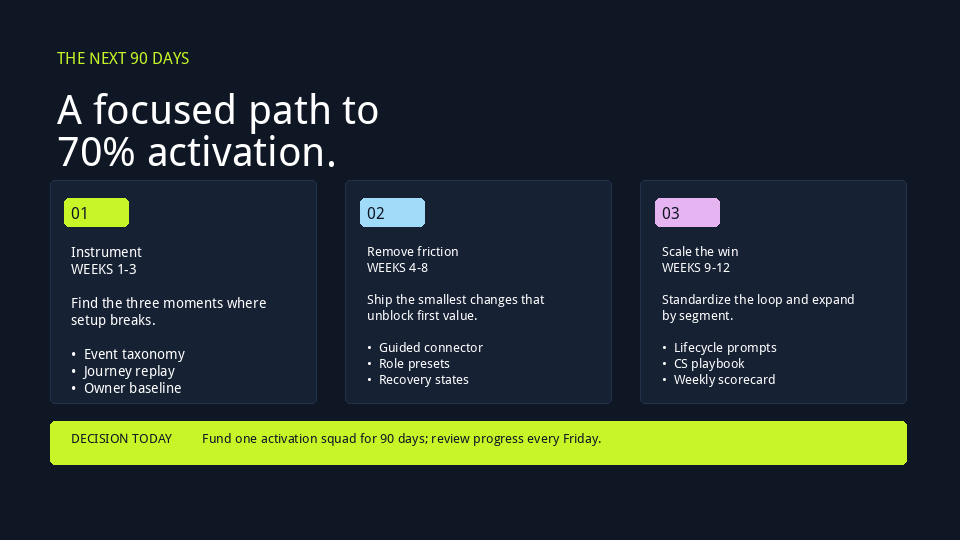

# Editable PowerPoint reconstruction

[← All showcases](README.md)

> **Refine comparison:** this case shows the complete original trajectory and the complete refined trajectory. Refine created a new rollout; it did not overwrite the original record.

The task supplies three visual references. The agent recreates their content and hierarchy as editable 16:9 slides and reviews the render.

## Original → Refined at a glance

| Stage | Episode | Steps | ReplayVerify | Judge |
| --- | --- | ---: | --- | ---: |
| Original | `task0019-86b5b3ac2780` | 64 | not_applicable | 0.35 |
| Refined | `task0019-6ce5196aa0d1` | 60 | not_applicable | 0.98 |

## Task

> 附件依次是 Northstar 董事会经营简报的三页参考图。请将它们复刻为一份 16:9、三页、可编辑的 PowerPoint：忠实保留每页的信息、视觉层级、版式关系、配色和页码，并让整套演示在投影时仍然清晰。不要把参考图整页作为背景或单张图片铺入；标题、数据、卡片、图形和流程内容都应尽可能保持可编辑。完成后检查整套页面的渲染效果，并保存为 northstar_board_update.pptx。

## Input references

<table>
  <tr>
    <td align="center" width="50%"> Input reference 1</td>
    <td align="center" width="50%"> Input reference 2</td>
  </tr>
  <tr>
    <td align="center" width="50%"> Input reference 3</td>
    <td width="50%"></td>
  </tr>
</table>

[Open compact original + refined trajectory JSON](trajectories/pptx.json).

## Original visual checkpoints

<table>
  <tr>
    <td align="center" width="50%"> Step 13</td>
    <td align="center" width="50%"> Step 45</td>
  </tr>
  <tr>
    <td align="center" width="50%"> Step 64</td>
    <td width="50%"></td>
  </tr>
</table>

## Original trajectory

Action mix: `manage_text` × 35, `add_shape` × 23, `add_slide` × 3, `create_presentation` × 1, `get_slide_info` × 1, `add_connector` × 1.

<code>01 · create_presentation</code> — Create a new 16:9 presentation titled &#x27;Northstar Board Update&#x27;.

**Reasoning**

Create a new 16:9 presentation titled &#x27;Northstar Board Update&#x27;.

**Arguments**

<pre><code>{
  &quot;aspect_ratio&quot;: &quot;16:9&quot;,
  &quot;title&quot;: &quot;Northstar Board Update&quot;
}</code></pre>

**Observation**

<pre><code>{&quot;aspect_ratio&quot;: &quot;16:9&quot;, &quot;message&quot;: &quot;Created 16:9 presentation presentation_1&quot;, &quot;presentation_id&quot;: &quot;presentation_1&quot;, &quot;slide_count&quot;: 0}</code></pre>

<code>02 · add_slide</code> — Add Slide 1 with solid dark navy background.

**Reasoning**

Add Slide 1 with solid dark navy background.

**Arguments**

<pre><code>{
  &quot;background_colors&quot;: [
    [
      15,
      23,
      36
    ]
  ],
  &quot;background_type&quot;: &quot;solid&quot;,
  &quot;layout_index&quot;: 6,
  &quot;presentation_id&quot;: &quot;presentation_1&quot;
}</code></pre>

**Observation**

<pre><code>{&quot;gradient_direction&quot;: &quot;horizontal&quot;, &quot;layout_name&quot;: &quot;Blank&quot;, &quot;message&quot;: &quot;Added slide 0 with layout 6&quot;, &quot;slide_index&quot;: 0}</code></pre>

<code>03 · manage_text</code> — Let&#x27;s call `manage_text` to add the top header text on slide 0.

**Reasoning**

Let&#x27;s call `manage_text` to add the top header text on slide 0.

**Arguments**

<pre><code>{
  &quot;alignment&quot;: &quot;left&quot;,
  &quot;bold&quot;: true,
  &quot;color&quot;: [
    200,
    245,
    40
  ],
  &quot;font_size&quot;: 14,
  &quot;height&quot;: 0.5,
  &quot;left&quot;: 0.8,
  &quot;operation&quot;: &quot;add&quot;,
  &quot;presentation_id&quot;: &quot;presentation_1&quot;,
  &quot;slide_index&quot;: 0,
  &quot;text&quot;: &quot;NORTHSTAR / BOARD UPDATE&quot;,
  &quot;top&quot;: 0.8,
  &quot;width&quot;: 5.0
}</code></pre>

**Observation**

<pre><code>{&quot;message&quot;: &quot;Added text box to slide 0&quot;, &quot;shape_index&quot;: 0, &quot;text&quot;: &quot;NORTHSTAR / BOARD UPDATE&quot;}</code></pre>

<code>04 · manage_text</code> — Add main title text to slide 0.

**Reasoning**

Add main title text to slide 0.

**Arguments**

<pre><code>{
  &quot;alignment&quot;: &quot;left&quot;,
  &quot;bold&quot;: true,
  &quot;color&quot;: [
    245,
    245,
    240
  ],
  &quot;font_size&quot;: 48,
  &quot;height&quot;: 2.5,
  &quot;left&quot;: 0.8,
  &quot;operation&quot;: &quot;add&quot;,
  &quot;presentation_id&quot;: &quot;presentation_1&quot;,
  &quot;slide_index&quot;: 0,
  &quot;text&quot;: &quot;Q2\nA sharper path\nto durable growth.&quot;,
  &quot;top&quot;: 2.0,
  &quot;width&quot;: 7.0
}</code></pre>

**Observation**

<pre><code>{&quot;message&quot;: &quot;Added text box to slide 0&quot;, &quot;shape_index&quot;: 1, &quot;text&quot;: &quot;Q2\nA sharper path\nto durable growth.&quot;}</code></pre>

<code>05 · manage_text</code> — Let&#x27;s call `manage_text` with operation format on shape 1. Wait, operation format accepts `shape_index`, `tex…

**Reasoning**

Let&#x27;s call `manage_text` with operation format on shape 1. Wait, operation format accepts `shape_index`, `text`, `font_size`, etc. Let&#x27;s see the schema. `manage_text` operation `format` requires `shape_index`.

**Arguments**

<pre><code>{
  &quot;bold&quot;: true,
  &quot;color&quot;: [
    245,
    245,
    240
  ],
  &quot;font_size&quot;: 84,
  &quot;height&quot;: 1.2,
  &quot;left&quot;: 0.8,
  &quot;operation&quot;: &quot;format&quot;,
  &quot;presentation_id&quot;: &quot;presentation_1&quot;,
  &quot;shape_index&quot;: 1,
  &quot;slide_index&quot;: 0,
  &quot;text&quot;: &quot;Q2&quot;,
  &quot;top&quot;: 1.9,
  &quot;width&quot;: 4.0
}</code></pre>

**Observation**

<pre><code>{&quot;message&quot;: &quot;Formatted text shape 1&quot;}</code></pre>

<code>06 · manage_text</code> — Formatting shape 1 to &#x27;Q2&#x27;.

**Reasoning**

Formatting shape 1 to &#x27;Q2&#x27;.

**Arguments**

<pre><code>{
  &quot;bold&quot;: true,
  &quot;color&quot;: [
    245,
    245,
    240
  ],
  &quot;font_size&quot;: 88,
  &quot;height&quot;: 1.3,
  &quot;left&quot;: 0.75,
  &quot;operation&quot;: &quot;format&quot;,
  &quot;presentation_id&quot;: &quot;presentation_1&quot;,
  &quot;shape_index&quot;: 1,
  &quot;slide_index&quot;: 0,
  &quot;text&quot;: &quot;Q2&quot;,
  &quot;top&quot;: 1.8,
  &quot;width&quot;: 3.0
}</code></pre>

**Observation**

<pre><code>{&quot;message&quot;: &quot;Formatted text shape 1&quot;}</code></pre>

<code>07 · manage_text</code> — Let&#x27;s separate Q2, the headline, and subtitle into distinct text boxes. First, edit shape 1 text to just &#x27;Q2&#x27;…

**Reasoning**

Let&#x27;s separate Q2, the headline, and subtitle into distinct text boxes. First, edit shape 1 text to just &#x27;Q2&#x27;, with large font size 84, bold, color white/off-white.

**Arguments**

<pre><code>{
  &quot;bold&quot;: true,
  &quot;color&quot;: [
    245,
    245,
    245
  ],
  &quot;font_size&quot;: 84,
  &quot;height&quot;: 1.2,
  &quot;left&quot;: 0.75,
  &quot;operation&quot;: &quot;format&quot;,
  &quot;presentation_id&quot;: &quot;presentation_1&quot;,
  &quot;shape_index&quot;: 1,
  &quot;slide_index&quot;: 0,
  &quot;text&quot;: &quot;Q2&quot;,
  &quot;top&quot;: 1.8,
  &quot;width&quot;: 3.0
}</code></pre>

**Observation**

<pre><code>{&quot;message&quot;: &quot;Formatted text shape 1&quot;}</code></pre>

<code>08 · get_slide_info</code> — Why didn&#x27;t shape 1 text change to just &#x27;Q2&#x27;? Because operation &#x27;format&#x27; in `manage_text` doesn&#x27;t overwrite te…

**Reasoning**

Why didn&#x27;t shape 1 text change to just &#x27;Q2&#x27;? Because operation &#x27;format&#x27; in `manage_text` doesn&#x27;t overwrite text if text is already present unless specified or maybe text argument in format operation is ignored / appends? Let&#x27;s check `get_slide_info` to see shapes on slide 0.

**Arguments**

<pre><code>{
  &quot;presentation_id&quot;: &quot;presentation_1&quot;,
  &quot;slide_index&quot;: 0
}</code></pre>

**Observation**

<pre><code>{&quot;connector_count&quot;: 0, &quot;has_charts&quot;: false, &quot;has_tables&quot;: false, &quot;layout_name&quot;: &quot;Blank&quot;, &quot;semantic_elements&quot;: [{&quot;height&quot;: 0.5, &quot;left&quot;: 0.8, &quot;text&quot;: &quot;NORTHSTAR / BOARD UPDATE&quot;, &quot;top&quot;: 0.8, &quot;width&quot;: 5.0}, {&quot;height&quot;: 2.5, &quot;left&quot;: 0.8, &quot;text&quot;: &quot;Q2\nA sharper path\nto durable growth.&quot;, &quot;top&quot;: 2.0, &quot;width&quot;: 7.0}], &quot;semantic_text&quot;: [&quot;NORTHSTAR / BOARD UPDATE&quot;, &quot;Q2\nA sharper path\nto durable growth.&quot;], &quot;shape_count&quot;: 2, &quot;shapes&quot;: [{&quot;has_chart&quot;: false, &quot;has_table&quot;: false, &quot;has_text&quot;: true, &quot;height&quot;: 0.5, &quot;index&quot;: 0, &quot;left&quot;: 0.8, &quot;name&quot;: &quot;TextBox 1&quot;, &quot;shape_type&quot;: &quot;TEXT_BOX (17)&quot;, &quot;text&quot;: &quot;NORTHSTAR / BOARD UPDATE&quot;, &quot;top&quot;: 0.8, &quot;width&quot;: 5.0}, {&quot;has_chart&quot;: false, &quot;has_table&quot;: false, &quot;has_text&quot;: true, &quot;height&quot;: 2.5, &quot;index&quot;: 1, &quot;left&quot;: 0.8, &quot;name&quot;: &quot;TextBox 2&quot;, &quot;shape_type&quot;: &quot;TEXT_BOX (17)&quot;, &quot;text&quot;: &quot;Q2\nA sharper path\nto durable growth.&quot;, &quot;top&quot;: 2.0, &quot;width&quot;: 7.0}], &quot;slide_index&quot;: 0, &quot;text&quot;: [&quot;NORTHSTAR / BOARD UPDATE&quot;, &quot;Q2\nA sharper path\nto durable growth.&quot;], &quot;title&quot;: null, &quot;transition&quot;: {&quot;duration_seconds&quot;: null, &quot;has_transition&quot;: false, &quot;transition_type&quot;: null}}</code></pre>

<code>09 · manage_text</code> — Let&#x27;s format shape 1 using `format_runs`.

**Reasoning**

Let&#x27;s format shape 1 using `format_runs`.

**Arguments**

<pre><code>{
  &quot;operation&quot;: &quot;format_runs&quot;,
  &quot;presentation_id&quot;: &quot;presentation_1&quot;,
  &quot;shape_index&quot;: 1,
  &quot;slide_index&quot;: 0,
  &quot;text_runs&quot;: [
    {
      &quot;bold&quot;: true,
      &quot;color&quot;: [
        245,
        245,
        245
      ],
      &quot;font_size&quot;: 72,
      &quot;text&quot;: &quot;Q2\n&quot;
    },
    {
      &quot;bold&quot;: true,
      &quot;color&quot;: [
        245,
        245,
        245
      ],
      &quot;font_size&quot;: 44,
      &quot;text&quot;: &quot;A sharper path\nto durable growth.&quot;
    }
  ]
}</code></pre>

**Observation**

<pre><code>{&quot;message&quot;: &quot;Formatted 2 text runs&quot;, &quot;shape_index&quot;: 1}</code></pre>

<code>10 · manage_text</code> — That worked. Now let&#x27;s add the subtitle below it: &#x27;Executive operating review&#x27;.

**Reasoning**

That worked. Now let&#x27;s add the subtitle below it: &#x27;Executive operating review&#x27;.

**Arguments**

<pre><code>{
  &quot;alignment&quot;: &quot;left&quot;,
  &quot;bold&quot;: false,
  &quot;color&quot;: [
    160,
    175,
    195
  ],
  &quot;font_size&quot;: 18,
  &quot;height&quot;: 0.5,
  &quot;left&quot;: 0.8,
  &quot;operation&quot;: &quot;add&quot;,
  &quot;presentation_id&quot;: &quot;presentation_1&quot;,
  &quot;slide_index&quot;: 0,
  &quot;text&quot;: &quot;Executive operating review&quot;,
  &quot;top&quot;: 4.8,
  &quot;width&quot;: 6.0
}</code></pre>

**Observation**

<pre><code>{&quot;message&quot;: &quot;Added text box to slide 0&quot;, &quot;shape_index&quot;: 2, &quot;text&quot;: &quot;Executive operating review&quot;}</code></pre>

<code>11 · add_shape</code> — Let&#x27;s call `add_shape` properly for the bottom metadata pill.

**Reasoning**

Let&#x27;s call `add_shape` properly for the bottom metadata pill.

**Arguments**

<pre><code>{
  &quot;fill_color&quot;: [
    25,
    37,
    55
  ],
  &quot;font_color&quot;: [
    255,
    255,
    255
  ],
  &quot;font_size&quot;: 12,
  &quot;height&quot;: 0.55,
  &quot;left&quot;: 0.8,
  &quot;line_color&quot;: [
    35,
    47,
    68
  ],
  &quot;line_width&quot;: 1,
  &quot;presentation_id&quot;: &quot;presentation_1&quot;,
  &quot;shape_type&quot;: &quot;rounded_rectangle&quot;,
  &quot;slide_index&quot;: 0,
  &quot;text&quot;: &quot;&quot;,
  &quot;top&quot;: 6.0,
  &quot;width&quot;: 4.8
}</code></pre>

**Observation**

<pre><code>{&quot;message&quot;: &quot;Added rounded_rectangle shape&quot;, &quot;shape_index&quot;: 3}</code></pre>

<code>12 · manage_text</code> — Now add text runs inside shape 3 or add a text box over it. A text box over it positioned at left: 1.0, top:…

**Reasoning**

Now add text runs inside shape 3 or add a text box over it. A text box over it positioned at left: 1.0, top: 6.0, height: 0.55.

**Arguments**

<pre><code>{
  &quot;operation&quot;: &quot;add&quot;,
  &quot;presentation_id&quot;: &quot;presentation_1&quot;,
  &quot;slide_index&quot;: 0,
  &quot;left&quot;: 1.0,
  &quot;top&quot;: 6.05,
  &quot;width&quot;: 4.4,
  &quot;height&quot;: 0.45,
  &quot;text&quot;: &quot;JUNE 2026   |   SAN FRANCISCO&quot;,
  &quot;color&quot;: [
    200,
    215,
    230
  ],
  &quot;font_size&quot;: 12,
  &quot;bold&quot;: true,
  &quot;alignment&quot;: &quot;left&quot;
}</code></pre>

**Observation**

<pre><code>{&quot;message&quot;: &quot;Added text box to slide 0&quot;, &quot;shape_index&quot;: 4, &quot;text&quot;: &quot;JUNE 2026   |   SAN FRANCISCO&quot;}</code></pre>

<code>13 · manage_text</code> — Let&#x27;s add page number &#x27;01&#x27; at bottom right of slide 0.

**Reasoning**

Let&#x27;s add page number &#x27;01&#x27; at bottom right of slide 0.

**Arguments**

<pre><code>{
  &quot;alignment&quot;: &quot;right&quot;,
  &quot;bold&quot;: true,
  &quot;color&quot;: [
    160,
    175,
    195
  ],
  &quot;font_size&quot;: 14,
  &quot;height&quot;: 0.4,
  &quot;left&quot;: 11.5,
  &quot;operation&quot;: &quot;add&quot;,
  &quot;presentation_id&quot;: &quot;presentation_1&quot;,
  &quot;slide_index&quot;: 0,
  &quot;text&quot;: &quot;01&quot;,
  &quot;top&quot;: 6.3,
  &quot;width&quot;: 1.0
}</code></pre>

**Observation**

<pre><code>{&quot;message&quot;: &quot;Added text box to slide 0&quot;, &quot;shape_index&quot;: 5, &quot;text&quot;: &quot;01&quot;}</code></pre>

<code>14 · add_shape</code> — Add large neon green circle at top right of Slide 1.

**Reasoning**

Add large neon green circle at top right of Slide 1.

**Arguments**

<pre><code>{
  &quot;height&quot;: 6.0,
  &quot;left&quot;: 9.5,
  &quot;line_color&quot;: [
    200,
    245,
    40
  ],
  &quot;line_width&quot;: 2.5,
  &quot;presentation_id&quot;: &quot;presentation_1&quot;,
  &quot;shape_type&quot;: &quot;oval&quot;,
  &quot;slide_index&quot;: 0,
  &quot;top&quot;: -1.8,
  &quot;width&quot;: 6.0
}</code></pre>

**Observation**

<pre><code>ERROR [invalid_arguments]: top must be non-negative</code></pre>

<code>15 · add_shape</code> — `top` must be non-negative. Let&#x27;s place it at top: 0.0, left: 10.0, height: 4.5, width: 4.5.

**Reasoning**

`top` must be non-negative. Let&#x27;s place it at top: 0.0, left: 10.0, height: 4.5, width: 4.5.

**Arguments**

<pre><code>{
  &quot;height&quot;: 4.5,
  &quot;left&quot;: 9.5,
  &quot;line_color&quot;: [
    200,
    245,
    40
  ],
  &quot;line_width&quot;: 2.5,
  &quot;presentation_id&quot;: &quot;presentation_1&quot;,
  &quot;shape_type&quot;: &quot;oval&quot;,
  &quot;slide_index&quot;: 0,
  &quot;top&quot;: 0.0,
  &quot;width&quot;: 4.5
}</code></pre>

**Observation**

<pre><code>{&quot;message&quot;: &quot;Added oval shape&quot;, &quot;shape_index&quot;: 6}</code></pre>

<code>16 · add_connector</code> — Let&#x27;s call `add_connector` to test a diagonal line.

**Reasoning**

Let&#x27;s call `add_connector` to test a diagonal line.

**Arguments**

<pre><code>{
  &quot;color&quot;: [
    70,
    85,
    110
  ],
  &quot;connector_type&quot;: &quot;straight&quot;,
  &quot;end_x&quot;: 13.33,
  &quot;end_y&quot;: 4.0,
  &quot;line_width&quot;: 1.5,
  &quot;presentation_id&quot;: &quot;presentation_1&quot;,
  &quot;slide_index&quot;: 0,
  &quot;start_x&quot;: 8.8,
  &quot;start_y&quot;: 0.0
}</code></pre>

**Observation**

<pre><code>{&quot;connector_type&quot;: &quot;straight&quot;, &quot;end_point&quot;: [13.33, 4.0], &quot;message&quot;: &quot;Added straight connector&quot;, &quot;shape_index&quot;: 7, &quot;start_point&quot;: [8.8, 0.0]}</code></pre>

<code>17 · add_slide</code> — Now add slide 2 (index 1). Background is light cream `[246, 244, 238]`.

**Reasoning**

Now add slide 2 (index 1). Background is light cream `[246, 244, 238]`.

**Arguments**

<pre><code>{
  &quot;background_colors&quot;: [
    [
      246,
      244,
      238
    ]
  ],
  &quot;background_type&quot;: &quot;solid&quot;,
  &quot;layout_index&quot;: 6,
  &quot;presentation_id&quot;: &quot;presentation_1&quot;
}</code></pre>

**Observation**

<pre><code>{&quot;gradient_direction&quot;: &quot;horizontal&quot;, &quot;layout_name&quot;: &quot;Blank&quot;, &quot;message&quot;: &quot;Added slide 1 with layout 6&quot;, &quot;slide_index&quot;: 1}</code></pre>

<code>18 · manage_text</code> — Add category tracker &#x27;Q2 EXECUTIVE PULSE&#x27; on slide 1.

**Reasoning**

Add category tracker &#x27;Q2 EXECUTIVE PULSE&#x27; on slide 1.

**Arguments**

<pre><code>{
  &quot;alignment&quot;: &quot;left&quot;,
  &quot;bold&quot;: true,
  &quot;color&quot;: [
    100,
    115,
    130
  ],
  &quot;font_size&quot;: 12,
  &quot;height&quot;: 0.4,
  &quot;left&quot;: 0.7,
  &quot;operation&quot;: &quot;add&quot;,
  &quot;presentation_id&quot;: &quot;presentation_1&quot;,
  &quot;slide_index&quot;: 1,
  &quot;text&quot;: &quot;Q2 EXECUTIVE PULSE&quot;,
  &quot;top&quot;: 0.5,
  &quot;width&quot;: 5.0
}</code></pre>

**Observation**

<pre><code>{&quot;message&quot;: &quot;Added text box to slide 1&quot;, &quot;shape_index&quot;: 0, &quot;text&quot;: &quot;Q2 EXECUTIVE PULSE&quot;}</code></pre>

<code>19 · manage_text</code> — Add main headline on slide 1: line 1 &#x27;Growth is strong.&#x27; in dark navy/black, line 2 &#x27;Activation is the constr…

**Reasoning**

Add main headline on slide 1: line 1 &#x27;Growth is strong.&#x27; in dark navy/black, line 2 &#x27;Activation is the constraint.&#x27; in coral red. Let&#x27;s create two text runs inside one box or two separate boxes. Two text runs in one box is very clean.

**Arguments**

<pre><code>{
  &quot;height&quot;: 1.2,
  &quot;left&quot;: 0.7,
  &quot;operation&quot;: &quot;add&quot;,
  &quot;presentation_id&quot;: &quot;presentation_1&quot;,
  &quot;slide_index&quot;: 1,
  &quot;text&quot;: &quot;Growth is strong.\nActivation is the constraint.&quot;,
  &quot;top&quot;: 0.9,
  &quot;width&quot;: 10.0
}</code></pre>

**Observation**

<pre><code>{&quot;message&quot;: &quot;Added text box to slide 1&quot;, &quot;shape_index&quot;: 1, &quot;text&quot;: &quot;Growth is strong.\nActivation is the constraint.&quot;}</code></pre>

<code>20 · manage_text</code> — Format the text runs on shape 1.

**Reasoning**

Format the text runs on shape 1.

**Arguments**

<pre><code>{
  &quot;operation&quot;: &quot;format_runs&quot;,
  &quot;presentation_id&quot;: &quot;presentation_1&quot;,
  &quot;shape_index&quot;: 1,
  &quot;slide_index&quot;: 1,
  &quot;text_runs&quot;: [
    {
      &quot;bold&quot;: true,
      &quot;color&quot;: [
        15,
        23,
        36
      ],
      &quot;font_size&quot;: 32,
      &quot;text&quot;: &quot;Growth is strong.\n&quot;
    },
    {
      &quot;bold&quot;: true,
      &quot;color&quot;: [
        245,
        115,
        100
      ],
      &quot;font_size&quot;: 32,
      &quot;text&quot;: &quot;Activation is the constraint.&quot;
    }
  ]
}</code></pre>

**Observation**

<pre><code>{&quot;message&quot;: &quot;Formatted 2 text runs&quot;, &quot;shape_index&quot;: 1}</code></pre>

<code>21 · add_shape</code> — Add shape for Card 1 background.

**Reasoning**

Add shape for Card 1 background.

**Arguments**

<pre><code>{
  &quot;fill_color&quot;: [
    15,
    23,
    36
  ],
  &quot;height&quot;: 1.4,
  &quot;left&quot;: 0.7,
  &quot;presentation_id&quot;: &quot;presentation_1&quot;,
  &quot;shape_type&quot;: &quot;rounded_rectangle&quot;,
  &quot;slide_index&quot;: 1,
  &quot;top&quot;: 2.2,
  &quot;width&quot;: 2.85
}</code></pre>

**Observation**

<pre><code>{&quot;message&quot;: &quot;Added rounded_rectangle shape&quot;, &quot;shape_index&quot;: 2}</code></pre>

<code>22 · manage_text</code> — Add text content inside Card 1: label &#x27;ARR&#x27; and value &#x27;$42.8M&#x27;.

**Reasoning**

Add text content inside Card 1: label &#x27;ARR&#x27; and value &#x27;$42.8M&#x27;.

**Arguments**

<pre><code>{
  &quot;operation&quot;: &quot;add&quot;,
  &quot;presentation_id&quot;: &quot;presentation_1&quot;,
  &quot;slide_index&quot;: 1,
  &quot;left&quot;: 0.85,
  &quot;top&quot;: 2.3,
  &quot;width&quot;: 2.5,
  &quot;height&quot;: 1.1,
  &quot;text&quot;: &quot;ARR\n$42.8M&quot;
}</code></pre>

**Observation**

<pre><code>{&quot;message&quot;: &quot;Added text box to slide 1&quot;, &quot;shape_index&quot;: 3, &quot;text&quot;: &quot;ARR\n$42.8M&quot;}</code></pre>

<code>23 · manage_text</code> — Format the text runs on shape 3 (Card 1 content).

**Reasoning**

Format the text runs on shape 3 (Card 1 content).

**Arguments**

<pre><code>{
  &quot;operation&quot;: &quot;format_runs&quot;,
  &quot;presentation_id&quot;: &quot;presentation_1&quot;,
  &quot;shape_index&quot;: 3,
  &quot;slide_index&quot;: 1,
  &quot;text_runs&quot;: [
    {
      &quot;bold&quot;: true,
      &quot;color&quot;: [
        180,
        195,
        210
      ],
      &quot;font_size&quot;: 11,
      &quot;text&quot;: &quot;ARR\n&quot;
    },
    {
      &quot;bold&quot;: true,
      &quot;color&quot;: [
        255,
        255,
        255
      ],
      &quot;font_size&quot;: 30,
      &quot;text&quot;: &quot;$42.8M&quot;
    }
  ]
}</code></pre>

**Observation**

<pre><code>{&quot;message&quot;: &quot;Formatted 2 text runs&quot;, &quot;shape_index&quot;: 3}</code></pre>

<code>24 · add_shape</code> — Add badge shape &#x27;+38% YoY&#x27; inside Card 1.

**Reasoning**

Add badge shape &#x27;+38% YoY&#x27; inside Card 1.

**Arguments**

<pre><code>{
  &quot;fill_color&quot;: [
    200,
    245,
    40
  ],
  &quot;font_color&quot;: [
    15,
    23,
    36
  ],
  &quot;font_size&quot;: 11,
  &quot;height&quot;: 0.36,
  &quot;left&quot;: 2.5,
  &quot;presentation_id&quot;: &quot;presentation_1&quot;,
  &quot;shape_type&quot;: &quot;rounded_rectangle&quot;,
  &quot;slide_index&quot;: 1,
  &quot;text&quot;: &quot;+38% YoY&quot;,
  &quot;top&quot;: 2.95,
  &quot;width&quot;: 0.9
}</code></pre>

**Observation**

<pre><code>{&quot;message&quot;: &quot;Added rounded_rectangle shape&quot;, &quot;shape_index&quot;: 4}</code></pre>

<code>25 · add_shape</code> — Card 2 background (NET REVENUE RETENTION).

**Reasoning**

Card 2 background (NET REVENUE RETENTION).

**Arguments**

<pre><code>{
  &quot;fill_color&quot;: [
    255,
    255,
    255
  ],
  &quot;height&quot;: 1.4,
  &quot;left&quot;: 3.7,
  &quot;presentation_id&quot;: &quot;presentation_1&quot;,
  &quot;shape_type&quot;: &quot;rounded_rectangle&quot;,
  &quot;slide_index&quot;: 1,
  &quot;top&quot;: 2.2,
  &quot;width&quot;: 2.75
}</code></pre>

**Observation**

<pre><code>{&quot;message&quot;: &quot;Added rounded_rectangle shape&quot;, &quot;shape_index&quot;: 5}</code></pre>

<code>26 · manage_text</code> — Card 2 text.

**Reasoning**

Card 2 text.

**Arguments**

<pre><code>{
  &quot;height&quot;: 1.1,
  &quot;left&quot;: 3.85,
  &quot;operation&quot;: &quot;add&quot;,
  &quot;presentation_id&quot;: &quot;presentation_1&quot;,
  &quot;slide_index&quot;: 1,
  &quot;text&quot;: &quot;NET REVENUE RETENTION\n118%&quot;,
  &quot;top&quot;: 2.3,
  &quot;width&quot;: 2.4
}</code></pre>

**Observation**

<pre><code>{&quot;message&quot;: &quot;Added text box to slide 1&quot;, &quot;shape_index&quot;: 6, &quot;text&quot;: &quot;NET REVENUE RETENTION\n118%&quot;}</code></pre>

<code>27 · manage_text</code> — Format Card 2 text runs and add pill shape &#x27;+4 pts&#x27;.

**Reasoning**

Format Card 2 text runs and add pill shape &#x27;+4 pts&#x27;.

**Arguments**

<pre><code>{
  &quot;operation&quot;: &quot;format_runs&quot;,
  &quot;presentation_id&quot;: &quot;presentation_1&quot;,
  &quot;shape_index&quot;: 6,
  &quot;slide_index&quot;: 1,
  &quot;text_runs&quot;: [
    {
      &quot;bold&quot;: true,
      &quot;color&quot;: [
        100,
        115,
        130
      ],
      &quot;font_size&quot;: 11,
      &quot;text&quot;: &quot;NET REVENUE RETENTION\n&quot;
    },
    {
      &quot;bold&quot;: true,
      &quot;color&quot;: [
        15,
        23,
        36
      ],
      &quot;font_size&quot;: 30,
      &quot;text&quot;: &quot;118%&quot;
    }
  ]
}</code></pre>

**Observation**

<pre><code>{&quot;message&quot;: &quot;Formatted 2 text runs&quot;, &quot;shape_index&quot;: 6}</code></pre>

<code>28 · add_shape</code> — Add pill shape &#x27;+4 pts&#x27; to Card 2.

**Reasoning**

Add pill shape &#x27;+4 pts&#x27; to Card 2.

**Arguments**

<pre><code>{
  &quot;fill_color&quot;: [
    210,
    230,
    245
  ],
  &quot;font_color&quot;: [
    15,
    23,
    36
  ],
  &quot;font_size&quot;: 11,
  &quot;height&quot;: 0.36,
  &quot;left&quot;: 5.45,
  &quot;presentation_id&quot;: &quot;presentation_1&quot;,
  &quot;shape_type&quot;: &quot;rounded_rectangle&quot;,
  &quot;slide_index&quot;: 1,
  &quot;text&quot;: &quot;+4 pts&quot;,
  &quot;top&quot;: 2.95,
  &quot;width&quot;: 0.85
}</code></pre>

**Observation**

<pre><code>{&quot;message&quot;: &quot;Added rounded_rectangle shape&quot;, &quot;shape_index&quot;: 7}</code></pre>

<code>29 · add_shape</code> — Card 3 background (GROSS MARGIN).

**Reasoning**

Card 3 background (GROSS MARGIN).

**Arguments**

<pre><code>{
  &quot;fill_color&quot;: [
    255,
    255,
    255
  ],
  &quot;height&quot;: 1.4,
  &quot;left&quot;: 6.6,
  &quot;presentation_id&quot;: &quot;presentation_1&quot;,
  &quot;shape_type&quot;: &quot;rounded_rectangle&quot;,
  &quot;slide_index&quot;: 1,
  &quot;top&quot;: 2.2,
  &quot;width&quot;: 2.75
}</code></pre>

**Observation**

<pre><code>{&quot;message&quot;: &quot;Added rounded_rectangle shape&quot;, &quot;shape_index&quot;: 8}</code></pre>

<code>30 · manage_text</code> — Card 3 text and pill.

**Reasoning**

Card 3 text and pill.

**Arguments**

<pre><code>{
  &quot;height&quot;: 1.1,
  &quot;left&quot;: 6.75,
  &quot;operation&quot;: &quot;add&quot;,
  &quot;presentation_id&quot;: &quot;presentation_1&quot;,
  &quot;slide_index&quot;: 1,
  &quot;text&quot;: &quot;GROSS MARGIN\n76%&quot;,
  &quot;top&quot;: 2.3,
  &quot;width&quot;: 2.4
}</code></pre>

**Observation**

<pre><code>{&quot;message&quot;: &quot;Added text box to slide 1&quot;, &quot;shape_index&quot;: 9, &quot;text&quot;: &quot;GROSS MARGIN\n76%&quot;}</code></pre>

<code>31 · manage_text</code> — Format Card 3 text runs and add pill shape &#x27;+2 pts&#x27;.

**Reasoning**

Format Card 3 text runs and add pill shape &#x27;+2 pts&#x27;.

**Arguments**

<pre><code>{
  &quot;operation&quot;: &quot;format_runs&quot;,
  &quot;presentation_id&quot;: &quot;presentation_1&quot;,
  &quot;shape_index&quot;: 9,
  &quot;slide_index&quot;: 1,
  &quot;text_runs&quot;: [
    {
      &quot;bold&quot;: true,
      &quot;color&quot;: [
        100,
        115,
        130
      ],
      &quot;font_size&quot;: 11,
      &quot;text&quot;: &quot;GROSS MARGIN\n&quot;
    },
    {
      &quot;bold&quot;: true,
      &quot;color&quot;: [
        15,
        23,
        36
      ],
      &quot;font_size&quot;: 30,
      &quot;text&quot;: &quot;76%&quot;
    }
  ]
}</code></pre>

**Observation**

<pre><code>{&quot;message&quot;: &quot;Formatted 2 text runs&quot;, &quot;shape_index&quot;: 9}</code></pre>

<code>32 · add_shape</code> — Add pill shape &#x27;+2 pts&#x27; to Card 3.

**Reasoning**

Add pill shape &#x27;+2 pts&#x27; to Card 3.

**Arguments**

<pre><code>{
  &quot;fill_color&quot;: [
    210,
    230,
    245
  ],
  &quot;font_color&quot;: [
    15,
    23,
    36
  ],
  &quot;font_size&quot;: 11,
  &quot;height&quot;: 0.36,
  &quot;left&quot;: 8.35,
  &quot;presentation_id&quot;: &quot;presentation_1&quot;,
  &quot;shape_type&quot;: &quot;rounded_rectangle&quot;,
  &quot;slide_index&quot;: 1,
  &quot;text&quot;: &quot;+2 pts&quot;,
  &quot;top&quot;: 2.95,
  &quot;width&quot;: 0.85
}</code></pre>

**Observation**

<pre><code>{&quot;message&quot;: &quot;Added rounded_rectangle shape&quot;, &quot;shape_index&quot;: 10}</code></pre>

<code>33 · add_shape</code> — Card 4 background (7-DAY ACTIVATION).

**Reasoning**

Card 4 background (7-DAY ACTIVATION).

**Arguments**

<pre><code>{
  &quot;fill_color&quot;: [
    255,
    255,
    255
  ],
  &quot;height&quot;: 1.4,
  &quot;left&quot;: 9.5,
  &quot;presentation_id&quot;: &quot;presentation_1&quot;,
  &quot;shape_type&quot;: &quot;rounded_rectangle&quot;,
  &quot;slide_index&quot;: 1,
  &quot;top&quot;: 2.2,
  &quot;width&quot;: 2.75
}</code></pre>

**Observation**

<pre><code>{&quot;message&quot;: &quot;Added rounded_rectangle shape&quot;, &quot;shape_index&quot;: 11}</code></pre>

<code>34 · manage_text</code> — Card 4 text.

**Reasoning**

Card 4 text.

**Arguments**

<pre><code>{
  &quot;height&quot;: 1.1,
  &quot;left&quot;: 9.65,
  &quot;operation&quot;: &quot;add&quot;,
  &quot;presentation_id&quot;: &quot;presentation_1&quot;,
  &quot;slide_index&quot;: 1,
  &quot;text&quot;: &quot;7-DAY ACTIVATION\n61%&quot;,
  &quot;top&quot;: 2.3,
  &quot;width&quot;: 2.4
}</code></pre>

**Observation**

<pre><code>{&quot;message&quot;: &quot;Added text box to slide 1&quot;, &quot;shape_index&quot;: 12, &quot;text&quot;: &quot;7-DAY ACTIVATION\n61%&quot;}</code></pre>

<code>35 · manage_text</code> — Format Card 4 text runs and add pill shape &#x27;-7 pts&#x27;.

**Reasoning**

Format Card 4 text runs and add pill shape &#x27;-7 pts&#x27;.

**Arguments**

<pre><code>{
  &quot;operation&quot;: &quot;format_runs&quot;,
  &quot;presentation_id&quot;: &quot;presentation_1&quot;,
  &quot;shape_index&quot;: 12,
  &quot;slide_index&quot;: 1,
  &quot;text_runs&quot;: [
    {
      &quot;bold&quot;: true,
      &quot;color&quot;: [
        100,
        115,
        130
      ],
      &quot;font_size&quot;: 11,
      &quot;text&quot;: &quot;7-DAY ACTIVATION\n&quot;
    },
    {
      &quot;bold&quot;: true,
      &quot;color&quot;: [
        15,
        23,
        36
      ],
      &quot;font_size&quot;: 30,
      &quot;text&quot;: &quot;61%&quot;
    }
  ]
}</code></pre>

**Observation**

<pre><code>{&quot;message&quot;: &quot;Formatted 2 text runs&quot;, &quot;shape_index&quot;: 12}</code></pre>

<code>36 · add_shape</code> — Add pill shape &#x27;-7 pts&#x27; to Card 4.

**Reasoning**

Add pill shape &#x27;-7 pts&#x27; to Card 4.

**Arguments**

<pre><code>{
  &quot;fill_color&quot;: [
    255,
    225,
    225
  ],
  &quot;font_color&quot;: [
    220,
    60,
    60
  ],
  &quot;font_size&quot;: 11,
  &quot;height&quot;: 0.36,
  &quot;left&quot;: 11.25,
  &quot;presentation_id&quot;: &quot;presentation_1&quot;,
  &quot;shape_type&quot;: &quot;rounded_rectangle&quot;,
  &quot;slide_index&quot;: 1,
  &quot;text&quot;: &quot;-7 pts&quot;,
  &quot;top&quot;: 2.95,
  &quot;width&quot;: 0.85
}</code></pre>

**Observation**

<pre><code>{&quot;message&quot;: &quot;Added rounded_rectangle shape&quot;, &quot;shape_index&quot;: 13}</code></pre>

<code>37 · manage_text</code> — Add &#x27;ACTIVATION FUNNEL&#x27; header text.

**Reasoning**

Add &#x27;ACTIVATION FUNNEL&#x27; header text.

**Arguments**

<pre><code>{
  &quot;alignment&quot;: &quot;left&quot;,
  &quot;bold&quot;: true,
  &quot;color&quot;: [
    100,
    115,
    130
  ],
  &quot;font_size&quot;: 12,
  &quot;height&quot;: 0.4,
  &quot;left&quot;: 0.7,
  &quot;operation&quot;: &quot;add&quot;,
  &quot;presentation_id&quot;: &quot;presentation_1&quot;,
  &quot;slide_index&quot;: 1,
  &quot;text&quot;: &quot;ACTIVATION FUNNEL&quot;,
  &quot;top&quot;: 3.9,
  &quot;width&quot;: 5.0
}</code></pre>

**Observation**

<pre><code>{&quot;message&quot;: &quot;Added text box to slide 1&quot;, &quot;shape_index&quot;: 14, &quot;text&quot;: &quot;ACTIVATION FUNNEL&quot;}</code></pre>

<code>38 · add_shape</code> — Add Funnel Bar 1: &#x27;12.4k Signed up&#x27;.

**Reasoning**

Add Funnel Bar 1: &#x27;12.4k Signed up&#x27;.

**Arguments**

<pre><code>{
  &quot;fill_color&quot;: [
    15,
    23,
    36
  ],
  &quot;font_color&quot;: [
    255,
    255,
    255
  ],
  &quot;font_size&quot;: 14,
  &quot;height&quot;: 0.5,
  &quot;left&quot;: 0.7,
  &quot;presentation_id&quot;: &quot;presentation_1&quot;,
  &quot;shape_type&quot;: &quot;rounded_rectangle&quot;,
  &quot;slide_index&quot;: 1,
  &quot;text&quot;: &quot;   12.4k   Signed up&quot;,
  &quot;top&quot;: 4.4,
  &quot;width&quot;: 8.5
}</code></pre>

**Observation**

<pre><code>{&quot;message&quot;: &quot;Added rounded_rectangle shape&quot;, &quot;shape_index&quot;: 15}</code></pre>

<code>39 · add_shape</code> — Add Funnel Bar 2: &#x27;8.1k Connected data&#x27;.

**Reasoning**

Add Funnel Bar 2: &#x27;8.1k Connected data&#x27;.

**Arguments**

<pre><code>{
  &quot;fill_color&quot;: [
    40,
    65,
    90
  ],
  &quot;font_color&quot;: [
    255,
    255,
    255
  ],
  &quot;font_size&quot;: 14,
  &quot;height&quot;: 0.5,
  &quot;left&quot;: 0.7,
  &quot;presentation_id&quot;: &quot;presentation_1&quot;,
  &quot;shape_type&quot;: &quot;rounded_rectangle&quot;,
  &quot;slide_index&quot;: 1,
  &quot;text&quot;: &quot;   8.1k   Connected data&quot;,
  &quot;top&quot;: 5.05,
  &quot;width&quot;: 5.6
}</code></pre>

**Observation**

<pre><code>{&quot;message&quot;: &quot;Added rounded_rectangle shape&quot;, &quot;shape_index&quot;: 16}</code></pre>

<code>40 · add_shape</code> — Add Funnel Bar 3: &#x27;6.0k Invited team&#x27;.

**Reasoning**

Add Funnel Bar 3: &#x27;6.0k Invited team&#x27;.

**Arguments**

<pre><code>{
  &quot;fill_color&quot;: [
    70,
    105,
    130
  ],
  &quot;font_color&quot;: [
    255,
    255,
    255
  ],
  &quot;font_size&quot;: 14,
  &quot;height&quot;: 0.5,
  &quot;left&quot;: 0.7,
  &quot;presentation_id&quot;: &quot;presentation_1&quot;,
  &quot;shape_type&quot;: &quot;rounded_rectangle&quot;,
  &quot;slide_index&quot;: 1,
  &quot;text&quot;: &quot;   6.0k   Invited team&quot;,
  &quot;top&quot;: 5.7,
  &quot;width&quot;: 4.15
}</code></pre>

**Observation**

<pre><code>{&quot;message&quot;: &quot;Added rounded_rectangle shape&quot;, &quot;shape_index&quot;: 17}</code></pre>

<code>41 · add_shape</code> — Add Funnel Bar 4: &#x27;3.9k Weekly value&#x27;.

**Reasoning**

Add Funnel Bar 4: &#x27;3.9k Weekly value&#x27;.

**Arguments**

<pre><code>{
  &quot;fill_color&quot;: [
    200,
    245,
    40
  ],
  &quot;font_color&quot;: [
    15,
    23,
    36
  ],
  &quot;font_size&quot;: 14,
  &quot;height&quot;: 0.5,
  &quot;left&quot;: 0.7,
  &quot;presentation_id&quot;: &quot;presentation_1&quot;,
  &quot;shape_type&quot;: &quot;rounded_rectangle&quot;,
  &quot;slide_index&quot;: 1,
  &quot;text&quot;: &quot;   3.9k   Weekly value&quot;,
  &quot;top&quot;: 6.35,
  &quot;width&quot;: 2.7
}</code></pre>

**Observation**

<pre><code>{&quot;message&quot;: &quot;Added rounded_rectangle shape&quot;, &quot;shape_index&quot;: 18}</code></pre>

<code>42 · add_shape</code> — Add &#x27;BOARD READOUT&#x27; card container shape.

**Reasoning**

Add &#x27;BOARD READOUT&#x27; card container shape.

**Arguments**

<pre><code>{
  &quot;fill_color&quot;: [
    255,
    255,
    255
  ],
  &quot;height&quot;: 2.45,
  &quot;left&quot;: 9.5,
  &quot;line_color&quot;: [
    225,
    225,
    220
  ],
  &quot;line_width&quot;: 1,
  &quot;presentation_id&quot;: &quot;presentation_1&quot;,
  &quot;shape_type&quot;: &quot;rounded_rectangle&quot;,
  &quot;slide_index&quot;: 1,
  &quot;top&quot;: 4.4,
  &quot;width&quot;: 3.15
}</code></pre>

**Observation**

<pre><code>{&quot;message&quot;: &quot;Added rounded_rectangle shape&quot;, &quot;shape_index&quot;: 19}</code></pre>

<code>43 · manage_text</code> — Add BOARD READOUT text box over the shape.

**Reasoning**

Add BOARD READOUT text box over the shape.

**Arguments**

<pre><code>{
  &quot;height&quot;: 2.2,
  &quot;left&quot;: 9.75,
  &quot;operation&quot;: &quot;add&quot;,
  &quot;presentation_id&quot;: &quot;presentation_1&quot;,
  &quot;slide_index&quot;: 1,
  &quot;text&quot;: &quot;BOARD READOUT\n\n35%\n\nof sign-ups never connect\na data source — the\nlargest controllable leak.&quot;,
  &quot;top&quot;: 4.6,
  &quot;width&quot;: 2.7
}</code></pre>

**Observation**

<pre><code>{&quot;message&quot;: &quot;Added text box to slide 1&quot;, &quot;shape_index&quot;: 20, &quot;text&quot;: &quot;BOARD READOUT\n\n35%\n\nof sign-ups never connect\na data source — the\nlargest controllable leak.&quot;}</code></pre>

<code>44 · manage_text</code> — Format BOARD READOUT text runs on shape 20.

**Reasoning**

Format BOARD READOUT text runs on shape 20.

**Arguments**

<pre><code>{
  &quot;operation&quot;: &quot;format_runs&quot;,
  &quot;presentation_id&quot;: &quot;presentation_1&quot;,
  &quot;shape_index&quot;: 20,
  &quot;slide_index&quot;: 1,
  &quot;text_runs&quot;: [
    {
      &quot;bold&quot;: true,
      &quot;color&quot;: [
        100,
        115,
        130
      ],
      &quot;font_size&quot;: 11,
      &quot;text&quot;: &quot;BOARD READOUT\n\n&quot;
    },
    {
      &quot;bold&quot;: true,
      &quot;color&quot;: [
        245,
        115,
        100
      ],
      &quot;font_size&quot;: 36,
      &quot;text&quot;: &quot;35%\n&quot;
    },
    {
      &quot;bold&quot;: false,
      &quot;color&quot;: [
        30,
        40,
        50
      ],
      &quot;font_size&quot;: 13,
      &quot;text&quot;: &quot;of sign-ups never connect\na data source — the\nlargest controllable leak.&quot;
    }
  ]
}</code></pre>

**Observation**

<pre><code>{&quot;message&quot;: &quot;Formatted 3 text runs&quot;, &quot;shape_index&quot;: 20}</code></pre>

<code>45 · manage_text</code> — Add page number &#x27;02&#x27; at bottom right of slide 1.

**Reasoning**

Add page number &#x27;02&#x27; at bottom right of slide 1.

**Arguments**

<pre><code>{
  &quot;alignment&quot;: &quot;right&quot;,
  &quot;bold&quot;: true,
  &quot;color&quot;: [
    140,
    150,
    160
  ],
  &quot;font_size&quot;: 14,
  &quot;height&quot;: 0.4,
  &quot;left&quot;: 11.5,
  &quot;operation&quot;: &quot;add&quot;,
  &quot;presentation_id&quot;: &quot;presentation_1&quot;,
  &quot;slide_index&quot;: 1,
  &quot;text&quot;: &quot;02&quot;,
  &quot;top&quot;: 6.6,
  &quot;width&quot;: 1.0
}</code></pre>

**Observation**

<pre><code>{&quot;message&quot;: &quot;Added text box to slide 1&quot;, &quot;shape_index&quot;: 21, &quot;text&quot;: &quot;02&quot;}</code></pre>

<code>46 · add_slide</code> — Now add slide 3 (index 2). Background is solid dark navy `[15, 23, 36]`.

**Reasoning**

Now add slide 3 (index 2). Background is solid dark navy `[15, 23, 36]`.

**Arguments**

<pre><code>{
  &quot;background_colors&quot;: [
    [
      15,
      23,
      36
    ]
  ],
  &quot;background_type&quot;: &quot;solid&quot;,
  &quot;layout_index&quot;: 6,
  &quot;presentation_id&quot;: &quot;presentation_1&quot;
}</code></pre>

**Observation**

<pre><code>{&quot;gradient_direction&quot;: &quot;horizontal&quot;, &quot;layout_name&quot;: &quot;Blank&quot;, &quot;message&quot;: &quot;Added slide 2 with layout 6&quot;, &quot;slide_index&quot;: 2}</code></pre>

<code>47 · manage_text</code> — Add category tracker &#x27;THE NEXT 90 DAYS&#x27; on slide 2.

**Reasoning**

Add category tracker &#x27;THE NEXT 90 DAYS&#x27; on slide 2.

**Arguments**

<pre><code>{
  &quot;alignment&quot;: &quot;left&quot;,
  &quot;bold&quot;: true,
  &quot;color&quot;: [
    200,
    245,
    40
  ],
  &quot;font_size&quot;: 14,
  &quot;height&quot;: 0.4,
  &quot;left&quot;: 0.7,
  &quot;operation&quot;: &quot;add&quot;,
  &quot;presentation_id&quot;: &quot;presentation_1&quot;,
  &quot;slide_index&quot;: 2,
  &quot;text&quot;: &quot;THE NEXT 90 DAYS&quot;,
  &quot;top&quot;: 0.6,
  &quot;width&quot;: 5.0
}</code></pre>

**Observation**

<pre><code>{&quot;message&quot;: &quot;Added text box to slide 2&quot;, &quot;shape_index&quot;: 0, &quot;text&quot;: &quot;THE NEXT 90 DAYS&quot;}</code></pre>

<code>48 · manage_text</code> — Add title on slide 2: &#x27;A focused path to 70% activation.&#x27;

**Reasoning**

Add title on slide 2: &#x27;A focused path to 70% activation.&#x27;

**Arguments**

<pre><code>{
  &quot;height&quot;: 1.2,
  &quot;left&quot;: 0.7,
  &quot;operation&quot;: &quot;add&quot;,
  &quot;presentation_id&quot;: &quot;presentation_1&quot;,
  &quot;slide_index&quot;: 2,
  &quot;text&quot;: &quot;A focused path to \n70% activation.&quot;,
  &quot;top&quot;: 1.1,
  &quot;width&quot;: 8.0
}</code></pre>

**Observation**

<pre><code>{&quot;message&quot;: &quot;Added text box to slide 2&quot;, &quot;shape_index&quot;: 1, &quot;text&quot;: &quot;A focused path to \n70% activation.&quot;}</code></pre>

<code>49 · manage_text</code> — Format title text runs on shape 1 of slide 2.

**Reasoning**

Format title text runs on shape 1 of slide 2.

**Arguments**

<pre><code>{
  &quot;operation&quot;: &quot;format_runs&quot;,
  &quot;presentation_id&quot;: &quot;presentation_1&quot;,
  &quot;shape_index&quot;: 1,
  &quot;slide_index&quot;: 2,
  &quot;text_runs&quot;: [
    {
      &quot;bold&quot;: true,
      &quot;color&quot;: [
        255,
        255,
        255
      ],
      &quot;font_size&quot;: 36,
      &quot;text&quot;: &quot;A focused path to \n&quot;
    },
    {
      &quot;bold&quot;: true,
      &quot;color&quot;: [
        200,
        245,
        40
      ],
      &quot;font_size&quot;: 36,
      &quot;text&quot;: &quot;70% activation.&quot;
    }
  ]
}</code></pre>

**Observation**

<pre><code>{&quot;message&quot;: &quot;Formatted 2 text runs&quot;, &quot;shape_index&quot;: 1}</code></pre>

<code>50 · add_shape</code> — Add background container shape for Card 1 (Instrument).

**Reasoning**

Add background container shape for Card 1 (Instrument).

**Arguments**

<pre><code>{
  &quot;fill_color&quot;: [
    22,
    33,
    52
  ],
  &quot;height&quot;: 3.1,
  &quot;left&quot;: 0.7,
  &quot;line_color&quot;: [
    35,
    50,
    75
  ],
  &quot;line_width&quot;: 1,
  &quot;presentation_id&quot;: &quot;presentation_1&quot;,
  &quot;shape_type&quot;: &quot;rounded_rectangle&quot;,
  &quot;slide_index&quot;: 2,
  &quot;top&quot;: 2.5,
  &quot;width&quot;: 3.7
}</code></pre>

**Observation**

<pre><code>{&quot;message&quot;: &quot;Added rounded_rectangle shape&quot;, &quot;shape_index&quot;: 2}</code></pre>

<code>51 · add_shape</code> — Add step pill shape &#x27;01&#x27; on Card 1.

**Reasoning**

Add step pill shape &#x27;01&#x27; on Card 1.

**Arguments**

<pre><code>{
  &quot;fill_color&quot;: [
    200,
    245,
    40
  ],
  &quot;font_color&quot;: [
    15,
    23,
    36
  ],
  &quot;font_size&quot;: 14,
  &quot;height&quot;: 0.4,
  &quot;left&quot;: 0.9,
  &quot;presentation_id&quot;: &quot;presentation_1&quot;,
  &quot;shape_type&quot;: &quot;rounded_rectangle&quot;,
  &quot;slide_index&quot;: 2,
  &quot;text&quot;: &quot;01&quot;,
  &quot;top&quot;: 2.75,
  &quot;width&quot;: 0.9
}</code></pre>

**Observation**

<pre><code>{&quot;message&quot;: &quot;Added rounded_rectangle shape&quot;, &quot;shape_index&quot;: 3}</code></pre>

<code>52 · manage_text</code> — Add text content inside Card 1.

**Reasoning**

Add text content inside Card 1.

**Arguments**

<pre><code>{
  &quot;height&quot;: 2.2,
  &quot;left&quot;: 0.9,
  &quot;operation&quot;: &quot;add&quot;,
  &quot;presentation_id&quot;: &quot;presentation_1&quot;,
  &quot;slide_index&quot;: 2,
  &quot;text&quot;: &quot;Instrument\nWEEKS 1-3\n\nFind the three moments where\nsetup breaks.\n\n•  Event taxonomy\n•  Journey replay\n•  Owner baseline&quot;,
  &quot;top&quot;: 3.3,
  &quot;width&quot;: 3.3
}</code></pre>

**Observation**

<pre><code>{&quot;message&quot;: &quot;Added text box to slide 2&quot;, &quot;shape_index&quot;: 4, &quot;text&quot;: &quot;Instrument\nWEEKS 1-3\n\nFind the three moments where\nsetup breaks.\n\n•  Event taxonomy\n•  Journey replay\n•  Owner baseline&quot;}</code></pre>

<code>53 · manage_text</code> — Format text runs on Card 1 content (shape 4).

**Reasoning**

Format text runs on Card 1 content (shape 4).

**Arguments**

<pre><code>{
  &quot;operation&quot;: &quot;format_runs&quot;,
  &quot;presentation_id&quot;: &quot;presentation_1&quot;,
  &quot;shape_index&quot;: 4,
  &quot;slide_index&quot;: 2,
  &quot;text_runs&quot;: [
    {
      &quot;bold&quot;: true,
      &quot;color&quot;: [
        255,
        255,
        255
      ],
      &quot;font_size&quot;: 20,
      &quot;text&quot;: &quot;Instrument\n&quot;
    },
    {
      &quot;bold&quot;: true,
      &quot;color&quot;: [
        200,
        245,
        40
      ],
      &quot;font_size&quot;: 11,
      &quot;text&quot;: &quot;WEEKS 1-3\n\n&quot;
    },
    {
      &quot;bold&quot;: false,
      &quot;color&quot;: [
        200,
        210,
        225
      ],
      &quot;font_size&quot;: 13,
      &quot;text&quot;: &quot;Find the three moments where\nsetup breaks.\n\n&quot;
    },
    {
      &quot;bold&quot;: true,
      &quot;color&quot;: [
        200,
        245,
        40
      ],
      &quot;font_size&quot;: 12,
      &quot;text&quot;: &quot;•  &quot;
    },
    {
      &quot;bold&quot;: false,
      &quot;color&quot;: [
        230,
        235,
        245
      ],
      &quot;font_size&quot;: 13,
      &quot;text&quot;: &quot;Event taxonomy\n&quot;
    },
    {
      &quot;bold&quot;: true,
      &quot;color&quot;: [
        200,
        245,
        40
      ],
      &quot;font_size&quot;: 12,
      &quot;text&quot;: &quot;•  &quot;
    },
    {
      &quot;bold&quot;: false,
      &quot;color&quot;: [
        230,
        235,
        245
      ],
      &quot;font_size&quot;: 13,
      &quot;text&quot;: &quot;Journey replay\n&quot;
    },
    {
      &quot;bold&quot;: true,
      &quot;color&quot;: [
        200,
        245,
        40
      ],
      &quot;font_size&quot;: 12,
      &quot;text&quot;: &quot;•  &quot;
    },
    {
      &quot;bold&quot;: false,
      &quot;color&quot;: [
        230,
        235,
        245
      ],
      &quot;font_size&quot;: 13,
      &quot;text&quot;: &quot;Owner baseline&quot;
    }
  ]
}</code></pre>

**Observation**

<pre><code>{&quot;message&quot;: &quot;Formatted 9 text runs&quot;, &quot;shape_index&quot;: 4}</code></pre>

<code>54 · add_shape</code> — Card 2 background container shape.

**Reasoning**

Card 2 background container shape.

**Arguments**

<pre><code>{
  &quot;fill_color&quot;: [
    22,
    33,
    52
  ],
  &quot;height&quot;: 3.1,
  &quot;left&quot;: 4.8,
  &quot;line_color&quot;: [
    35,
    50,
    75
  ],
  &quot;line_width&quot;: 1,
  &quot;presentation_id&quot;: &quot;presentation_1&quot;,
  &quot;shape_type&quot;: &quot;rounded_rectangle&quot;,
  &quot;slide_index&quot;: 2,
  &quot;top&quot;: 2.5,
  &quot;width&quot;: 3.7
}</code></pre>

**Observation**

<pre><code>{&quot;message&quot;: &quot;Added rounded_rectangle shape&quot;, &quot;shape_index&quot;: 5}</code></pre>

<code>55 · add_shape</code> — Add step pill shape &#x27;02&#x27; on Card 2. Light blue `[160, 220, 250]`.

**Reasoning**

Add step pill shape &#x27;02&#x27; on Card 2. Light blue `[160, 220, 250]`.

**Arguments**

<pre><code>{
  &quot;fill_color&quot;: [
    160,
    220,
    250
  ],
  &quot;font_color&quot;: [
    15,
    23,
    36
  ],
  &quot;font_size&quot;: 14,
  &quot;height&quot;: 0.4,
  &quot;left&quot;: 5.0,
  &quot;presentation_id&quot;: &quot;presentation_1&quot;,
  &quot;shape_type&quot;: &quot;rounded_rectangle&quot;,
  &quot;slide_index&quot;: 2,
  &quot;text&quot;: &quot;02&quot;,
  &quot;top&quot;: 2.75,
  &quot;width&quot;: 0.9
}</code></pre>

**Observation**

<pre><code>{&quot;message&quot;: &quot;Added rounded_rectangle shape&quot;, &quot;shape_index&quot;: 6}</code></pre>

<code>56 · manage_text</code> — Add text content inside Card 2.

**Reasoning**

Add text content inside Card 2.

**Arguments**

<pre><code>{
  &quot;height&quot;: 2.2,
  &quot;left&quot;: 5.0,
  &quot;operation&quot;: &quot;add&quot;,
  &quot;presentation_id&quot;: &quot;presentation_1&quot;,
  &quot;slide_index&quot;: 2,
  &quot;text&quot;: &quot;Remove friction\nWEEKS 4-8\n\nShip the smallest changes that\nunblock first value.\n\n•  Guided connector\n•  Role presets\n•  Recovery states&quot;,
  &quot;top&quot;: 3.3,
  &quot;width&quot;: 3.3
}</code></pre>

**Observation**

<pre><code>{&quot;message&quot;: &quot;Added text box to slide 2&quot;, &quot;shape_index&quot;: 7, &quot;text&quot;: &quot;Remove friction\nWEEKS 4-8\n\nShip the smallest changes that\nunblock first value.\n\n•  Guided connector\n•  Role presets\n•  Recovery states&quot;}</code></pre>

<code>57 · manage_text</code> — Format text runs on Card 2 content (shape 7).

**Reasoning**

Format text runs on Card 2 content (shape 7).

**Arguments**

<pre><code>{
  &quot;operation&quot;: &quot;format_runs&quot;,
  &quot;presentation_id&quot;: &quot;presentation_1&quot;,
  &quot;shape_index&quot;: 7,
  &quot;slide_index&quot;: 2,
  &quot;text_runs&quot;: [
    {
      &quot;bold&quot;: true,
      &quot;color&quot;: [
        255,
        255,
        255
      ],
      &quot;font_size&quot;: 20,
      &quot;text&quot;: &quot;Remove friction\n&quot;
    },
    {
      &quot;bold&quot;: true,
      &quot;color&quot;: [
        160,
        220,
        250
      ],
      &quot;font_size&quot;: 11,
      &quot;text&quot;: &quot;WEEKS 4-8\n\n&quot;
    },
    {
      &quot;bold&quot;: false,
      &quot;color&quot;: [
        200,
        210,
        225
      ],
      &quot;font_size&quot;: 13,
      &quot;text&quot;: &quot;Ship the smallest changes that\nunblock first value.\n\n&quot;
    },
    {
      &quot;bold&quot;: true,
      &quot;color&quot;: [
        160,
        220,
        250
      ],
      &quot;font_size&quot;: 12,
      &quot;text&quot;: &quot;•  &quot;
    },
    {
      &quot;bold&quot;: false,
      &quot;color&quot;: [
        230,
        235,
        245
      ],
      &quot;font_size&quot;: 13,
      &quot;text&quot;: &quot;Guided connector\n&quot;
    },
    {
      &quot;bold&quot;: true,
      &quot;color&quot;: [
        160,
        220,
        250
      ],
      &quot;font_size&quot;: 12,
      &quot;text&quot;: &quot;•  &quot;
    },
    {
      &quot;bold&quot;: false,
      &quot;color&quot;: [
        230,
        235,
        245
      ],
      &quot;font_size&quot;: 13,
      &quot;text&quot;: &quot;Role presets\n&quot;
    },
    {
      &quot;bold&quot;: true,
      &quot;color&quot;: [
        160,
        220,
        250
      ],
      &quot;font_size&quot;: 12,
      &quot;text&quot;: &quot;•  &quot;
    },
    {
      &quot;bold&quot;: false,
      &quot;color&quot;: [
        230,
        235,
        245
      ],
      &quot;font_size&quot;: 13,
      &quot;text&quot;: &quot;Recovery states&quot;
    }
  ]
}</code></pre>

**Observation**

<pre><code>{&quot;message&quot;: &quot;Formatted 9 text runs&quot;, &quot;shape_index&quot;: 7}</code></pre>

<code>58 · add_shape</code> — Card 3 background container shape.

**Reasoning**

Card 3 background container shape.

**Arguments**

<pre><code>{
  &quot;fill_color&quot;: [
    22,
    33,
    52
  ],
  &quot;height&quot;: 3.1,
  &quot;left&quot;: 8.9,
  &quot;line_color&quot;: [
    35,
    50,
    75
  ],
  &quot;line_width&quot;: 1,
  &quot;presentation_id&quot;: &quot;presentation_1&quot;,
  &quot;shape_type&quot;: &quot;rounded_rectangle&quot;,
  &quot;slide_index&quot;: 2,
  &quot;top&quot;: 2.5,
  &quot;width&quot;: 3.7
}</code></pre>

**Observation**

<pre><code>{&quot;message&quot;: &quot;Added rounded_rectangle shape&quot;, &quot;shape_index&quot;: 8}</code></pre>

<code>59 · add_shape</code> — Add step pill shape &#x27;03&#x27; on Card 3. Pink/lavender `[230, 180, 240]`.

**Reasoning**

Add step pill shape &#x27;03&#x27; on Card 3. Pink/lavender `[230, 180, 240]`.

**Arguments**

<pre><code>{
  &quot;fill_color&quot;: [
    230,
    180,
    240
  ],
  &quot;font_color&quot;: [
    15,
    23,
    36
  ],
  &quot;font_size&quot;: 14,
  &quot;height&quot;: 0.4,
  &quot;left&quot;: 9.1,
  &quot;presentation_id&quot;: &quot;presentation_1&quot;,
  &quot;shape_type&quot;: &quot;rounded_rectangle&quot;,
  &quot;slide_index&quot;: 2,
  &quot;text&quot;: &quot;03&quot;,
  &quot;top&quot;: 2.75,
  &quot;width&quot;: 0.9
}</code></pre>

**Observation**

<pre><code>{&quot;message&quot;: &quot;Added rounded_rectangle shape&quot;, &quot;shape_index&quot;: 9}</code></pre>

<code>60 · manage_text</code> — Add text content inside Card 3.

**Reasoning**

Add text content inside Card 3.

**Arguments**

<pre><code>{
  &quot;height&quot;: 2.2,
  &quot;left&quot;: 9.1,
  &quot;operation&quot;: &quot;add&quot;,
  &quot;presentation_id&quot;: &quot;presentation_1&quot;,
  &quot;slide_index&quot;: 2,
  &quot;text&quot;: &quot;Scale the win\nWEEKS 9-12\n\nStandardize the loop and expand\nby segment.\n\n•  Lifecycle prompts\n•  CS playbook\n•  Weekly scorecard&quot;,
  &quot;top&quot;: 3.3,
  &quot;width&quot;: 3.3
}</code></pre>

**Observation**

<pre><code>{&quot;message&quot;: &quot;Added text box to slide 2&quot;, &quot;shape_index&quot;: 10, &quot;text&quot;: &quot;Scale the win\nWEEKS 9-12\n\nStandardize the loop and expand\nby segment.\n\n•  Lifecycle prompts\n•  CS playbook\n•  Weekly scorecard&quot;}</code></pre>

<code>61 · manage_text</code> — Format text runs on Card 3 content (shape 10).

**Reasoning**

Format text runs on Card 3 content (shape 10).

**Arguments**

<pre><code>{
  &quot;operation&quot;: &quot;format_runs&quot;,
  &quot;presentation_id&quot;: &quot;presentation_1&quot;,
  &quot;shape_index&quot;: 10,
  &quot;slide_index&quot;: 2,
  &quot;text_runs&quot;: [
    {
      &quot;bold&quot;: true,
      &quot;color&quot;: [
        255,
        255,
        255
      ],
      &quot;font_size&quot;: 20,
      &quot;text&quot;: &quot;Scale the win\n&quot;
    },
    {
      &quot;bold&quot;: true,
      &quot;color&quot;: [
        230,
        180,
        240
      ],
      &quot;font_size&quot;: 11,
      &quot;text&quot;: &quot;WEEKS 9-12\n\n&quot;
    },
    {
      &quot;bold&quot;: false,
      &quot;color&quot;: [
        200,
        210,
        225
      ],
      &quot;font_size&quot;: 13,
      &quot;text&quot;: &quot;Standardize the loop and expand\nby segment.\n\n&quot;
    },
    {
      &quot;bold&quot;: true,
      &quot;color&quot;: [
        230,
        180,
        240
      ],
      &quot;font_size&quot;: 12,
      &quot;text&quot;: &quot;•  &quot;
    },
    {
      &quot;bold&quot;: false,
      &quot;color&quot;: [
        230,
        235,
        245
      ],
      &quot;font_size&quot;: 13,
      &quot;text&quot;: &quot;Lifecycle prompts\n&quot;
    },
    {
      &quot;bold&quot;: true,
      &quot;color&quot;: [
        230,
        180,
        240
      ],
      &quot;font_size&quot;: 12,
      &quot;text&quot;: &quot;•  &quot;
    },
    {
      &quot;bold&quot;: false,
      &quot;color&quot;: [
        230,
        235,
        245
      ],
      &quot;font_size&quot;: 13,
      &quot;text&quot;: &quot;CS playbook\n&quot;
    },
    {
      &quot;bold&quot;: true,
      &quot;color&quot;: [
        230,
        180,
        240
      ],
      &quot;font_size&quot;: 12,
      &quot;text&quot;: &quot;•  &quot;
    },
    {
      &quot;bold&quot;: false,
      &quot;color&quot;: [
        230,
        235,
        245
      ],
      &quot;font_size&quot;: 13,
      &quot;text&quot;: &quot;Weekly scorecard&quot;
    }
  ]
}</code></pre>

**Observation**

<pre><code>{&quot;message&quot;: &quot;Formatted 9 text runs&quot;, &quot;shape_index&quot;: 10}</code></pre>

<code>62 · add_shape</code> — Add bottom banner shape &#x27;DECISION TODAY&#x27;. Neon green `[200, 245, 40]`.

**Reasoning**

Add bottom banner shape &#x27;DECISION TODAY&#x27;. Neon green `[200, 245, 40]`.

**Arguments**

<pre><code>{
  &quot;fill_color&quot;: [
    200,
    245,
    40
  ],
  &quot;height&quot;: 0.6,
  &quot;left&quot;: 0.7,
  &quot;presentation_id&quot;: &quot;presentation_1&quot;,
  &quot;shape_type&quot;: &quot;rounded_rectangle&quot;,
  &quot;slide_index&quot;: 2,
  &quot;top&quot;: 5.85,
  &quot;width&quot;: 11.9
}</code></pre>

**Observation**

<pre><code>{&quot;message&quot;: &quot;Added rounded_rectangle shape&quot;, &quot;shape_index&quot;: 11}</code></pre>

<code>63 · manage_text</code> — Add text inside bottom banner shape 11.

**Reasoning**

Add text inside bottom banner shape 11.

**Arguments**

<pre><code>{
  &quot;height&quot;: 0.5,
  &quot;left&quot;: 0.9,
  &quot;operation&quot;: &quot;add&quot;,
  &quot;presentation_id&quot;: &quot;presentation_1&quot;,
  &quot;slide_index&quot;: 2,
  &quot;text&quot;: &quot;DECISION TODAY         Fund one activation squad for 90 days; review progress every Friday.&quot;,
  &quot;top&quot;: 5.9,
  &quot;width&quot;: 11.5
}</code></pre>

**Observation**

<pre><code>{&quot;message&quot;: &quot;Added text box to slide 2&quot;, &quot;shape_index&quot;: 12, &quot;text&quot;: &quot;DECISION TODAY         Fund one activation squad for 90 days; review progress every Friday.&quot;}</code></pre>

<code>64 · manage_text</code> — Format text runs on banner (shape 12).

**Reasoning**

Format text runs on banner (shape 12).

**Arguments**

<pre><code>{
  &quot;operation&quot;: &quot;format_runs&quot;,
  &quot;presentation_id&quot;: &quot;presentation_1&quot;,
  &quot;shape_index&quot;: 12,
  &quot;slide_index&quot;: 2,
  &quot;text_runs&quot;: [
    {
      &quot;bold&quot;: true,
      &quot;color&quot;: [
        15,
        23,
        36
      ],
      &quot;font_size&quot;: 11,
      &quot;text&quot;: &quot;DECISION TODAY         &quot;
    },
    {
      &quot;bold&quot;: true,
      &quot;color&quot;: [
        15,
        23,
        36
      ],
      &quot;font_size&quot;: 14,
      &quot;text&quot;: &quot;Fund one activation squad for 90 days; review progress every Friday.&quot;
    }
  ]
}</code></pre>

**Observation**

<pre><code>{&quot;message&quot;: &quot;Formatted 2 text runs&quot;, &quot;shape_index&quot;: 12}</code></pre>

## Original final answer

No final answer was recorded.

## Original evaluation

- ReplayVerify: **not_applicable**
- Judge: **0.35**
- Replay detail: task has no replay verifier

Judge rationale

Agent 成功创建了 16:9 的演示文稿并逐步复刻了三页幻灯片的内容与视觉层级（包括第一页的暗蓝背景、绿字标签、Q2 标题及日期基带；第二页的 4 个指标卡片、4 级漏斗图与 35% 提示卡；第三页的 3 个阶段卡片和底部决策横条）。然而，Agent 存在以下主要缺陷：
1. 未执行保存操作：整个轨迹未调用 `save_presentation` 保存为任务要求的 `northstar_board_update.pptx` 文件，任务未最终完成。
2. 第三页缺少页码（“03”）。
3. 过程中存在工具调用失误（如第 14 步使用了负数 top 参数导致 ERROR，以及在前几步多次混淆 format 与 format_runs）。
综合来看，虽然页面复刻质量较高且保持了可编辑性，但因未导出保存最终文件导致任务目标未完全达成。

## Why Refine ran

> Agent 成功创建了 16:9 的演示文稿并逐步复刻了三页幻灯片的内容与视觉层级（包括第一页的暗蓝背景、绿字标签、Q2 标题及日期基带；第二页的 4 个指标卡片、4 级漏斗图与 35% 提示卡；第三页的 3 个阶段卡片和底部决策横条）。然而，Agent 存在以下主要缺陷：
> 1. 未执行保存操作：整个轨迹未调用 `save_presentation` 保存为任务要求的 `northstar_board_update.pptx` 文件，任务未最终完成。
> 2. 第三页缺少页码（“03”）。
> 3. 过程中存在工具调用失误（如第 14 步使用了负数 top 参数导致 ERROR，以及在前几步多次混淆 format 与 format_runs）。
> 综合来看，虽然页面复刻质量较高且保持了可编辑性，但因未导出保存最终文件导致任务目标未完全达成。

## Refined visual checkpoints

<table>
  <tr>
    <td align="center" width="50%"> Step 58</td>
    <td width="50%"></td>
  </tr>
</table>

## Refined trajectory

Action mix: `manage_text` × 32, `add_shape` × 21, `add_slide` × 3, `create_presentation` × 1, `view_all` × 1, `save_presentation` × 1, `finish` × 1.

<code>01 · create_presentation</code> — Create a new 16:9 presentation for Northstar Board Update.

**Reasoning**

Create a new 16:9 presentation for Northstar Board Update.

**Arguments**

<pre><code>{
  &quot;aspect_ratio&quot;: &quot;16:9&quot;,
  &quot;title&quot;: &quot;Northstar Board Update&quot;
}</code></pre>

**Observation**

<pre><code>{&quot;aspect_ratio&quot;: &quot;16:9&quot;, &quot;message&quot;: &quot;Created 16:9 presentation presentation_1&quot;, &quot;presentation_id&quot;: &quot;presentation_1&quot;, &quot;slide_count&quot;: 0}</code></pre>

<code>02 · add_slide</code> — Add Slide 1 with dark background.

**Reasoning**

Add Slide 1 with dark background.

**Arguments**

<pre><code>{
  &quot;background_colors&quot;: [
    [
      11,
      19,
      31
    ]
  ],
  &quot;background_type&quot;: &quot;solid&quot;,
  &quot;layout_index&quot;: 6,
  &quot;presentation_id&quot;: &quot;presentation_1&quot;
}</code></pre>

**Observation**

<pre><code>{&quot;gradient_direction&quot;: &quot;horizontal&quot;, &quot;layout_name&quot;: &quot;Blank&quot;, &quot;message&quot;: &quot;Added slide 0 with layout 6&quot;, &quot;slide_index&quot;: 0}</code></pre>

<code>03 · manage_text</code> — Let&#x27;s call manage_text to add NORTHSTAR / BOARD UPDATE on slide 0.

**Reasoning**

Let&#x27;s call manage_text to add NORTHSTAR / BOARD UPDATE on slide 0.

**Arguments**

<pre><code>{
  &quot;alignment&quot;: &quot;left&quot;,
  &quot;bold&quot;: true,
  &quot;color&quot;: [
    180,
    230,
    40
  ],
  &quot;font_size&quot;: 14,
  &quot;height&quot;: 0.5,
  &quot;left&quot;: 0.8,
  &quot;operation&quot;: &quot;add&quot;,
  &quot;presentation_id&quot;: &quot;presentation_1&quot;,
  &quot;slide_index&quot;: 0,
  &quot;text&quot;: &quot;NORTHSTAR / BOARD UPDATE&quot;,
  &quot;top&quot;: 0.8,
  &quot;width&quot;: 5.0
}</code></pre>

**Observation**

<pre><code>{&quot;message&quot;: &quot;Added text box to slide 0&quot;, &quot;shape_index&quot;: 0, &quot;text&quot;: &quot;NORTHSTAR / BOARD UPDATE&quot;}</code></pre>

<code>04 · manage_text</code> — Now add main title on Slide 0 using format_runs for exact font sizing. First add text box.

**Reasoning**

Now add main title on Slide 0 using format_runs for exact font sizing. First add text box.

**Arguments**

<pre><code>{
  &quot;alignment&quot;: &quot;left&quot;,
  &quot;color&quot;: [
    245,
    245,
    245
  ],
  &quot;font_size&quot;: 44,
  &quot;height&quot;: 3.0,
  &quot;left&quot;: 0.8,
  &quot;operation&quot;: &quot;add&quot;,
  &quot;presentation_id&quot;: &quot;presentation_1&quot;,
  &quot;slide_index&quot;: 0,
  &quot;text&quot;: &quot;Q2\nA sharper path\nto durable growth.&quot;,
  &quot;top&quot;: 2.0,
  &quot;width&quot;: 7.0
}</code></pre>

**Observation**

<pre><code>{&quot;message&quot;: &quot;Added text box to slide 0&quot;, &quot;shape_index&quot;: 1, &quot;text&quot;: &quot;Q2\nA sharper path\nto durable growth.&quot;}</code></pre>

<code>05 · manage_text</code> — Format runs for Q2 (huge bold font) and subtitle text.

**Reasoning**

Format runs for Q2 (huge bold font) and subtitle text.

**Arguments**

<pre><code>{
  &quot;operation&quot;: &quot;format_runs&quot;,
  &quot;presentation_id&quot;: &quot;presentation_1&quot;,
  &quot;shape_index&quot;: 1,
  &quot;slide_index&quot;: 0,
  &quot;text_runs&quot;: [
    {
      &quot;bold&quot;: true,
      &quot;color&quot;: [
        245,
        245,
        245
      ],
      &quot;font_size&quot;: 76,
      &quot;text&quot;: &quot;Q2\n&quot;
    },
    {
      &quot;bold&quot;: true,
      &quot;color&quot;: [
        245,
        245,
        245
      ],
      &quot;font_size&quot;: 44,
      &quot;text&quot;: &quot;A sharper path\nto durable growth.&quot;
    }
  ]
}</code></pre>

**Observation**

<pre><code>{&quot;message&quot;: &quot;Formatted 2 text runs&quot;, &quot;shape_index&quot;: 1}</code></pre>

<code>06 · manage_text</code> — Add &#x27;Executive operating review&#x27; below title.

**Reasoning**

Add &#x27;Executive operating review&#x27; below title.

**Arguments**

<pre><code>{
  &quot;alignment&quot;: &quot;left&quot;,
  &quot;color&quot;: [
    160,
    175,
    195
  ],
  &quot;font_size&quot;: 18,
  &quot;height&quot;: 0.5,
  &quot;left&quot;: 0.8,
  &quot;operation&quot;: &quot;add&quot;,
  &quot;presentation_id&quot;: &quot;presentation_1&quot;,
  &quot;slide_index&quot;: 0,
  &quot;text&quot;: &quot;Executive operating review&quot;,
  &quot;top&quot;: 4.3,
  &quot;width&quot;: 6.0
}</code></pre>

**Observation**

<pre><code>{&quot;message&quot;: &quot;Added text box to slide 0&quot;, &quot;shape_index&quot;: 2, &quot;text&quot;: &quot;Executive operating review&quot;}</code></pre>

<code>07 · add_shape</code> — Add date bar shape at bottom left: JUNE 2026 | SAN FRANCISCO.

**Reasoning**

Add date bar shape at bottom left: JUNE 2026 | SAN FRANCISCO.

**Arguments**

<pre><code>{
  &quot;fill_color&quot;: [
    22,
    34,
    50
  ],
  &quot;font_color&quot;: [
    220,
    230,
    240
  ],
  &quot;font_size&quot;: 11,
  &quot;height&quot;: 0.55,
  &quot;left&quot;: 0.8,
  &quot;line_color&quot;: [
    30,
    45,
    65
  ],
  &quot;line_width&quot;: 1,
  &quot;presentation_id&quot;: &quot;presentation_1&quot;,
  &quot;shape_type&quot;: &quot;rounded_rectangle&quot;,
  &quot;slide_index&quot;: 0,
  &quot;text&quot;: &quot;JUNE 2026    |    SAN FRANCISCO&quot;,
  &quot;top&quot;: 6.0,
  &quot;width&quot;: 5.0
}</code></pre>

**Observation**

<pre><code>{&quot;message&quot;: &quot;Added rounded_rectangle shape&quot;, &quot;shape_index&quot;: 3}</code></pre>

<code>08 · manage_text</code> — Add page number &#x27;01&#x27; at bottom right of slide 0.

**Reasoning**

Add page number &#x27;01&#x27; at bottom right of slide 0.

**Arguments**

<pre><code>{
  &quot;alignment&quot;: &quot;right&quot;,
  &quot;bold&quot;: false,
  &quot;color&quot;: [
    140,
    155,
    175
  ],
  &quot;font_size&quot;: 14,
  &quot;height&quot;: 0.4,
  &quot;left&quot;: 11.5,
  &quot;operation&quot;: &quot;add&quot;,
  &quot;presentation_id&quot;: &quot;presentation_1&quot;,
  &quot;slide_index&quot;: 0,
  &quot;text&quot;: &quot;01&quot;,
  &quot;top&quot;: 6.3,
  &quot;width&quot;: 1.0
}</code></pre>

**Observation**

<pre><code>{&quot;message&quot;: &quot;Added text box to slide 0&quot;, &quot;shape_index&quot;: 4, &quot;text&quot;: &quot;01&quot;}</code></pre>

<code>09 · add_slide</code> — Now add Slide 2 (light background).

**Reasoning**

Now add Slide 2 (light background).

**Arguments**

<pre><code>{
  &quot;background_colors&quot;: [
    [
      245,
      243,
      238
    ]
  ],
  &quot;background_type&quot;: &quot;solid&quot;,
  &quot;layout_index&quot;: 6,
  &quot;presentation_id&quot;: &quot;presentation_1&quot;
}</code></pre>

**Observation**

<pre><code>{&quot;gradient_direction&quot;: &quot;horizontal&quot;, &quot;layout_name&quot;: &quot;Blank&quot;, &quot;message&quot;: &quot;Added slide 1 with layout 6&quot;, &quot;slide_index&quot;: 1}</code></pre>

<code>10 · manage_text</code> — Add header to Slide 1: Q2 EXECUTIVE PULSE, and main title: Growth is strong. Activation is the constraint.

**Reasoning**

Add header to Slide 1: Q2 EXECUTIVE PULSE, and main title: Growth is strong. Activation is the constraint.

**Arguments**

<pre><code>{
  &quot;alignment&quot;: &quot;left&quot;,
  &quot;bold&quot;: true,
  &quot;color&quot;: [
    120,
    130,
    140
  ],
  &quot;font_size&quot;: 11,
  &quot;height&quot;: 0.4,
  &quot;left&quot;: 0.8,
  &quot;operation&quot;: &quot;add&quot;,
  &quot;presentation_id&quot;: &quot;presentation_1&quot;,
  &quot;slide_index&quot;: 1,
  &quot;text&quot;: &quot;Q2 EXECUTIVE PULSE&quot;,
  &quot;top&quot;: 0.6,
  &quot;width&quot;: 5.0
}</code></pre>

**Observation**

<pre><code>{&quot;message&quot;: &quot;Added text box to slide 1&quot;, &quot;shape_index&quot;: 0, &quot;text&quot;: &quot;Q2 EXECUTIVE PULSE&quot;}</code></pre>

<code>11 · manage_text</code> — Add main title on slide 1 with two colored lines. First add text box then format runs.

**Reasoning**

Add main title on slide 1 with two colored lines. First add text box then format runs.

**Arguments**

<pre><code>{
  &quot;alignment&quot;: &quot;left&quot;,
  &quot;color&quot;: [
    20,
    25,
    35
  ],
  &quot;font_size&quot;: 32,
  &quot;height&quot;: 1.2,
  &quot;left&quot;: 0.8,
  &quot;operation&quot;: &quot;add&quot;,
  &quot;presentation_id&quot;: &quot;presentation_1&quot;,
  &quot;slide_index&quot;: 1,
  &quot;text&quot;: &quot;Growth is strong.\nActivation is the constraint.&quot;,
  &quot;top&quot;: 1.0,
  &quot;width&quot;: 9.0
}</code></pre>

**Observation**

<pre><code>{&quot;message&quot;: &quot;Added text box to slide 1&quot;, &quot;shape_index&quot;: 1, &quot;text&quot;: &quot;Growth is strong.\nActivation is the constraint.&quot;}</code></pre>

<code>12 · manage_text</code> — Format runs for title: line 1 dark navy bold 34pt, line 2 coral red bold 34pt.

**Reasoning**

Format runs for title: line 1 dark navy bold 34pt, line 2 coral red bold 34pt.

**Arguments**

<pre><code>{
  &quot;operation&quot;: &quot;format_runs&quot;,
  &quot;presentation_id&quot;: &quot;presentation_1&quot;,
  &quot;shape_index&quot;: 1,
  &quot;slide_index&quot;: 1,
  &quot;text_runs&quot;: [
    {
      &quot;bold&quot;: true,
      &quot;color&quot;: [
        15,
        23,
        36
      ],
      &quot;font_size&quot;: 34,
      &quot;text&quot;: &quot;Growth is strong.\n&quot;
    },
    {
      &quot;bold&quot;: true,
      &quot;color&quot;: [
        240,
        110,
        95
      ],
      &quot;font_size&quot;: 34,
      &quot;text&quot;: &quot;Activation is the constraint.&quot;
    }
  ]
}</code></pre>

**Observation**

<pre><code>{&quot;message&quot;: &quot;Formatted 2 text runs&quot;, &quot;shape_index&quot;: 1}</code></pre>

<code>13 · add_shape</code> — Add shape for Card 1 background.

**Reasoning**

Add shape for Card 1 background.

**Arguments**

<pre><code>{
  &quot;fill_color&quot;: [
    15,
    23,
    36
  ],
  &quot;height&quot;: 1.3,
  &quot;left&quot;: 0.8,
  &quot;presentation_id&quot;: &quot;presentation_1&quot;,
  &quot;shape_type&quot;: &quot;rounded_rectangle&quot;,
  &quot;slide_index&quot;: 1,
  &quot;top&quot;: 2.3,
  &quot;width&quot;: 2.7
}</code></pre>

**Observation**

<pre><code>{&quot;message&quot;: &quot;Added rounded_rectangle shape&quot;, &quot;shape_index&quot;: 2}</code></pre>

<code>14 · manage_text</code> — Add Card 1 text content and tag badge.

**Reasoning**

Add Card 1 text content and tag badge.

**Arguments**

<pre><code>{
  &quot;alignment&quot;: &quot;left&quot;,
  &quot;bold&quot;: true,
  &quot;color&quot;: [
    160,
    175,
    195
  ],
  &quot;font_size&quot;: 10,
  &quot;height&quot;: 0.3,
  &quot;left&quot;: 0.95,
  &quot;operation&quot;: &quot;add&quot;,
  &quot;presentation_id&quot;: &quot;presentation_1&quot;,
  &quot;slide_index&quot;: 1,
  &quot;text&quot;: &quot;ARR&quot;,
  &quot;top&quot;: 2.45,
  &quot;width&quot;: 2.0
}</code></pre>

**Observation**

<pre><code>{&quot;message&quot;: &quot;Added text box to slide 1&quot;, &quot;shape_index&quot;: 3, &quot;text&quot;: &quot;ARR&quot;}</code></pre>

<code>15 · manage_text</code> — Add value text $42.8M for card 1.

**Reasoning**

Add value text $42.8M for card 1.

**Arguments**

<pre><code>{
  &quot;alignment&quot;: &quot;left&quot;,
  &quot;bold&quot;: true,
  &quot;color&quot;: [
    255,
    255,
    255
  ],
  &quot;font_size&quot;: 28,
  &quot;height&quot;: 0.6,
  &quot;left&quot;: 0.95,
  &quot;operation&quot;: &quot;add&quot;,
  &quot;presentation_id&quot;: &quot;presentation_1&quot;,
  &quot;slide_index&quot;: 1,
  &quot;text&quot;: &quot;$42.8M&quot;,
  &quot;top&quot;: 2.8,
  &quot;width&quot;: 1.5
}</code></pre>

**Observation**

<pre><code>{&quot;message&quot;: &quot;Added text box to slide 1&quot;, &quot;shape_index&quot;: 4, &quot;text&quot;: &quot;$42.8M&quot;}</code></pre>

<code>16 · add_shape</code> — Add badge +38% YoY for Card 1.

**Reasoning**

Add badge +38% YoY for Card 1.

**Arguments**

<pre><code>{
  &quot;fill_color&quot;: [
    200,
    245,
    40
  ],
  &quot;font_color&quot;: [
    15,
    23,
    36
  ],
  &quot;font_size&quot;: 11,
  &quot;height&quot;: 0.35,
  &quot;left&quot;: 2.5,
  &quot;presentation_id&quot;: &quot;presentation_1&quot;,
  &quot;shape_type&quot;: &quot;rounded_rectangle&quot;,
  &quot;slide_index&quot;: 1,
  &quot;text&quot;: &quot;+38% YoY&quot;,
  &quot;top&quot;: 2.95,
  &quot;width&quot;: 0.85
}</code></pre>

**Observation**

<pre><code>{&quot;message&quot;: &quot;Added rounded_rectangle shape&quot;, &quot;shape_index&quot;: 5}</code></pre>

<code>17 · add_shape</code> — Add Card 2: white background card for NET REVENUE RETENTION, 118%, badge +4 pts.

**Reasoning**

Add Card 2: white background card for NET REVENUE RETENTION, 118%, badge +4 pts.

**Arguments**

<pre><code>{
  &quot;fill_color&quot;: [
    255,
    255,
    255
  ],
  &quot;height&quot;: 1.3,
  &quot;left&quot;: 3.7,
  &quot;presentation_id&quot;: &quot;presentation_1&quot;,
  &quot;shape_type&quot;: &quot;rounded_rectangle&quot;,
  &quot;slide_index&quot;: 1,
  &quot;top&quot;: 2.3,
  &quot;width&quot;: 2.7
}</code></pre>

**Observation**

<pre><code>{&quot;message&quot;: &quot;Added rounded_rectangle shape&quot;, &quot;shape_index&quot;: 6}</code></pre>

<code>18 · manage_text</code> — Add Card 2 text: NET REVENUE RETENTION.

**Reasoning**

Add Card 2 text: NET REVENUE RETENTION.

**Arguments**

<pre><code>{
  &quot;alignment&quot;: &quot;left&quot;,
  &quot;bold&quot;: true,
  &quot;color&quot;: [
    100,
    110,
    125
  ],
  &quot;font_size&quot;: 10,
  &quot;height&quot;: 0.3,
  &quot;left&quot;: 3.85,
  &quot;operation&quot;: &quot;add&quot;,
  &quot;presentation_id&quot;: &quot;presentation_1&quot;,
  &quot;slide_index&quot;: 1,
  &quot;text&quot;: &quot;NET REVENUE RETENTION&quot;,
  &quot;top&quot;: 2.45,
  &quot;width&quot;: 2.4
}</code></pre>

**Observation**

<pre><code>{&quot;message&quot;: &quot;Added text box to slide 1&quot;, &quot;shape_index&quot;: 7, &quot;text&quot;: &quot;NET REVENUE RETENTION&quot;}</code></pre>

<code>19 · manage_text</code> — Add value 118% for Card 2.

**Reasoning**

Add value 118% for Card 2.

**Arguments**

<pre><code>{
  &quot;alignment&quot;: &quot;left&quot;,
  &quot;bold&quot;: true,
  &quot;color&quot;: [
    15,
    23,
    36
  ],
  &quot;font_size&quot;: 28,
  &quot;height&quot;: 0.6,
  &quot;left&quot;: 3.85,
  &quot;operation&quot;: &quot;add&quot;,
  &quot;presentation_id&quot;: &quot;presentation_1&quot;,
  &quot;slide_index&quot;: 1,
  &quot;text&quot;: &quot;118%&quot;,
  &quot;top&quot;: 2.8,
  &quot;width&quot;: 1.4
}</code></pre>

**Observation**

<pre><code>{&quot;message&quot;: &quot;Added text box to slide 1&quot;, &quot;shape_index&quot;: 8, &quot;text&quot;: &quot;118%&quot;}</code></pre>

<code>20 · add_shape</code> — Add badge +4 pts for Card 2.

**Reasoning**

Add badge +4 pts for Card 2.

**Arguments**

<pre><code>{
  &quot;fill_color&quot;: [
    215,
    230,
    245
  ],
  &quot;font_color&quot;: [
    15,
    23,
    36
  ],
  &quot;font_size&quot;: 11,
  &quot;height&quot;: 0.35,
  &quot;left&quot;: 5.4,
  &quot;presentation_id&quot;: &quot;presentation_1&quot;,
  &quot;shape_type&quot;: &quot;rounded_rectangle&quot;,
  &quot;slide_index&quot;: 1,
  &quot;text&quot;: &quot;+4 pts&quot;,
  &quot;top&quot;: 2.95,
  &quot;width&quot;: 0.75
}</code></pre>

**Observation**

<pre><code>{&quot;message&quot;: &quot;Added rounded_rectangle shape&quot;, &quot;shape_index&quot;: 9}</code></pre>

<code>21 · add_shape</code> — Add Card 3: white background card for GROSS MARGIN, 76%, badge +2 pts.

**Reasoning**

Add Card 3: white background card for GROSS MARGIN, 76%, badge +2 pts.

**Arguments**

<pre><code>{
  &quot;fill_color&quot;: [
    255,
    255,
    255
  ],
  &quot;height&quot;: 1.3,
  &quot;left&quot;: 6.6,
  &quot;presentation_id&quot;: &quot;presentation_1&quot;,
  &quot;shape_type&quot;: &quot;rounded_rectangle&quot;,
  &quot;slide_index&quot;: 1,
  &quot;top&quot;: 2.3,
  &quot;width&quot;: 2.7
}</code></pre>

**Observation**

<pre><code>{&quot;message&quot;: &quot;Added rounded_rectangle shape&quot;, &quot;shape_index&quot;: 10}</code></pre>

<code>22 · manage_text</code> — Add text GROSS MARGIN, value 76%, badge +2 pts for Card 3.

**Reasoning**

Add text GROSS MARGIN, value 76%, badge +2 pts for Card 3.

**Arguments**

<pre><code>{
  &quot;alignment&quot;: &quot;left&quot;,
  &quot;bold&quot;: true,
  &quot;color&quot;: [
    100,
    110,
    125
  ],
  &quot;font_size&quot;: 10,
  &quot;height&quot;: 0.3,
  &quot;left&quot;: 6.75,
  &quot;operation&quot;: &quot;add&quot;,
  &quot;presentation_id&quot;: &quot;presentation_1&quot;,
  &quot;slide_index&quot;: 1,
  &quot;text&quot;: &quot;GROSS MARGIN&quot;,
  &quot;top&quot;: 2.45,
  &quot;width&quot;: 2.4
}</code></pre>

**Observation**

<pre><code>{&quot;message&quot;: &quot;Added text box to slide 1&quot;, &quot;shape_index&quot;: 11, &quot;text&quot;: &quot;GROSS MARGIN&quot;}</code></pre>

<code>23 · manage_text</code> — Add value 76% for Card 3.

**Reasoning**

Add value 76% for Card 3.

**Arguments**

<pre><code>{
  &quot;alignment&quot;: &quot;left&quot;,
  &quot;bold&quot;: true,
  &quot;color&quot;: [
    15,
    23,
    36
  ],
  &quot;font_size&quot;: 28,
  &quot;height&quot;: 0.6,
  &quot;left&quot;: 6.75,
  &quot;operation&quot;: &quot;add&quot;,
  &quot;presentation_id&quot;: &quot;presentation_1&quot;,
  &quot;slide_index&quot;: 1,
  &quot;text&quot;: &quot;76%&quot;,
  &quot;top&quot;: 2.8,
  &quot;width&quot;: 1.4
}</code></pre>

**Observation**

<pre><code>{&quot;message&quot;: &quot;Added text box to slide 1&quot;, &quot;shape_index&quot;: 12, &quot;text&quot;: &quot;76%&quot;}</code></pre>

<code>24 · add_shape</code> — Add badge +2 pts for Card 3.

**Reasoning**

Add badge +2 pts for Card 3.

**Arguments**

<pre><code>{
  &quot;fill_color&quot;: [
    215,
    230,
    245
  ],
  &quot;font_color&quot;: [
    15,
    23,
    36
  ],
  &quot;font_size&quot;: 11,
  &quot;height&quot;: 0.35,
  &quot;left&quot;: 8.3,
  &quot;presentation_id&quot;: &quot;presentation_1&quot;,
  &quot;shape_type&quot;: &quot;rounded_rectangle&quot;,
  &quot;slide_index&quot;: 1,
  &quot;text&quot;: &quot;+2 pts&quot;,
  &quot;top&quot;: 2.95,
  &quot;width&quot;: 0.75
}</code></pre>

**Observation**

<pre><code>{&quot;message&quot;: &quot;Added rounded_rectangle shape&quot;, &quot;shape_index&quot;: 13}</code></pre>

<code>25 · add_shape</code> — Add Card 4: 7-DAY ACTIVATION, 61%, badge -7 pts (light pink background).

**Reasoning**

Add Card 4: 7-DAY ACTIVATION, 61%, badge -7 pts (light pink background).

**Arguments**

<pre><code>{
  &quot;fill_color&quot;: [
    255,
    255,
    255
  ],
  &quot;height&quot;: 1.3,
  &quot;left&quot;: 9.5,
  &quot;presentation_id&quot;: &quot;presentation_1&quot;,
  &quot;shape_type&quot;: &quot;rounded_rectangle&quot;,
  &quot;slide_index&quot;: 1,
  &quot;top&quot;: 2.3,
  &quot;width&quot;: 2.7
}</code></pre>

**Observation**

<pre><code>{&quot;message&quot;: &quot;Added rounded_rectangle shape&quot;, &quot;shape_index&quot;: 14}</code></pre>

<code>26 · manage_text</code> — Add text 7-DAY ACTIVATION, 61%, badge -7 pts for Card 4.

**Reasoning**

Add text 7-DAY ACTIVATION, 61%, badge -7 pts for Card 4.

**Arguments**

<pre><code>{
  &quot;alignment&quot;: &quot;left&quot;,
  &quot;bold&quot;: true,
  &quot;color&quot;: [
    100,
    110,
    125
  ],
  &quot;font_size&quot;: 10,
  &quot;height&quot;: 0.3,
  &quot;left&quot;: 9.65,
  &quot;operation&quot;: &quot;add&quot;,
  &quot;presentation_id&quot;: &quot;presentation_1&quot;,
  &quot;slide_index&quot;: 1,
  &quot;text&quot;: &quot;7-DAY ACTIVATION&quot;,
  &quot;top&quot;: 2.45,
  &quot;width&quot;: 2.4
}</code></pre>

**Observation**

<pre><code>{&quot;message&quot;: &quot;Added text box to slide 1&quot;, &quot;shape_index&quot;: 15, &quot;text&quot;: &quot;7-DAY ACTIVATION&quot;}</code></pre>

<code>27 · manage_text</code> — Add value 61% for Card 4.

**Reasoning**

Add value 61% for Card 4.

**Arguments**

<pre><code>{
  &quot;alignment&quot;: &quot;left&quot;,
  &quot;bold&quot;: true,
  &quot;color&quot;: [
    15,
    23,
    36
  ],
  &quot;font_size&quot;: 28,
  &quot;height&quot;: 0.6,
  &quot;left&quot;: 9.65,
  &quot;operation&quot;: &quot;add&quot;,
  &quot;presentation_id&quot;: &quot;presentation_1&quot;,
  &quot;slide_index&quot;: 1,
  &quot;text&quot;: &quot;61%&quot;,
  &quot;top&quot;: 2.8,
  &quot;width&quot;: 1.4
}</code></pre>

**Observation**

<pre><code>{&quot;message&quot;: &quot;Added text box to slide 1&quot;, &quot;shape_index&quot;: 16, &quot;text&quot;: &quot;61%&quot;}</code></pre>

<code>28 · add_shape</code> — Add badge -7 pts for Card 4.

**Reasoning**

Add badge -7 pts for Card 4.

**Arguments**

<pre><code>{
  &quot;fill_color&quot;: [
    255,
    225,
    225
  ],
  &quot;font_color&quot;: [
    210,
    60,
    60
  ],
  &quot;font_size&quot;: 11,
  &quot;height&quot;: 0.35,
  &quot;left&quot;: 11.2,
  &quot;presentation_id&quot;: &quot;presentation_1&quot;,
  &quot;shape_type&quot;: &quot;rounded_rectangle&quot;,
  &quot;slide_index&quot;: 1,
  &quot;text&quot;: &quot;-7 pts&quot;,
  &quot;top&quot;: 2.95,
  &quot;width&quot;: 0.75
}</code></pre>

**Observation**

<pre><code>{&quot;message&quot;: &quot;Added rounded_rectangle shape&quot;, &quot;shape_index&quot;: 17}</code></pre>

<code>29 · manage_text</code> — Now add section title &#x27;ACTIVATION FUNNEL&#x27;.

**Reasoning**

Now add section title &#x27;ACTIVATION FUNNEL&#x27;.

**Arguments**

<pre><code>{
  &quot;alignment&quot;: &quot;left&quot;,
  &quot;bold&quot;: true,
  &quot;color&quot;: [
    120,
    130,
    140
  ],
  &quot;font_size&quot;: 11,
  &quot;height&quot;: 0.3,
  &quot;left&quot;: 0.8,
  &quot;operation&quot;: &quot;add&quot;,
  &quot;presentation_id&quot;: &quot;presentation_1&quot;,
  &quot;slide_index&quot;: 1,
  &quot;text&quot;: &quot;ACTIVATION FUNNEL&quot;,
  &quot;top&quot;: 4.0,
  &quot;width&quot;: 5.0
}</code></pre>

**Observation**

<pre><code>{&quot;message&quot;: &quot;Added text box to slide 1&quot;, &quot;shape_index&quot;: 18, &quot;text&quot;: &quot;ACTIVATION FUNNEL&quot;}</code></pre>

<code>30 · add_shape</code> — Add funnel bar 1: 12.4k Signed up.

**Reasoning**

Add funnel bar 1: 12.4k Signed up.

**Arguments**

<pre><code>{
  &quot;fill_color&quot;: [
    15,
    23,
    36
  ],
  &quot;font_color&quot;: [
    255,
    255,
    255
  ],
  &quot;font_size&quot;: 12,
  &quot;height&quot;: 0.45,
  &quot;left&quot;: 0.8,
  &quot;presentation_id&quot;: &quot;presentation_1&quot;,
  &quot;shape_type&quot;: &quot;rounded_rectangle&quot;,
  &quot;slide_index&quot;: 1,
  &quot;text&quot;: &quot;   12.4k   Signed up&quot;,
  &quot;top&quot;: 4.4,
  &quot;width&quot;: 8.35
}</code></pre>

**Observation**

<pre><code>{&quot;message&quot;: &quot;Added rounded_rectangle shape&quot;, &quot;shape_index&quot;: 19}</code></pre>

<code>31 · add_shape</code> — Add funnel bar 2: 8.1k Connected data.

**Reasoning**

Add funnel bar 2: 8.1k Connected data.

**Arguments**

<pre><code>{
  &quot;fill_color&quot;: [
    42,
    65,
    90
  ],
  &quot;font_color&quot;: [
    255,
    255,
    255
  ],
  &quot;font_size&quot;: 12,
  &quot;height&quot;: 0.45,
  &quot;left&quot;: 0.8,
  &quot;presentation_id&quot;: &quot;presentation_1&quot;,
  &quot;shape_type&quot;: &quot;rounded_rectangle&quot;,
  &quot;slide_index&quot;: 1,
  &quot;text&quot;: &quot;   8.1k   Connected data&quot;,
  &quot;top&quot;: 4.95,
  &quot;width&quot;: 5.45
}</code></pre>

**Observation**

<pre><code>{&quot;message&quot;: &quot;Added rounded_rectangle shape&quot;, &quot;shape_index&quot;: 20}</code></pre>

<code>32 · add_shape</code> — Add funnel bar 3: 6.0k Invited team.

**Reasoning**

Add funnel bar 3: 6.0k Invited team.

**Arguments**

<pre><code>{
  &quot;fill_color&quot;: [
    75,
    105,
    130
  ],
  &quot;font_color&quot;: [
    255,
    255,
    255
  ],
  &quot;font_size&quot;: 12,
  &quot;height&quot;: 0.45,
  &quot;left&quot;: 0.8,
  &quot;presentation_id&quot;: &quot;presentation_1&quot;,
  &quot;shape_type&quot;: &quot;rounded_rectangle&quot;,
  &quot;slide_index&quot;: 1,
  &quot;text&quot;: &quot;   6.0k   Invited team&quot;,
  &quot;top&quot;: 5.5,
  &quot;width&quot;: 4.0
}</code></pre>

**Observation**

<pre><code>{&quot;message&quot;: &quot;Added rounded_rectangle shape&quot;, &quot;shape_index&quot;: 21}</code></pre>

<code>33 · add_shape</code> — Add funnel bar 4: 3.9k Weekly value (bright neon green bar).

**Reasoning**

Add funnel bar 4: 3.9k Weekly value (bright neon green bar).

**Arguments**

<pre><code>{
  &quot;fill_color&quot;: [
    200,
    245,
    40
  ],
  &quot;font_color&quot;: [
    15,
    23,
    36
  ],
  &quot;font_size&quot;: 12,
  &quot;height&quot;: 0.45,
  &quot;left&quot;: 0.8,
  &quot;presentation_id&quot;: &quot;presentation_1&quot;,
  &quot;shape_type&quot;: &quot;rounded_rectangle&quot;,
  &quot;slide_index&quot;: 1,
  &quot;text&quot;: &quot;   3.9k   Weekly value&quot;,
  &quot;top&quot;: 6.05,
  &quot;width&quot;: 2.6
}</code></pre>

**Observation**

<pre><code>{&quot;message&quot;: &quot;Added rounded_rectangle shape&quot;, &quot;shape_index&quot;: 22}</code></pre>

<code>34 · add_shape</code> — Add BOARD READOUT right side white card box on slide 1.

**Reasoning**

Add BOARD READOUT right side white card box on slide 1.

**Arguments**

<pre><code>{
  &quot;fill_color&quot;: [
    255,
    255,
    255
  ],
  &quot;height&quot;: 2.1,
  &quot;left&quot;: 9.55,
  &quot;line_color&quot;: [
    230,
    230,
    225
  ],
  &quot;line_width&quot;: 1,
  &quot;presentation_id&quot;: &quot;presentation_1&quot;,
  &quot;shape_type&quot;: &quot;rounded_rectangle&quot;,
  &quot;slide_index&quot;: 1,
  &quot;top&quot;: 4.4,
  &quot;width&quot;: 3.1
}</code></pre>

**Observation**

<pre><code>{&quot;message&quot;: &quot;Added rounded_rectangle shape&quot;, &quot;shape_index&quot;: 23}</code></pre>

<code>35 · manage_text</code> — Add BOARD READOUT text inside the card on slide 1.

**Reasoning**

Add BOARD READOUT text inside the card on slide 1.

**Arguments**

<pre><code>{
  &quot;alignment&quot;: &quot;left&quot;,
  &quot;color&quot;: [
    15,
    23,
    36
  ],
  &quot;font_size&quot;: 14,
  &quot;height&quot;: 1.8,
  &quot;left&quot;: 9.8,
  &quot;operation&quot;: &quot;add&quot;,
  &quot;presentation_id&quot;: &quot;presentation_1&quot;,
  &quot;slide_index&quot;: 1,
  &quot;text&quot;: &quot;BOARD READOUT\n35%\nof sign-ups never connect\na data source — the\nlargest controllable leak.&quot;,
  &quot;top&quot;: 4.6,
  &quot;width&quot;: 2.7
}</code></pre>

**Observation**

<pre><code>{&quot;message&quot;: &quot;Added text box to slide 1&quot;, &quot;shape_index&quot;: 24, &quot;text&quot;: &quot;BOARD READOUT\n35%\nof sign-ups never connect\na data source — the\nlargest controllable leak.&quot;}</code></pre>

<code>36 · manage_text</code> — Format runs in BOARD READOUT box: BOARD READOUT 10pt gray bold, 35% 32pt coral red bold, body text 12pt dark…

**Reasoning**

Format runs in BOARD READOUT box: BOARD READOUT 10pt gray bold, 35% 32pt coral red bold, body text 12pt dark navy.

**Arguments**

<pre><code>{
  &quot;operation&quot;: &quot;format_runs&quot;,
  &quot;presentation_id&quot;: &quot;presentation_1&quot;,
  &quot;shape_index&quot;: 24,
  &quot;slide_index&quot;: 1,
  &quot;text_runs&quot;: [
    {
      &quot;bold&quot;: true,
      &quot;color&quot;: [
        100,
        110,
        125
      ],
      &quot;font_size&quot;: 10,
      &quot;text&quot;: &quot;BOARD READOUT\n\n&quot;
    },
    {
      &quot;bold&quot;: true,
      &quot;color&quot;: [
        240,
        110,
        95
      ],
      &quot;font_size&quot;: 32,
      &quot;text&quot;: &quot;35%\n&quot;
    },
    {
      &quot;bold&quot;: false,
      &quot;color&quot;: [
        15,
        23,
        36
      ],
      &quot;font_size&quot;: 12,
      &quot;text&quot;: &quot;of sign-ups never connect\na data source — the\nlargest controllable leak.&quot;
    }
  ]
}</code></pre>

**Observation**

<pre><code>{&quot;message&quot;: &quot;Formatted 3 text runs&quot;, &quot;shape_index&quot;: 24}</code></pre>

<code>37 · manage_text</code> — Add page number &#x27;02&#x27; at bottom right of slide 1.

**Reasoning**

Add page number &#x27;02&#x27; at bottom right of slide 1.

**Arguments**

<pre><code>{
  &quot;alignment&quot;: &quot;right&quot;,
  &quot;bold&quot;: false,
  &quot;color&quot;: [
    140,
    150,
    160
  ],
  &quot;font_size&quot;: 14,
  &quot;height&quot;: 0.4,
  &quot;left&quot;: 11.5,
  &quot;operation&quot;: &quot;add&quot;,
  &quot;presentation_id&quot;: &quot;presentation_1&quot;,
  &quot;slide_index&quot;: 1,
  &quot;text&quot;: &quot;02&quot;,
  &quot;top&quot;: 6.3,
  &quot;width&quot;: 1.0
}</code></pre>

**Observation**

<pre><code>{&quot;message&quot;: &quot;Added text box to slide 1&quot;, &quot;shape_index&quot;: 25, &quot;text&quot;: &quot;02&quot;}</code></pre>

<code>38 · add_slide</code> — Now add Slide 3 (dark navy background).

**Reasoning**

Now add Slide 3 (dark navy background).

**Arguments**

<pre><code>{
  &quot;background_colors&quot;: [
    [
      11,
      19,
      31
    ]
  ],
  &quot;background_type&quot;: &quot;solid&quot;,
  &quot;layout_index&quot;: 6,
  &quot;presentation_id&quot;: &quot;presentation_1&quot;
}</code></pre>

**Observation**

<pre><code>{&quot;gradient_direction&quot;: &quot;horizontal&quot;, &quot;layout_name&quot;: &quot;Blank&quot;, &quot;message&quot;: &quot;Added slide 2 with layout 6&quot;, &quot;slide_index&quot;: 2}</code></pre>

<code>39 · manage_text</code> — On Slide 3 (index 2), add category header: THE NEXT 90 DAYS.

**Reasoning**

On Slide 3 (index 2), add category header: THE NEXT 90 DAYS.

**Arguments**

<pre><code>{
  &quot;alignment&quot;: &quot;left&quot;,
  &quot;bold&quot;: true,
  &quot;color&quot;: [
    180,
    230,
    40
  ],
  &quot;font_size&quot;: 11,
  &quot;height&quot;: 0.4,
  &quot;left&quot;: 0.8,
  &quot;operation&quot;: &quot;add&quot;,
  &quot;presentation_id&quot;: &quot;presentation_1&quot;,
  &quot;slide_index&quot;: 2,
  &quot;text&quot;: &quot;THE NEXT 90 DAYS&quot;,
  &quot;top&quot;: 0.6,
  &quot;width&quot;: 5.0
}</code></pre>

**Observation**

<pre><code>{&quot;message&quot;: &quot;Added text box to slide 2&quot;, &quot;shape_index&quot;: 0, &quot;text&quot;: &quot;THE NEXT 90 DAYS&quot;}</code></pre>

<code>40 · manage_text</code> — Add main title on slide 3: A focused path to 70% activation.

**Reasoning**

Add main title on slide 3: A focused path to
70% activation.

**Arguments**

<pre><code>{
  &quot;alignment&quot;: &quot;left&quot;,
  &quot;color&quot;: [
    255,
    255,
    255
  ],
  &quot;font_size&quot;: 34,
  &quot;height&quot;: 1.2,
  &quot;left&quot;: 0.8,
  &quot;operation&quot;: &quot;add&quot;,
  &quot;presentation_id&quot;: &quot;presentation_1&quot;,
  &quot;slide_index&quot;: 2,
  &quot;text&quot;: &quot;A focused path to\n70% activation.&quot;,
  &quot;top&quot;: 1.0,
  &quot;width&quot;: 8.0
}</code></pre>

**Observation**

<pre><code>{&quot;message&quot;: &quot;Added text box to slide 2&quot;, &quot;shape_index&quot;: 1, &quot;text&quot;: &quot;A focused path to\n70% activation.&quot;}</code></pre>

<code>41 · manage_text</code> — Format runs for slide 3 title: white bold 36pt, second line &#x27;70% activation.&#x27; light neon green bold 36pt.

**Reasoning**

Format runs for slide 3 title: white bold 36pt, second line &#x27;70% activation.&#x27; light neon green bold 36pt.

**Arguments**

<pre><code>{
  &quot;operation&quot;: &quot;format_runs&quot;,
  &quot;presentation_id&quot;: &quot;presentation_1&quot;,
  &quot;shape_index&quot;: 1,
  &quot;slide_index&quot;: 2,
  &quot;text_runs&quot;: [
    {
      &quot;bold&quot;: true,
      &quot;color&quot;: [
        255,
        255,
        255
      ],
      &quot;font_size&quot;: 36,
      &quot;text&quot;: &quot;A focused path to\n&quot;
    },
    {
      &quot;bold&quot;: true,
      &quot;color&quot;: [
        180,
        230,
        40
      ],
      &quot;font_size&quot;: 36,
      &quot;text&quot;: &quot;70% activation.&quot;
    }
  ]
}</code></pre>

**Observation**

<pre><code>{&quot;message&quot;: &quot;Formatted 2 text runs&quot;, &quot;shape_index&quot;: 1}</code></pre>

<code>42 · add_shape</code> — Add 3 card containers on slide 3. Card 1 container shape.

**Reasoning**

Add 3 card containers on slide 3. Card 1 container shape.

**Arguments**

<pre><code>{
  &quot;fill_color&quot;: [
    18,
    28,
    44
  ],
  &quot;height&quot;: 2.8,
  &quot;left&quot;: 0.8,
  &quot;line_color&quot;: [
    35,
    50,
    75
  ],
  &quot;line_width&quot;: 1,
  &quot;presentation_id&quot;: &quot;presentation_1&quot;,
  &quot;shape_type&quot;: &quot;rounded_rectangle&quot;,
  &quot;slide_index&quot;: 2,
  &quot;top&quot;: 2.5,
  &quot;width&quot;: 3.6
}</code></pre>

**Observation**

<pre><code>{&quot;message&quot;: &quot;Added rounded_rectangle shape&quot;, &quot;shape_index&quot;: 2}</code></pre>

<code>43 · add_shape</code> — Card 2 container shape.

**Reasoning**

Card 2 container shape.

**Arguments**

<pre><code>{
  &quot;fill_color&quot;: [
    18,
    28,
    44
  ],
  &quot;height&quot;: 2.8,
  &quot;left&quot;: 4.85,
  &quot;line_color&quot;: [
    35,
    50,
    75
  ],
  &quot;line_width&quot;: 1,
  &quot;presentation_id&quot;: &quot;presentation_1&quot;,
  &quot;shape_type&quot;: &quot;rounded_rectangle&quot;,
  &quot;slide_index&quot;: 2,
  &quot;top&quot;: 2.5,
  &quot;width&quot;: 3.6
}</code></pre>

**Observation**

<pre><code>{&quot;message&quot;: &quot;Added rounded_rectangle shape&quot;, &quot;shape_index&quot;: 3}</code></pre>

<code>44 · add_shape</code> — Card 3 container shape.

**Reasoning**

Card 3 container shape.

**Arguments**

<pre><code>{
  &quot;fill_color&quot;: [
    18,
    28,
    44
  ],
  &quot;height&quot;: 2.8,
  &quot;left&quot;: 8.9,
  &quot;line_color&quot;: [
    35,
    50,
    75
  ],
  &quot;line_width&quot;: 1,
  &quot;presentation_id&quot;: &quot;presentation_1&quot;,
  &quot;shape_type&quot;: &quot;rounded_rectangle&quot;,
  &quot;slide_index&quot;: 2,
  &quot;top&quot;: 2.5,
  &quot;width&quot;: 3.6
}</code></pre>

**Observation**

<pre><code>{&quot;message&quot;: &quot;Added rounded_rectangle shape&quot;, &quot;shape_index&quot;: 4}</code></pre>

<code>45 · add_shape</code> — Add badge 01 for Card 1 (lime green background).

**Reasoning**

Add badge 01 for Card 1 (lime green background).

**Arguments**

<pre><code>{
  &quot;fill_color&quot;: [
    180,
    230,
    40
  ],
  &quot;font_color&quot;: [
    15,
    23,
    36
  ],
  &quot;font_size&quot;: 14,
  &quot;height&quot;: 0.38,
  &quot;left&quot;: 1.05,
  &quot;presentation_id&quot;: &quot;presentation_1&quot;,
  &quot;shape_type&quot;: &quot;rounded_rectangle&quot;,
  &quot;slide_index&quot;: 2,
  &quot;text&quot;: &quot;01&quot;,
  &quot;top&quot;: 2.75,
  &quot;width&quot;: 0.9
}</code></pre>

**Observation**

<pre><code>{&quot;message&quot;: &quot;Added rounded_rectangle shape&quot;, &quot;shape_index&quot;: 5}</code></pre>

<code>46 · add_shape</code> — Add badge 02 for Card 2 (light blue background).

**Reasoning**

Add badge 02 for Card 2 (light blue background).

**Arguments**

<pre><code>{
  &quot;fill_color&quot;: [
    150,
    215,
    245
  ],
  &quot;font_color&quot;: [
    15,
    23,
    36
  ],
  &quot;font_size&quot;: 14,
  &quot;height&quot;: 0.38,
  &quot;left&quot;: 5.1,
  &quot;presentation_id&quot;: &quot;presentation_1&quot;,
  &quot;shape_type&quot;: &quot;rounded_rectangle&quot;,
  &quot;slide_index&quot;: 2,
  &quot;text&quot;: &quot;02&quot;,
  &quot;top&quot;: 2.75,
  &quot;width&quot;: 0.9
}</code></pre>

**Observation**

<pre><code>{&quot;message&quot;: &quot;Added rounded_rectangle shape&quot;, &quot;shape_index&quot;: 6}</code></pre>

<code>47 · add_shape</code> — Add badge 03 for Card 3 (light purple background).

**Reasoning**

Add badge 03 for Card 3 (light purple background).

**Arguments**

<pre><code>{
  &quot;fill_color&quot;: [
    230,
    175,
    240
  ],
  &quot;font_color&quot;: [
    15,
    23,
    36
  ],
  &quot;font_size&quot;: 14,
  &quot;height&quot;: 0.38,
  &quot;left&quot;: 9.15,
  &quot;presentation_id&quot;: &quot;presentation_1&quot;,
  &quot;shape_type&quot;: &quot;rounded_rectangle&quot;,
  &quot;slide_index&quot;: 2,
  &quot;text&quot;: &quot;03&quot;,
  &quot;top&quot;: 2.75,
  &quot;width&quot;: 0.9
}</code></pre>

**Observation**

<pre><code>{&quot;message&quot;: &quot;Added rounded_rectangle shape&quot;, &quot;shape_index&quot;: 7}</code></pre>

<code>48 · manage_text</code> — Add Card 1 text content on slide 3.

**Reasoning**

Add Card 1 text content on slide 3.

**Arguments**

<pre><code>{
  &quot;alignment&quot;: &quot;left&quot;,
  &quot;color&quot;: [
    255,
    255,
    255
  ],
  &quot;font_size&quot;: 14,
  &quot;height&quot;: 1.8,
  &quot;left&quot;: 1.05,
  &quot;operation&quot;: &quot;add&quot;,
  &quot;presentation_id&quot;: &quot;presentation_1&quot;,
  &quot;slide_index&quot;: 2,
  &quot;text&quot;: &quot;Instrument\nWEEKS 1-3\n\nFind the three moments where\nsetup breaks.\n\n•  Event taxonomy\n•  Journey replay\n•  Owner baseline&quot;,
  &quot;top&quot;: 3.3,
  &quot;width&quot;: 3.1
}</code></pre>

**Observation**

<pre><code>{&quot;message&quot;: &quot;Added text box to slide 2&quot;, &quot;shape_index&quot;: 8, &quot;text&quot;: &quot;Instrument\nWEEKS 1-3\n\nFind the three moments where\nsetup breaks.\n\n•  Event taxonomy\n•  Journey replay\n•  Owner baseline&quot;}</code></pre>

<code>49 · manage_text</code> — Format runs for Card 1 text: Instrument bold 18pt white, WEEKS 1-3 bold 10pt lime green, body 11pt, bullets 1…

**Reasoning**

Format runs for Card 1 text: Instrument bold 18pt white, WEEKS 1-3 bold 10pt lime green, body 11pt, bullets 11pt with lime green bullet dots or text. Let&#x27;s format runs cleanly.

**Arguments**

<pre><code>{
  &quot;operation&quot;: &quot;format_runs&quot;,
  &quot;presentation_id&quot;: &quot;presentation_1&quot;,
  &quot;shape_index&quot;: 8,
  &quot;slide_index&quot;: 2,
  &quot;text_runs&quot;: [
    {
      &quot;bold&quot;: true,
      &quot;color&quot;: [
        255,
        255,
        255
      ],
      &quot;font_size&quot;: 18,
      &quot;text&quot;: &quot;Instrument\n&quot;
    },
    {
      &quot;bold&quot;: true,
      &quot;color&quot;: [
        180,
        230,
        40
      ],
      &quot;font_size&quot;: 10,
      &quot;text&quot;: &quot;WEEKS 1-3\n\n&quot;
    },
    {
      &quot;bold&quot;: false,
      &quot;color&quot;: [
        200,
        210,
        225
      ],
      &quot;font_size&quot;: 11,
      &quot;text&quot;: &quot;Find the three moments where\nsetup breaks.\n\n&quot;
    },
    {
      &quot;bold&quot;: false,
      &quot;color&quot;: [
        180,
        230,
        40
      ],
      &quot;font_size&quot;: 11,
      &quot;text&quot;: &quot;•  &quot;
    },
    {
      &quot;bold&quot;: false,
      &quot;color&quot;: [
        220,
        230,
        240
      ],
      &quot;font_size&quot;: 11,
      &quot;text&quot;: &quot;Event taxonomy\n&quot;
    },
    {
      &quot;bold&quot;: false,
      &quot;color&quot;: [
        180,
        230,
        40
      ],
      &quot;font_size&quot;: 11,
      &quot;text&quot;: &quot;•  &quot;
    },
    {
      &quot;bold&quot;: false,
      &quot;color&quot;: [
        220,
        230,
        240
      ],
      &quot;font_size&quot;: 11,
      &quot;text&quot;: &quot;Journey replay\n&quot;
    },
    {
      &quot;bold&quot;: false,
      &quot;color&quot;: [
        180,
        230,
        40
      ],
      &quot;font_size&quot;: 11,
      &quot;text&quot;: &quot;•  &quot;
    },
    {
      &quot;bold&quot;: false,
      &quot;color&quot;: [
        220,
        230,
        240
      ],
      &quot;font_size&quot;: 11,
      &quot;text&quot;: &quot;Owner baseline&quot;
    }
  ]
}</code></pre>

**Observation**

<pre><code>{&quot;message&quot;: &quot;Formatted 9 text runs&quot;, &quot;shape_index&quot;: 8}</code></pre>

<code>50 · manage_text</code> — Add Card 2 text content on slide 3.

**Reasoning**

Add Card 2 text content on slide 3.

**Arguments**

<pre><code>{
  &quot;alignment&quot;: &quot;left&quot;,
  &quot;color&quot;: [
    255,
    255,
    255
  ],
  &quot;font_size&quot;: 14,
  &quot;height&quot;: 1.8,
  &quot;left&quot;: 5.1,
  &quot;operation&quot;: &quot;add&quot;,
  &quot;presentation_id&quot;: &quot;presentation_1&quot;,
  &quot;slide_index&quot;: 2,
  &quot;text&quot;: &quot;Remove friction\nWEEKS 4-8\n\nShip the smallest changes that\nunblock first value.\n\n•  Guided connector\n•  Role presets\n•  Recovery states&quot;,
  &quot;top&quot;: 3.3,
  &quot;width&quot;: 3.1
}</code></pre>

**Observation**

<pre><code>{&quot;message&quot;: &quot;Added text box to slide 2&quot;, &quot;shape_index&quot;: 9, &quot;text&quot;: &quot;Remove friction\nWEEKS 4-8\n\nShip the smallest changes that\nunblock first value.\n\n•  Guided connector\n•  Role presets\n•  Recovery states&quot;}</code></pre>

<code>51 · manage_text</code> — Format runs for Card 2 text.

**Reasoning**

Format runs for Card 2 text.

**Arguments**

<pre><code>{
  &quot;operation&quot;: &quot;format_runs&quot;,
  &quot;presentation_id&quot;: &quot;presentation_1&quot;,
  &quot;shape_index&quot;: 9,
  &quot;slide_index&quot;: 2,
  &quot;text_runs&quot;: [
    {
      &quot;bold&quot;: true,
      &quot;color&quot;: [
        255,
        255,
        255
      ],
      &quot;font_size&quot;: 18,
      &quot;text&quot;: &quot;Remove friction\n&quot;
    },
    {
      &quot;bold&quot;: true,
      &quot;color&quot;: [
        150,
        215,
        245
      ],
      &quot;font_size&quot;: 10,
      &quot;text&quot;: &quot;WEEKS 4-8\n\n&quot;
    },
    {
      &quot;bold&quot;: false,
      &quot;color&quot;: [
        200,
        210,
        225
      ],
      &quot;font_size&quot;: 11,
      &quot;text&quot;: &quot;Ship the smallest changes that\nunblock first value.\n\n&quot;
    },
    {
      &quot;bold&quot;: false,
      &quot;color&quot;: [
        150,
        215,
        245
      ],
      &quot;font_size&quot;: 11,
      &quot;text&quot;: &quot;•  &quot;
    },
    {
      &quot;bold&quot;: false,
      &quot;color&quot;: [
        220,
        230,
        240
      ],
      &quot;font_size&quot;: 11,
      &quot;text&quot;: &quot;Guided connector\n&quot;
    },
    {
      &quot;bold&quot;: false,
      &quot;color&quot;: [
        150,
        215,
        245
      ],
      &quot;font_size&quot;: 11,
      &quot;text&quot;: &quot;•  &quot;
    },
    {
      &quot;bold&quot;: false,
      &quot;color&quot;: [
        220,
        230,
        240
      ],
      &quot;font_size&quot;: 11,
      &quot;text&quot;: &quot;Role presets\n&quot;
    },
    {
      &quot;bold&quot;: false,
      &quot;color&quot;: [
        150,
        215,
        245
      ],
      &quot;font_size&quot;: 11,
      &quot;text&quot;: &quot;•  &quot;
    },
    {
      &quot;bold&quot;: false,
      &quot;color&quot;: [
        220,
        230,
        240
      ],
      &quot;font_size&quot;: 11,
      &quot;text&quot;: &quot;Recovery states&quot;
    }
  ]
}</code></pre>

**Observation**

<pre><code>{&quot;message&quot;: &quot;Formatted 9 text runs&quot;, &quot;shape_index&quot;: 9}</code></pre>

<code>52 · manage_text</code> — Add Card 3 text content on slide 3.

**Reasoning**

Add Card 3 text content on slide 3.

**Arguments**

<pre><code>{
  &quot;alignment&quot;: &quot;left&quot;,
  &quot;color&quot;: [
    255,
    255,
    255
  ],
  &quot;font_size&quot;: 14,
  &quot;height&quot;: 1.8,
  &quot;left&quot;: 9.15,
  &quot;operation&quot;: &quot;add&quot;,
  &quot;presentation_id&quot;: &quot;presentation_1&quot;,
  &quot;slide_index&quot;: 2,
  &quot;text&quot;: &quot;Scale the win\nWEEKS 9-12\n\nStandardize the loop and expand\nby segment.\n\n•  Lifecycle prompts\n•  CS playbook\n•  Weekly scorecard&quot;,
  &quot;top&quot;: 3.3,
  &quot;width&quot;: 3.1
}</code></pre>

**Observation**

<pre><code>{&quot;message&quot;: &quot;Added text box to slide 2&quot;, &quot;shape_index&quot;: 10, &quot;text&quot;: &quot;Scale the win\nWEEKS 9-12\n\nStandardize the loop and expand\nby segment.\n\n•  Lifecycle prompts\n•  CS playbook\n•  Weekly scorecard&quot;}</code></pre>

<code>53 · manage_text</code> — Format runs for Card 3 text.

**Reasoning**

Format runs for Card 3 text.

**Arguments**

<pre><code>{
  &quot;operation&quot;: &quot;format_runs&quot;,
  &quot;presentation_id&quot;: &quot;presentation_1&quot;,
  &quot;shape_index&quot;: 10,
  &quot;slide_index&quot;: 2,
  &quot;text_runs&quot;: [
    {
      &quot;bold&quot;: true,
      &quot;color&quot;: [
        255,
        255,
        255
      ],
      &quot;font_size&quot;: 18,
      &quot;text&quot;: &quot;Scale the win\n&quot;
    },
    {
      &quot;bold&quot;: true,
      &quot;color&quot;: [
        230,
        175,
        240
      ],
      &quot;font_size&quot;: 10,
      &quot;text&quot;: &quot;WEEKS 9-12\n\n&quot;
    },
    {
      &quot;bold&quot;: false,
      &quot;color&quot;: [
        200,
        210,
        225
      ],
      &quot;font_size&quot;: 11,
      &quot;text&quot;: &quot;Standardize the loop and expand\nby segment.\n\n&quot;
    },
    {
      &quot;bold&quot;: false,
      &quot;color&quot;: [
        230,
        175,
        240
      ],
      &quot;font_size&quot;: 11,
      &quot;text&quot;: &quot;•  &quot;
    },
    {
      &quot;bold&quot;: false,
      &quot;color&quot;: [
        220,
        230,
        240
      ],
      &quot;font_size&quot;: 11,
      &quot;text&quot;: &quot;Lifecycle prompts\n&quot;
    },
    {
      &quot;bold&quot;: false,
      &quot;color&quot;: [
        230,
        175,
        240
      ],
      &quot;font_size&quot;: 11,
      &quot;text&quot;: &quot;•  &quot;
    },
    {
      &quot;bold&quot;: false,
      &quot;color&quot;: [
        220,
        230,
        240
      ],
      &quot;font_size&quot;: 11,
      &quot;text&quot;: &quot;CS playbook\n&quot;
    },
    {
      &quot;bold&quot;: false,
      &quot;color&quot;: [
        230,
        175,
        240
      ],
      &quot;font_size&quot;: 11,
      &quot;text&quot;: &quot;•  &quot;
    },
    {
      &quot;bold&quot;: false,
      &quot;color&quot;: [
        220,
        230,
        240
      ],
      &quot;font_size&quot;: 11,
      &quot;text&quot;: &quot;Weekly scorecard&quot;
    }
  ]
}</code></pre>

**Observation**

<pre><code>{&quot;message&quot;: &quot;Formatted 9 text runs&quot;, &quot;shape_index&quot;: 10}</code></pre>

<code>54 · add_shape</code> — Add bottom banner shape on slide 3 (lime green banner).

**Reasoning**

Add bottom banner shape on slide 3 (lime green banner).

**Arguments**

<pre><code>{
  &quot;fill_color&quot;: [
    200,
    245,
    40
  ],
  &quot;height&quot;: 0.6,
  &quot;left&quot;: 0.8,
  &quot;presentation_id&quot;: &quot;presentation_1&quot;,
  &quot;shape_type&quot;: &quot;rounded_rectangle&quot;,
  &quot;slide_index&quot;: 2,
  &quot;top&quot;: 5.55,
  &quot;width&quot;: 11.7
}</code></pre>

**Observation**

<pre><code>{&quot;message&quot;: &quot;Added rounded_rectangle shape&quot;, &quot;shape_index&quot;: 11}</code></pre>

<code>55 · manage_text</code> — Add banner text on slide 3: DECISION TODAY Fund one activation squad for 90 days; review progress every Frida…

**Reasoning**

Add banner text on slide 3: DECISION TODAY      Fund one activation squad for 90 days; review progress every Friday.

**Arguments**

<pre><code>{
  &quot;alignment&quot;: &quot;left&quot;,
  &quot;color&quot;: [
    15,
    23,
    36
  ],
  &quot;font_size&quot;: 13,
  &quot;height&quot;: 0.45,
  &quot;left&quot;: 1.1,
  &quot;operation&quot;: &quot;add&quot;,
  &quot;presentation_id&quot;: &quot;presentation_1&quot;,
  &quot;slide_index&quot;: 2,
  &quot;text&quot;: &quot;DECISION TODAY         Fund one activation squad for 90 days; review progress every Friday.&quot;,
  &quot;top&quot;: 5.62,
  &quot;width&quot;: 11.0
}</code></pre>

**Observation**

<pre><code>{&quot;message&quot;: &quot;Added text box to slide 2&quot;, &quot;shape_index&quot;: 12, &quot;text&quot;: &quot;DECISION TODAY         Fund one activation squad for 90 days; review progress every Friday.&quot;}</code></pre>

<code>56 · manage_text</code> — Format runs in DECISION TODAY banner: DECISION TODAY bold 11pt, description bold 13pt.

**Reasoning**

Format runs in DECISION TODAY banner: DECISION TODAY bold 11pt, description bold 13pt.

**Arguments**

<pre><code>{
  &quot;operation&quot;: &quot;format_runs&quot;,
  &quot;presentation_id&quot;: &quot;presentation_1&quot;,
  &quot;shape_index&quot;: 12,
  &quot;slide_index&quot;: 2,
  &quot;text_runs&quot;: [
    {
      &quot;bold&quot;: true,
      &quot;color&quot;: [
        15,
        23,
        36
      ],
      &quot;font_size&quot;: 11,
      &quot;text&quot;: &quot;DECISION TODAY         &quot;
    },
    {
      &quot;bold&quot;: true,
      &quot;color&quot;: [
        15,
        23,
        36
      ],
      &quot;font_size&quot;: 13,
      &quot;text&quot;: &quot;Fund one activation squad for 90 days; review progress every Friday.&quot;
    }
  ]
}</code></pre>

**Observation**

<pre><code>{&quot;message&quot;: &quot;Formatted 2 text runs&quot;, &quot;shape_index&quot;: 12}</code></pre>

<code>57 · manage_text</code> — Add page number &#x27;03&#x27; at bottom right of slide 2.

**Reasoning**

Add page number &#x27;03&#x27; at bottom right of slide 2.

**Arguments**

<pre><code>{
  &quot;alignment&quot;: &quot;right&quot;,
  &quot;bold&quot;: false,
  &quot;color&quot;: [
    140,
    155,
    175
  ],
  &quot;font_size&quot;: 14,
  &quot;height&quot;: 0.4,
  &quot;left&quot;: 11.5,
  &quot;operation&quot;: &quot;add&quot;,
  &quot;presentation_id&quot;: &quot;presentation_1&quot;,
  &quot;slide_index&quot;: 2,
  &quot;text&quot;: &quot;03&quot;,
  &quot;top&quot;: 6.3,
  &quot;width&quot;: 1.0
}</code></pre>

**Observation**

<pre><code>{&quot;message&quot;: &quot;Added text box to slide 2&quot;, &quot;shape_index&quot;: 13, &quot;text&quot;: &quot;03&quot;}</code></pre>

<code>58 · view_all</code> — Check overview contact sheet with view_all.

**Reasoning**

Check overview contact sheet with view_all.

**Arguments**

<pre><code>{}</code></pre>

**Observation**

<pre><code>All-slide contact sheet; saved=False; general_session=True.</code></pre>

<code>59 · save_presentation</code> — Save the presentation to northstar_board_update.pptx as required by the prompt.

**Reasoning**

Save the presentation to northstar_board_update.pptx as required by the prompt.

**Arguments**

<pre><code>{
  &quot;file_path&quot;: &quot;northstar_board_update.pptx&quot;,
  &quot;presentation_id&quot;: &quot;presentation_1&quot;
}</code></pre>

**Observation**

<pre><code>{&quot;artifact&quot;: {&quot;name&quot;: &quot;northstar_board_update.pptx&quot;, &quot;presentation_id&quot;: &quot;presentation_1&quot;, &quot;sha256&quot;: &quot;897127ea6f4a92a27b48c5e1d644d83193c18cf8e91f8f0295d1c59713128414&quot;, &quot;size_bytes&quot;: 33039, &quot;slide_count&quot;: 3}, &quot;file_path&quot;: &quot;northstar_board_update.pptx&quot;, &quot;message&quot;: &quot;Presentation saved to northstar_board_update.pptx&quot;}</code></pre>

<code>60 · finish</code> — Fix finish tool argument formatting.

**Reasoning**

Fix finish tool argument formatting.

**Arguments**

<pre><code>{
  &quot;answer&quot;: &quot;已成功复刻 Northstar 董事会经营简报的三页 16:9 演示文稿，并保存为 northstar_board_update.pptx。\n\n包含以下内容与视觉层级复刻：\n1. Slide 1 (封面页)：深蓝背景，包含 NORTHSTAR / BOARD UPDATE 绿字标签、大号 Q2 主标题与副标题、Executive operating review 描述、底部 JUNE 2026 | SAN FRANCISCO 胶囊型基带，以及右下角 01 页码。\n2. Slide 2 (数据脉搏与漏斗页)：浅米色背景，包含双色对比大标题、4 个 KPI 指标卡片（ARR $42.8M [+38% YoY]、Net Revenue Retention 118% [+4 pts]、Gross Margin 76% [+2 pts]、7-Day Activation 61% [-7 pts]）、4 级 Activation Funnel 梯度柱状图，以及右侧 35% BOARD READOUT 核心痛点提示卡片和右下角 02 页码。\n3. Slide 3 (未来规划与决策页)：深蓝背景，包含 70% activation 标题、3 个阶段执行卡片（01 Instrument / 02 Remove friction / 03 Scale the win 及其时间跨度与要点清单）、底部亮绿色 DECISION TODAY 决策行动横条，以及右下角 03 页码。\n\n全套 PPT 中所有标题、文本、数据、卡片及图形均为可编辑对象，完美保持视觉清晰度与高可读性。&quot;
}</code></pre>

## Refined final answer

已成功复刻 Northstar 董事会经营简报的三页 16:9 演示文稿，并保存为 northstar_board_update.pptx。

包含以下内容与视觉层级复刻：
1. Slide 1 (封面页)：深蓝背景，包含 NORTHSTAR / BOARD UPDATE 绿字标签、大号 Q2 主标题与副标题、Executive operating review 描述、底部 JUNE 2026 | SAN FRANCISCO 胶囊型基带，以及右下角 01 页码。
2. Slide 2 (数据脉搏与漏斗页)：浅米色背景，包含双色对比大标题、4 个 KPI 指标卡片（ARR $42.8M [+38% YoY]、Net Revenue Retention 118% [+4 pts]、Gross Margin 76% [+2 pts]、7-Day Activation 61% [-7 pts]）、4 级 Activation Funnel 梯度柱状图，以及右侧 35% BOARD READOUT 核心痛点提示卡片和右下角 02 页码。
3. Slide 3 (未来规划与决策页)：深蓝背景，包含 70% activation 标题、3 个阶段执行卡片（01 Instrument / 02 Remove friction / 03 Scale the win 及其时间跨度与要点清单）、底部亮绿色 DECISION TODAY 决策行动横条，以及右下角 03 页码。

全套 PPT 中所有标题、文本、数据、卡片及图形均为可编辑对象，完美保持视觉清晰度与高可读性。

## Refined evaluation

- ReplayVerify: **not_applicable**
- Judge: **0.98**
- Replay detail: task has no replay verifier

Judge rationale

Agent 在本次尝试中吸取了上一次的教训，完美完成了任务的所有要求：
1. 目标达成度（goal_achievement: 5）：成功创建了 16:9、三页、全可编辑的 PowerPoint 演示文稿。 Slide 1 包含深蓝背景、绿字标签、Q2 大标题、执行审查说明、日期基带和页码“01”；Slide 2 包含双色标题、4 个 KPI 指标卡片、4 级 Activation 漏斗柱状图、35% BOARD READOUT 提示卡片和页码“02”；Slide 3 包含 70% 目标标题、3 个阶段卡片（带 01/02/03 胶囊标签、时间跨度及 bullet 清单）、亮绿 DECISION TODAY 决策横条以及补全的页码“03”。完成后调用了 view_all 审阅渲染效果，并成功保存为 northstar_board_update.pptx。
2. 效率（efficiency: 5）：每一步调用均有明确目的，没有出现负数坐标报错、重复调整或无效循环，操作非常精炼高效。
3. 连贯性（coherence: 5）：推理逻辑严密，紧跟前一步观察结果，样式与排版逐步构建，符合多模态视觉呈现。
4. 工具使用（tool_use: 5）：正确且高效地使用了 create_presentation, add_slide, manage_text (包含 format_runs 的精细化控制), add_shape, view_all, save_presentation 和 finish，参数设置完全正确。
综合评估给予满分/高分评价。

