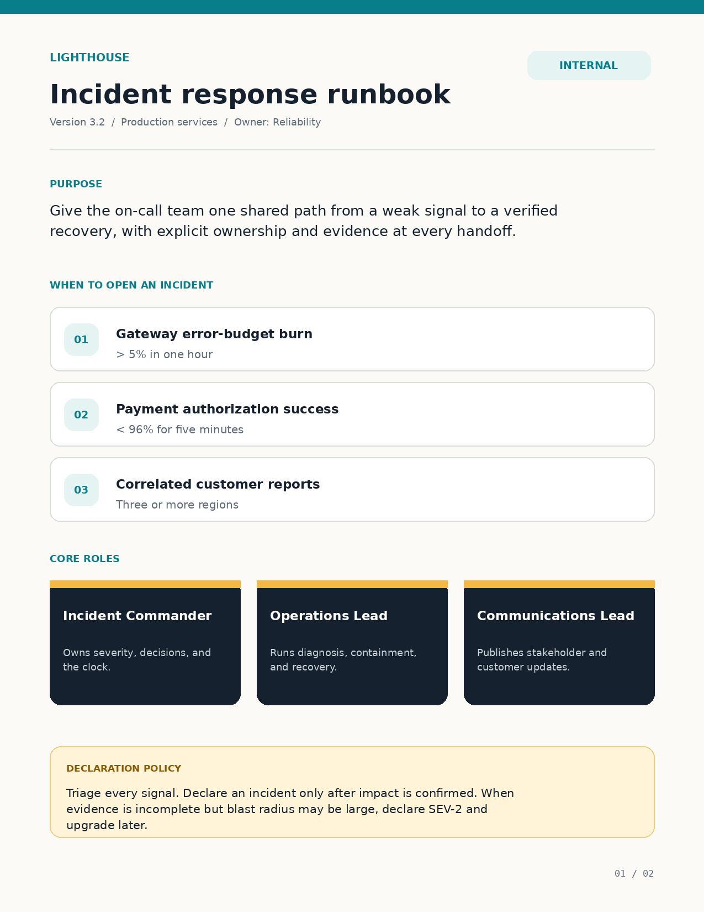
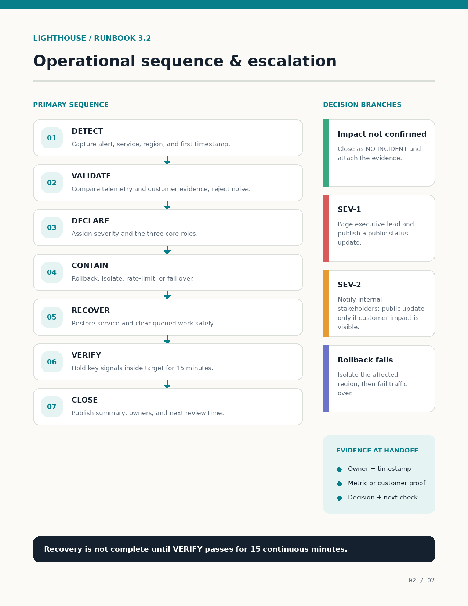
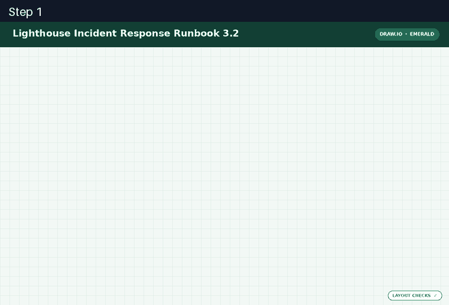
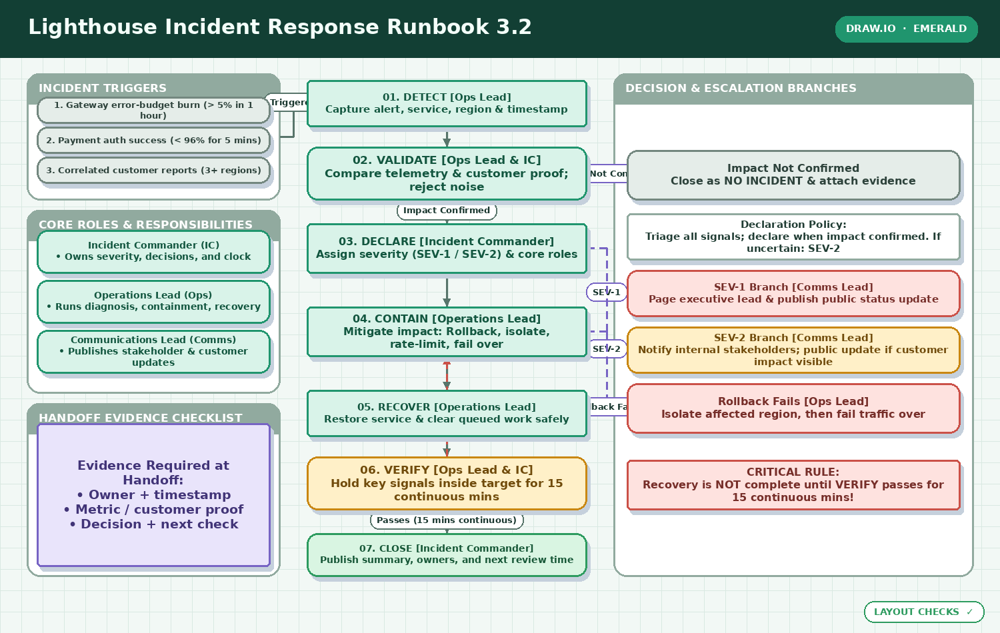

# Document pages to an editable diagram

[← All showcases](README.md)

> **Complete trajectory imagery:** the animation is a compressed overview of every rendered observation. Every original image is also preserved inside its corresponding tool-call section.

The agent synthesizes two incident-runbook pages into one operational flow, observes a legibility problem, and repairs the affected nodes.

| Env | Task | Branch | Steps | ReplayVerify | Judge |
| --- | --- | --- | ---: | --- | ---: |
| `diagram` | `task0003` | initial | 7 | not_applicable | 0.98 |

## Task

> 附件是《Lighthouse Incident Response Runbook 3.2》的两页摘录。请把其中分散的信息转成一张值班人员可直接使用的单页、可编辑流程图，而不是照抄文档版式。图中应清楚表达从信号发现到关闭事件的主流程、何时判定为非事件、SEV-1/SEV-2 的通知分支、回滚失败后的隔离与故障转移，以及每次交接必须留下的证据；三类核心角色也要在相应阶段有明确归属。读者应能从连线方向和视觉分组中快速理解正常路径与升级路径，关键步骤、角色和证据必须完整可读，不能用省略号代替。完成后检查图的可读性，并保存 Draw.io 源文件和 PNG 预览。

## Input references

<table>
  <tr>
    <td align="center" width="50%"> Input reference 1</td>
    <td align="center" width="50%"> Input reference 2</td>
  </tr>
</table>

[Open compact trajectory JSON](trajectories/diagram.json).

## Visual checkpoints

 Full trajectory — every rendered observation in chronological order

## Trajectory

Action mix: `add_nodes` × 2, `create_diagram` × 1, `add_edges` × 1, `update_cells` × 1, `save_diagram` × 1, `finish` × 1.

<code>01 · create_diagram</code> — Create the initial canvas with appropriate dimensions and theme.

**Reasoning**

Create the initial canvas with appropriate dimensions and theme.

**Arguments**

<pre><code>{
  &quot;height&quot;: 950,
  &quot;theme&quot;: &quot;emerald&quot;,
  &quot;title&quot;: &quot;Lighthouse Incident Response Runbook 3.2&quot;,
  &quot;width&quot;: 1500
}</code></pre>

**Observation**

<pre><code>Created an empty diagram. nodes=0, edges=0, saved=False. Layout diagnostics: {&quot;overlap_pairs&quot;: [], &quot;out_of_bounds&quot;: [], &quot;dangling_edges&quot;: [], &quot;valid_layout&quot;: true}</code></pre>

<code>02 · add_nodes</code> — Add nodes for the complete runbook diagram.

**Reasoning**

Add nodes for the complete runbook diagram.

**Arguments**

<pre><code>{
  &quot;nodes&quot;: [
    {
      &quot;height&quot;: 190,
      &quot;id&quot;: &quot;c_triggers&quot;,
      &quot;label&quot;: &quot;INCIDENT TRIGGERS&quot;,
      &quot;shape&quot;: &quot;container&quot;,
      &quot;style&quot;: &quot;surface&quot;,
      &quot;width&quot;: 380,
      &quot;x&quot;: 40,
      &quot;y&quot;: 110
    },
    {
      &quot;height&quot;: 275,
      &quot;id&quot;: &quot;c_roles&quot;,
      &quot;label&quot;: &quot;CORE ROLES &amp; RESPONSIBILITIES&quot;,
      &quot;shape&quot;: &quot;container&quot;,
      &quot;style&quot;: &quot;surface&quot;,
      &quot;width&quot;: 380,
      &quot;x&quot;: 40,
      &quot;y&quot;: 315
    },
    {
      &quot;height&quot;: 260,
      &quot;id&quot;: &quot;c_evidence&quot;,
      &quot;label&quot;: &quot;HANDOFF EVIDENCE CHECKLIST&quot;,
      &quot;shape&quot;: &quot;container&quot;,
      &quot;style&quot;: &quot;surface&quot;,
      &quot;width&quot;: 380,
      &quot;x&quot;: 40,
      &quot;y&quot;: 605
    },
    {
      &quot;height&quot;: 755,
      &quot;id&quot;: &quot;c_branches&quot;,
      &quot;label&quot;: &quot;DECISION &amp; ESCALATION BRANCHES&quot;,
      &quot;shape&quot;: &quot;container&quot;,
      &quot;style&quot;: &quot;surface&quot;,
      &quot;width&quot;: 540,
      &quot;x&quot;: 920,
      &quot;y&quot;: 110
    },
    {
      &quot;height&quot;: 40,
      &quot;id&quot;: &quot;n_trig1&quot;,
      &quot;label&quot;: &quot;1. Gateway error-budget burn (&gt; 5% in 1 hour)&quot;,
      &quot;parent_id&quot;: &quot;c_triggers&quot;,
      &quot;shape&quot;: &quot;rounded_rectangle&quot;,
      &quot;style&quot;: &quot;neutral&quot;,
      &quot;width&quot;: 350,
      &quot;x&quot;: 55,
      &quot;y&quot;: 145
    },
    {
      &quot;height&quot;: 40,
      &quot;id&quot;: &quot;n_trig2&quot;,
      &quot;label&quot;: &quot;2. Payment auth success (&lt; 96% for 5 mins)&quot;,
      &quot;parent_id&quot;: &quot;c_triggers&quot;,
      &quot;shape&quot;: &quot;rounded_rectangle&quot;,
      &quot;style&quot;: &quot;neutral&quot;,
      &quot;width&quot;: 350,
      &quot;x&quot;: 55,
      &quot;y&quot;: 190
    },
    {
      &quot;height&quot;: 40,
      &quot;id&quot;: &quot;n_trig3&quot;,
      &quot;label&quot;: &quot;3. Correlated customer reports (3+ regions)&quot;,
      &quot;parent_id&quot;: &quot;c_triggers&quot;,
      &quot;shape&quot;: &quot;rounded_rectangle&quot;,
      &quot;style&quot;: &quot;neutral&quot;,
      &quot;width&quot;: 350,
      &quot;x&quot;: 55,
      &quot;y&quot;: 235
    },
    {
      &quot;height&quot;: 65,
      &quot;id&quot;: &quot;n_role_ic&quot;,
      &quot;label&quot;: &quot;Incident Commander (IC)\n• Owns severity, decisions, and clock&quot;,
      &quot;parent_id&quot;: &quot;c_roles&quot;,
      &quot;shape&quot;: &quot;rounded_rectangle&quot;,
      &quot;style&quot;: &quot;primary&quot;,
      &quot;width&quot;: 350,
      &quot;x&quot;: 55,
      &quot;y&quot;: 345
    },
    {
      &quot;height&quot;: 65,
      &quot;id&quot;: &quot;n_role_ops&quot;,
      &quot;label&quot;: &quot;Operations Lead (Ops)\n• Runs diagnosis, containment, recovery&quot;,
      &quot;parent_id&quot;: &quot;c_roles&quot;,
      &quot;shape&quot;: &quot;rounded_rectangle&quot;,
      &quot;style&quot;: &quot;primary&quot;,
      &quot;width&quot;: 350,
      &quot;x&quot;: 55,
      &quot;y&quot;: 420
    },
    {
      &quot;height&quot;: 65,
      &quot;id&quot;: &quot;n_role_comms&quot;,
      &quot;label&quot;: &quot;Communications Lead (Comms)\n• Publishes stakeholder &amp; customer updates&quot;,
      &quot;parent_id&quot;: &quot;c_roles&quot;,
      &quot;shape&quot;: &quot;rounded_rectangle&quot;,
      &quot;style&quot;: &quot;primary&quot;,
      &quot;width&quot;: 350,
      &quot;x&quot;: 55,
      &quot;y&quot;: 495
    },
    {
      &quot;height&quot;: 215,
      &quot;id&quot;: &quot;n_ev_rule&quot;,
      &quot;label&quot;: &quot;Required Evidence at Every Handoff:\n\n1. Owner + Timestamp\n2. Metric or customer proof\n3. Decision + Next check time&quot;,
      &quot;parent_id&quot;: &quot;c_evidence&quot;,
      &quot;shape&quot;: &quot;note&quot;,
      &quot;style&quot;: &quot;secondary&quot;,
      &quot;width&quot;: 350,
      &quot;x&quot;: 55,
      &quot;y&quot;: 635
    },
    {
      &quot;height&quot;: 70,
      &quot;id&quot;: &quot;seq_detect&quot;,
      &quot;label&quot;: &quot;01. DETECT [Ops Lead]\nCapture alert, service, region &amp; timestamp&quot;,
      &quot;shape&quot;: &quot;process&quot;,
      &quot;style&quot;: &quot;primary&quot;,
      &quot;width&quot;: 420,
      &quot;x&quot;: 460,
      &quot;y&quot;: 120
    },
    {
      &quot;height&quot;: 85,
      &quot;id&quot;: &quot;seq_validate&quot;,
      &quot;label&quot;: &quot;02. VALIDATE [Ops Lead &amp; IC]\nCompare telemetry &amp; customer proof; reject noise&quot;,
      &quot;shape&quot;: &quot;decision&quot;,
      &quot;style&quot;: &quot;primary&quot;,
      &quot;width&quot;: 420,
      &quot;x&quot;: 460,
      &quot;y&quot;: 220
    },
    {
      &quot;height&quot;: 75,
      &quot;id&quot;: &quot;seq_declare&quot;,
      &quot;label&quot;: &quot;03. DECLARE [Incident Commander]\nAssign severity (SEV-1 / SEV-2) &amp; core roles&quot;,
      &quot;shape&quot;: &quot;process&quot;,
      &quot;style&quot;: &quot;primary&quot;,
      &quot;width&quot;: 420,
      &quot;x&quot;: 460,
      &quot;y&quot;: 335
    },
    {
      &quot;height&quot;: 75,
      &quot;id&quot;: &quot;seq_contain&quot;,
      &quot;label&quot;: &quot;04. CONTAIN [Operations Lead]\nMitigate impact: Rollback, isolate, rate-limit, fail over&quot;,
      &quot;shape&quot;: &quot;process&quot;,
      &quot;style&quot;: &quot;primary&quot;,
      &quot;width&quot;: 420,
      &quot;x&quot;: 460,
      &quot;y&quot;: 460
    },
    {
      &quot;height&quot;: 70,
      &quot;id&quot;: &quot;seq_recover&quot;,
      &quot;label&quot;: &quot;05. RECOVER [Operations Lead]\nRestore service &amp; clear queued work safely&quot;,
      &quot;shape&quot;: &quot;process&quot;,
      &quot;style&quot;: &quot;primary&quot;,
      &quot;width&quot;: 420,
      &quot;x&quot;: 460,
      &quot;y&quot;: 585
    },
    {
      &quot;height&quot;: 85,
      &quot;id&quot;: &quot;seq_verify&quot;,
      &quot;label&quot;: &quot;06. VERIFY [Ops Lead &amp; IC]\nHold key signals inside target for 15 continuous mins&quot;,
      &quot;shape&quot;: &quot;decision&quot;,
      &quot;style&quot;: &quot;warning&quot;,
      &quot;width&quot;: 420,
      &quot;x&quot;: 460,
      &quot;y&quot;: 685
    },
    {
      &quot;height&quot;: 65,
      &quot;id&quot;: &quot;seq_close&quot;,
      &quot;label&quot;: &quot;07. CLOSE [Incident Commander]\nPublish summary, owners, and next review time&quot;,
      &quot;shape&quot;: &quot;terminator&quot;,
      &quot;style&quot;: &quot;success&quot;,
      &quot;width&quot;: 420,
      &quot;x&quot;: 460,
      &quot;y&quot;: 800
    },
    {
      &quot;height&quot;: 75,
      &quot;id&quot;: &quot;br_no_inc&quot;,
      &quot;label&quot;: &quot;Impact Not Confirmed\nAction: Close as NO INCIDENT &amp; attach evidence&quot;,
      &quot;parent_id&quot;: &quot;c_branches&quot;,
      &quot;shape&quot;: &quot;rounded_rectangle&quot;,
      &quot;style&quot;: &quot;neutral&quot;,
      &quot;width&quot;: 500,
      &quot;x&quot;: 940,
      &quot;y&quot;: 225
    },
    {
      &quot;height&quot;: 70,
      &quot;id&quot;: &quot;br_policy&quot;,
      &quot;label&quot;: &quot;Declaration Policy:\nTriage every signal. Declare when impact confirmed.\nIf incomplete evidence but large blast radius: declare SEV-2 &amp; upgrade later.&quot;,
      &quot;parent_id&quot;: &quot;c_branches&quot;,
      &quot;shape&quot;: &quot;note&quot;,
      &quot;style&quot;: &quot;surface&quot;,
      &quot;width&quot;: 500,
      &quot;x&quot;: 940,
      &quot;y&quot;: 320
    },
    {
      &quot;height&quot;: 70,
      &quot;id&quot;: &quot;br_sev1&quot;,
      &quot;label&quot;: &quot;SEV-1 Branch [Comms Lead]\nPage executive lead &amp; publish public status update&quot;,
      &quot;parent_id&quot;: &quot;c_branches&quot;,
      &quot;shape&quot;: &quot;rounded_rectangle&quot;,
      &quot;style&quot;: &quot;danger&quot;,
      &quot;width&quot;: 500,
      &quot;x&quot;: 940,
      &quot;y&quot;: 405
    },
    {
      &quot;height&quot;: 70,
      &quot;id&quot;: &quot;br_sev2&quot;,
      &quot;label&quot;: &quot;SEV-2 Branch [Comms Lead]\nNotify internal stakeholders; public update ONLY if customer impact visible&quot;,
      &quot;parent_id&quot;: &quot;c_branches&quot;,
      &quot;shape&quot;: &quot;rounded_rectangle&quot;,
      &quot;style&quot;: &quot;warning&quot;,
      &quot;width&quot;: 500,
      &quot;x&quot;: 940,
      &quot;y&quot;: 490
    },
    {
      &quot;height&quot;: 75,
      &quot;id&quot;: &quot;br_rollback_fail&quot;,
      &quot;label&quot;: &quot;Rollback Fails [Operations Lead]\nAction: Isolate affected region, then fail traffic over&quot;,
      &quot;parent_id&quot;: &quot;c_branches&quot;,
      &quot;shape&quot;: &quot;rounded_rectangle&quot;,
      &quot;style&quot;: &quot;danger&quot;,
      &quot;width&quot;: 500,
      &quot;x&quot;: 940,
      &quot;y&quot;: 575
    },
    {
      &quot;height&quot;: 75,
      &quot;id&quot;: &quot;br_verify_rule&quot;,
      &quot;label&quot;: &quot;CRITICAL RULE:\nRecovery is NOT complete until VERIFY passes for 15 continuous minutes!&quot;,
      &quot;parent_id&quot;: &quot;c_branches&quot;,
      &quot;shape&quot;: &quot;note&quot;,
      &quot;style&quot;: &quot;danger&quot;,
      &quot;width&quot;: 500,
      &quot;x&quot;: 940,
      &quot;y&quot;: 690
    }
  ]
}</code></pre>

**Observation**

<pre><code>ERROR [invalid_arguments]: &#x27;SEV-2 Branch [Comms Lead]\nNotify internal stakeholders; public update ONLY if customer impact visible&#x27; is too long</code></pre>

<code>03 · add_nodes</code> — Add nodes for the diagram.

**Reasoning**

Add nodes for the diagram.

**Arguments**

<pre><code>{
  &quot;nodes&quot;: [
    {
      &quot;height&quot;: 190,
      &quot;id&quot;: &quot;c_triggers&quot;,
      &quot;label&quot;: &quot;INCIDENT TRIGGERS&quot;,
      &quot;shape&quot;: &quot;container&quot;,
      &quot;style&quot;: &quot;surface&quot;,
      &quot;width&quot;: 380,
      &quot;x&quot;: 40,
      &quot;y&quot;: 110
    },
    {
      &quot;height&quot;: 275,
      &quot;id&quot;: &quot;c_roles&quot;,
      &quot;label&quot;: &quot;CORE ROLES &amp; RESPONSIBILITIES&quot;,
      &quot;shape&quot;: &quot;container&quot;,
      &quot;style&quot;: &quot;surface&quot;,
      &quot;width&quot;: 380,
      &quot;x&quot;: 40,
      &quot;y&quot;: 315
    },
    {
      &quot;height&quot;: 260,
      &quot;id&quot;: &quot;c_evidence&quot;,
      &quot;label&quot;: &quot;HANDOFF EVIDENCE CHECKLIST&quot;,
      &quot;shape&quot;: &quot;container&quot;,
      &quot;style&quot;: &quot;surface&quot;,
      &quot;width&quot;: 380,
      &quot;x&quot;: 40,
      &quot;y&quot;: 605
    },
    {
      &quot;height&quot;: 755,
      &quot;id&quot;: &quot;c_branches&quot;,
      &quot;label&quot;: &quot;DECISION &amp; ESCALATION BRANCHES&quot;,
      &quot;shape&quot;: &quot;container&quot;,
      &quot;style&quot;: &quot;surface&quot;,
      &quot;width&quot;: 540,
      &quot;x&quot;: 920,
      &quot;y&quot;: 110
    },
    {
      &quot;height&quot;: 40,
      &quot;id&quot;: &quot;n_trig1&quot;,
      &quot;label&quot;: &quot;1. Gateway error-budget burn (&gt; 5% in 1 hour)&quot;,
      &quot;parent_id&quot;: &quot;c_triggers&quot;,
      &quot;shape&quot;: &quot;rounded_rectangle&quot;,
      &quot;style&quot;: &quot;neutral&quot;,
      &quot;width&quot;: 350,
      &quot;x&quot;: 55,
      &quot;y&quot;: 145
    },
    {
      &quot;height&quot;: 40,
      &quot;id&quot;: &quot;n_trig2&quot;,
      &quot;label&quot;: &quot;2. Payment auth success (&lt; 96% for 5 mins)&quot;,
      &quot;parent_id&quot;: &quot;c_triggers&quot;,
      &quot;shape&quot;: &quot;rounded_rectangle&quot;,
      &quot;style&quot;: &quot;neutral&quot;,
      &quot;width&quot;: 350,
      &quot;x&quot;: 55,
      &quot;y&quot;: 190
    },
    {
      &quot;height&quot;: 40,
      &quot;id&quot;: &quot;n_trig3&quot;,
      &quot;label&quot;: &quot;3. Correlated customer reports (3+ regions)&quot;,
      &quot;parent_id&quot;: &quot;c_triggers&quot;,
      &quot;shape&quot;: &quot;rounded_rectangle&quot;,
      &quot;style&quot;: &quot;neutral&quot;,
      &quot;width&quot;: 350,
      &quot;x&quot;: 55,
      &quot;y&quot;: 235
    },
    {
      &quot;height&quot;: 65,
      &quot;id&quot;: &quot;n_role_ic&quot;,
      &quot;label&quot;: &quot;Incident Commander (IC)\n• Owns severity, decisions, and clock&quot;,
      &quot;parent_id&quot;: &quot;c_roles&quot;,
      &quot;shape&quot;: &quot;rounded_rectangle&quot;,
      &quot;style&quot;: &quot;primary&quot;,
      &quot;width&quot;: 350,
      &quot;x&quot;: 55,
      &quot;y&quot;: 345
    },
    {
      &quot;height&quot;: 65,
      &quot;id&quot;: &quot;n_role_ops&quot;,
      &quot;label&quot;: &quot;Operations Lead (Ops)\n• Runs diagnosis, containment, recovery&quot;,
      &quot;parent_id&quot;: &quot;c_roles&quot;,
      &quot;shape&quot;: &quot;rounded_rectangle&quot;,
      &quot;style&quot;: &quot;primary&quot;,
      &quot;width&quot;: 350,
      &quot;x&quot;: 55,
      &quot;y&quot;: 420
    },
    {
      &quot;height&quot;: 65,
      &quot;id&quot;: &quot;n_role_comms&quot;,
      &quot;label&quot;: &quot;Communications Lead (Comms)\n• Publishes stakeholder &amp; customer updates&quot;,
      &quot;parent_id&quot;: &quot;c_roles&quot;,
      &quot;shape&quot;: &quot;rounded_rectangle&quot;,
      &quot;style&quot;: &quot;primary&quot;,
      &quot;width&quot;: 350,
      &quot;x&quot;: 55,
      &quot;y&quot;: 495
    },
    {
      &quot;height&quot;: 215,
      &quot;id&quot;: &quot;n_ev_rule&quot;,
      &quot;label&quot;: &quot;Evidence Required at Handoff:\n• Owner + timestamp\n• Metric / customer proof\n• Decision + next check&quot;,
      &quot;parent_id&quot;: &quot;c_evidence&quot;,
      &quot;shape&quot;: &quot;note&quot;,
      &quot;style&quot;: &quot;secondary&quot;,
      &quot;width&quot;: 350,
      &quot;x&quot;: 55,
      &quot;y&quot;: 635
    },
    {
      &quot;height&quot;: 70,
      &quot;id&quot;: &quot;seq_detect&quot;,
      &quot;label&quot;: &quot;01. DETECT [Ops Lead]\nCapture alert, service, region &amp; timestamp&quot;,
      &quot;shape&quot;: &quot;process&quot;,
      &quot;style&quot;: &quot;primary&quot;,
      &quot;width&quot;: 420,
      &quot;x&quot;: 460,
      &quot;y&quot;: 120
    },
    {
      &quot;height&quot;: 85,
      &quot;id&quot;: &quot;seq_validate&quot;,
      &quot;label&quot;: &quot;02. VALIDATE [Ops Lead &amp; IC]\nCompare telemetry &amp; customer proof; reject noise&quot;,
      &quot;shape&quot;: &quot;decision&quot;,
      &quot;style&quot;: &quot;primary&quot;,
      &quot;width&quot;: 420,
      &quot;x&quot;: 460,
      &quot;y&quot;: 220
    },
    {
      &quot;height&quot;: 75,
      &quot;id&quot;: &quot;seq_declare&quot;,
      &quot;label&quot;: &quot;03. DECLARE [Incident Commander]\nAssign severity (SEV-1 / SEV-2) &amp; core roles&quot;,
      &quot;shape&quot;: &quot;process&quot;,
      &quot;style&quot;: &quot;primary&quot;,
      &quot;width&quot;: 420,
      &quot;x&quot;: 460,
      &quot;y&quot;: 335
    },
    {
      &quot;height&quot;: 75,
      &quot;id&quot;: &quot;seq_contain&quot;,
      &quot;label&quot;: &quot;04. CONTAIN [Operations Lead]\nMitigate impact: Rollback, isolate, rate-limit, fail over&quot;,
      &quot;shape&quot;: &quot;process&quot;,
      &quot;style&quot;: &quot;primary&quot;,
      &quot;width&quot;: 420,
      &quot;x&quot;: 460,
      &quot;y&quot;: 460
    },
    {
      &quot;height&quot;: 70,
      &quot;id&quot;: &quot;seq_recover&quot;,
      &quot;label&quot;: &quot;05. RECOVER [Operations Lead]\nRestore service &amp; clear queued work safely&quot;,
      &quot;shape&quot;: &quot;process&quot;,
      &quot;style&quot;: &quot;primary&quot;,
      &quot;width&quot;: 420,
      &quot;x&quot;: 460,
      &quot;y&quot;: 585
    },
    {
      &quot;height&quot;: 85,
      &quot;id&quot;: &quot;seq_verify&quot;,
      &quot;label&quot;: &quot;06. VERIFY [Ops Lead &amp; IC]\nHold key signals inside target for 15 continuous mins&quot;,
      &quot;shape&quot;: &quot;decision&quot;,
      &quot;style&quot;: &quot;warning&quot;,
      &quot;width&quot;: 420,
      &quot;x&quot;: 460,
      &quot;y&quot;: 685
    },
    {
      &quot;height&quot;: 65,
      &quot;id&quot;: &quot;seq_close&quot;,
      &quot;label&quot;: &quot;07. CLOSE [Incident Commander]\nPublish summary, owners, and next review time&quot;,
      &quot;shape&quot;: &quot;terminator&quot;,
      &quot;style&quot;: &quot;success&quot;,
      &quot;width&quot;: 420,
      &quot;x&quot;: 460,
      &quot;y&quot;: 800
    },
    {
      &quot;height&quot;: 75,
      &quot;id&quot;: &quot;br_no_inc&quot;,
      &quot;label&quot;: &quot;Impact Not Confirmed\nClose as NO INCIDENT &amp; attach evidence&quot;,
      &quot;parent_id&quot;: &quot;c_branches&quot;,
      &quot;shape&quot;: &quot;rounded_rectangle&quot;,
      &quot;style&quot;: &quot;neutral&quot;,
      &quot;width&quot;: 500,
      &quot;x&quot;: 940,
      &quot;y&quot;: 225
    },
    {
      &quot;height&quot;: 70,
      &quot;id&quot;: &quot;br_policy&quot;,
      &quot;label&quot;: &quot;Declaration Policy:\nTriage all signals; declare when impact confirmed. If uncertain: SEV-2&quot;,
      &quot;parent_id&quot;: &quot;c_branches&quot;,
      &quot;shape&quot;: &quot;note&quot;,
      &quot;style&quot;: &quot;surface&quot;,
      &quot;width&quot;: 500,
      &quot;x&quot;: 940,
      &quot;y&quot;: 320
    },
    {
      &quot;height&quot;: 70,
      &quot;id&quot;: &quot;br_sev1&quot;,
      &quot;label&quot;: &quot;SEV-1 Branch [Comms Lead]\nPage executive lead &amp; publish public status update&quot;,
      &quot;parent_id&quot;: &quot;c_branches&quot;,
      &quot;shape&quot;: &quot;rounded_rectangle&quot;,
      &quot;style&quot;: &quot;danger&quot;,
      &quot;width&quot;: 500,
      &quot;x&quot;: 940,
      &quot;y&quot;: 405
    },
    {
      &quot;height&quot;: 70,
      &quot;id&quot;: &quot;br_sev2&quot;,
      &quot;label&quot;: &quot;SEV-2 Branch [Comms Lead]\nNotify internal stakeholders; public update if customer impact visible&quot;,
      &quot;parent_id&quot;: &quot;c_branches&quot;,
      &quot;shape&quot;: &quot;rounded_rectangle&quot;,
      &quot;style&quot;: &quot;warning&quot;,
      &quot;width&quot;: 500,
      &quot;x&quot;: 940,
      &quot;y&quot;: 490
    },
    {
      &quot;height&quot;: 75,
      &quot;id&quot;: &quot;br_rollback_fail&quot;,
      &quot;label&quot;: &quot;Rollback Fails [Ops Lead]\nIsolate affected region, then fail traffic over&quot;,
      &quot;parent_id&quot;: &quot;c_branches&quot;,
      &quot;shape&quot;: &quot;rounded_rectangle&quot;,
      &quot;style&quot;: &quot;danger&quot;,
      &quot;width&quot;: 500,
      &quot;x&quot;: 940,
      &quot;y&quot;: 575
    },
    {
      &quot;height&quot;: 75,
      &quot;id&quot;: &quot;br_verify_rule&quot;,
      &quot;label&quot;: &quot;CRITICAL RULE:\nRecovery is NOT complete until VERIFY passes for 15 continuous mins!&quot;,
      &quot;parent_id&quot;: &quot;c_branches&quot;,
      &quot;shape&quot;: &quot;note&quot;,
      &quot;style&quot;: &quot;danger&quot;,
      &quot;width&quot;: 500,
      &quot;x&quot;: 940,
      &quot;y&quot;: 690
    }
  ]
}</code></pre>

**Observation**

<pre><code>Added 24 node(s). nodes=24, edges=0, saved=False. Layout diagnostics: {&quot;overlap_pairs&quot;: [], &quot;out_of_bounds&quot;: [], &quot;dangling_edges&quot;: [], &quot;valid_layout&quot;: true}</code></pre>

<code>04 · add_edges</code> — Now add edges connecting the primary sequence flow and decision branches.

**Reasoning**

Now add edges connecting the primary sequence flow and decision branches.

**Arguments**

<pre><code>{
  &quot;edges&quot;: [
    {
      &quot;id&quot;: &quot;e_trig_detect&quot;,
      &quot;label&quot;: &quot;Triggered&quot;,
      &quot;source_id&quot;: &quot;c_triggers&quot;,
      &quot;style&quot;: &quot;solid&quot;,
      &quot;target_id&quot;: &quot;seq_detect&quot;
    },
    {
      &quot;id&quot;: &quot;e_det_val&quot;,
      &quot;label&quot;: &quot;&quot;,
      &quot;source_id&quot;: &quot;seq_detect&quot;,
      &quot;style&quot;: &quot;solid&quot;,
      &quot;target_id&quot;: &quot;seq_validate&quot;
    },
    {
      &quot;id&quot;: &quot;e_val_noinc&quot;,
      &quot;label&quot;: &quot;Impact Not Confirmed&quot;,
      &quot;source_id&quot;: &quot;seq_validate&quot;,
      &quot;style&quot;: &quot;dashed&quot;,
      &quot;target_id&quot;: &quot;br_no_inc&quot;
    },
    {
      &quot;id&quot;: &quot;e_val_dec&quot;,
      &quot;label&quot;: &quot;Impact Confirmed&quot;,
      &quot;source_id&quot;: &quot;seq_validate&quot;,
      &quot;style&quot;: &quot;solid&quot;,
      &quot;target_id&quot;: &quot;seq_declare&quot;
    },
    {
      &quot;id&quot;: &quot;e_dec_sev1&quot;,
      &quot;label&quot;: &quot;SEV-1&quot;,
      &quot;source_id&quot;: &quot;seq_declare&quot;,
      &quot;style&quot;: &quot;dashed&quot;,
      &quot;target_id&quot;: &quot;br_sev1&quot;
    },
    {
      &quot;id&quot;: &quot;e_dec_sev2&quot;,
      &quot;label&quot;: &quot;SEV-2&quot;,
      &quot;source_id&quot;: &quot;seq_declare&quot;,
      &quot;style&quot;: &quot;dashed&quot;,
      &quot;target_id&quot;: &quot;br_sev2&quot;
    },
    {
      &quot;id&quot;: &quot;e_dec_con&quot;,
      &quot;label&quot;: &quot;&quot;,
      &quot;source_id&quot;: &quot;seq_declare&quot;,
      &quot;style&quot;: &quot;solid&quot;,
      &quot;target_id&quot;: &quot;seq_contain&quot;
    },
    {
      &quot;id&quot;: &quot;e_con_fail&quot;,
      &quot;label&quot;: &quot;Rollback Fails&quot;,
      &quot;source_id&quot;: &quot;seq_contain&quot;,
      &quot;style&quot;: &quot;dashed&quot;,
      &quot;target_id&quot;: &quot;br_rollback_fail&quot;
    },
    {
      &quot;id&quot;: &quot;e_con_rec&quot;,
      &quot;label&quot;: &quot;&quot;,
      &quot;source_id&quot;: &quot;seq_contain&quot;,
      &quot;style&quot;: &quot;solid&quot;,
      &quot;target_id&quot;: &quot;seq_recover&quot;
    },
    {
      &quot;id&quot;: &quot;e_rec_ver&quot;,
      &quot;label&quot;: &quot;&quot;,
      &quot;source_id&quot;: &quot;seq_recover&quot;,
      &quot;style&quot;: &quot;solid&quot;,
      &quot;target_id&quot;: &quot;seq_verify&quot;
    },
    {
      &quot;id&quot;: &quot;e_ver_fail&quot;,
      &quot;label&quot;: &quot;Fails (&lt;15 mins)&quot;,
      &quot;source_id&quot;: &quot;seq_verify&quot;,
      &quot;style&quot;: &quot;feedback&quot;,
      &quot;target_id&quot;: &quot;seq_contain&quot;
    },
    {
      &quot;id&quot;: &quot;e_ver_cls&quot;,
      &quot;label&quot;: &quot;Passes (15 mins continuous)&quot;,
      &quot;source_id&quot;: &quot;seq_verify&quot;,
      &quot;style&quot;: &quot;solid&quot;,
      &quot;target_id&quot;: &quot;seq_close&quot;
    }
  ]
}</code></pre>

**Observation**

<pre><code>Added 12 directed edge(s). nodes=24, edges=12, saved=False. Layout diagnostics: {&quot;overlap_pairs&quot;: [], &quot;out_of_bounds&quot;: [], &quot;dangling_edges&quot;: [], &quot;valid_layout&quot;: true}</code></pre>

<code>05 · update_cells</code> — Adjust shapes, labels, and heights for `seq_validate` and `seq_verify` so their text fits inside cleanly with…

**Reasoning**

Adjust shapes, labels, and heights for `seq_validate` and `seq_verify` so their text fits inside cleanly without overlapping shape borders.

**Arguments**

<pre><code>{
  &quot;changes&quot;: [
    {
      &quot;height&quot;: 80,
      &quot;id&quot;: &quot;seq_validate&quot;,
      &quot;shape&quot;: &quot;rounded_rectangle&quot;,
      &quot;style&quot;: &quot;primary&quot;
    },
    {
      &quot;height&quot;: 80,
      &quot;id&quot;: &quot;seq_verify&quot;,
      &quot;shape&quot;: &quot;rounded_rectangle&quot;,
      &quot;style&quot;: &quot;warning&quot;
    }
  ]
}</code></pre>

**Observation**

<pre><code>Updated 2 cell(s): seq_validate, seq_verify. nodes=24, edges=12, saved=False. Layout diagnostics: {&quot;overlap_pairs&quot;: [], &quot;out_of_bounds&quot;: [], &quot;dangling_edges&quot;: [], &quot;valid_layout&quot;: true}</code></pre>

<code>06 · save_diagram</code> — Save the diagram and export the final artifacts.

**Reasoning**

Save the diagram and export the final artifacts.

**Arguments**

<pre><code>{}</code></pre>

**Observation**

<pre><code>Saved and validated diagram.drawio=13235 bytes, diagram.svg=12161 bytes, diagram.png=179445 bytes. nodes=24, edges=12, saved=True. Layout diagnostics: {&quot;overlap_pairs&quot;: [], &quot;out_of_bounds&quot;: [], &quot;dangling_edges&quot;: [], &quot;valid_layout&quot;: true}</code></pre>

<code>07 · finish</code> — The layout is verified and saved. Finish the task with a summary of the single-page incident response runbook…

**Reasoning**

The layout is verified and saved. Finish the task with a summary of the single-page incident response runbook diagram creation.

**Arguments**

<pre><code>{
  &quot;answer&quot;: &quot;已将《Lighthouse Incident Response Runbook 3.2》整合并转换为单页、可编辑且结构清晰的事件响应流程图。\n\n### 图表设计要点与结构：\n1. **主流程 (Primary Sequence)**: 位于中央，按顺序包含 `01. DETECT` -&gt; `02. VALIDATE` -&gt; `03. DECLARE` -&gt; `04. CONTAIN` -&gt; `05. RECOVER` -&gt; `06. VERIFY` -&gt; `07. CLOSE` 完整的生命周期。\n2. **信号触发与判定 (Triggers &amp; Non-Incident)**:\n   - 左侧汇总三大触发条件（网关错误预算消耗、支付授权成功率下降、多区域用户反馈）。\n   - 在 `02. VALIDATE` 阶段如果“影响未确认”，分支转向右侧 `NO INCIDENT` 并要求附上证据关闭。\n3. **通知与升级分支 (SEV-1 / SEV-2 Branches)**:\n   - 在 `03. DECLARE` 阶段区分 SEV-1（Call Executive &amp; 发布公开更新）与 SEV-2（通知内部干系人；仅当影响可见时发布公开更新）分支路径。\n4. **隔离与故障转移 (Containment &amp; Escalation)**:\n   - 在 `04. CONTAIN` 阶段引入“Rollback Fails”处理分支：隔离受影响区域并进行流量故障转移 (Failover)。\n5. **验证与反馈循环 (Verification &amp; Loop)**:\n   - `06. VERIFY` 强调必须连续 15 分钟指标达标；若验证失败，通过红色虚线反馈回路返回 `04. CONTAIN` 重新处置。\n6. **角色归属与证据要求 (Roles &amp; Evidence Checklist)**:\n   - 左侧明确标注三类核心角色（Incident Commander, Operations Lead, Communications Lead）的权责，并在主流程各节点直接标明负责角色。\n   - 左下角突出“每次交接必须留下的证据”清单（Owner + Timestamp, Metric/Customer proof, Decision + Next check time）。\n\n源文件 (`diagram.drawio`) 及预览图 (`diagram.png`, `diagram.svg`) 已成功保存至工作区。&quot;
}</code></pre>

## Final answer

已将《Lighthouse Incident Response Runbook 3.2》整合并转换为单页、可编辑且结构清晰的事件响应流程图。

### 图表设计要点与结构：
1. **主流程 (Primary Sequence)**: 位于中央，按顺序包含 `01. DETECT` -> `02. VALIDATE` -> `03. DECLARE` -> `04. CONTAIN` -> `05. RECOVER` -> `06. VERIFY` -> `07. CLOSE` 完整的生命周期。
2. **信号触发与判定 (Triggers & Non-Incident)**:
   - 左侧汇总三大触发条件（网关错误预算消耗、支付授权成功率下降、多区域用户反馈）。
   - 在 `02. VALIDATE` 阶段如果“影响未确认”，分支转向右侧 `NO INCIDENT` 并要求附上证据关闭。
3. **通知与升级分支 (SEV-1 / SEV-2 Branches)**:
   - 在 `03. DECLARE` 阶段区分 SEV-1（Call Executive & 发布公开更新）与 SEV-2（通知内部干系人；仅当影响可见时发布公开更新）分支路径。
4. **隔离与故障转移 (Containment & Escalation)**:
   - 在 `04. CONTAIN` 阶段引入“Rollback Fails”处理分支：隔离受影响区域并进行流量故障转移 (Failover)。
5. **验证与反馈循环 (Verification & Loop)**:
   - `06. VERIFY` 强调必须连续 15 分钟指标达标；若验证失败，通过红色虚线反馈回路返回 `04. CONTAIN` 重新处置。
6. **角色归属与证据要求 (Roles & Evidence Checklist)**:
   - 左侧明确标注三类核心角色（Incident Commander, Operations Lead, Communications Lead）的权责，并在主流程各节点直接标明负责角色。
   - 左下角突出“每次交接必须留下的证据”清单（Owner + Timestamp, Metric/Customer proof, Decision + Next check time）。

源文件 (`diagram.drawio`) 及预览图 (`diagram.png`, `diagram.svg`) 已成功保存至工作区。

## Evaluation

- ReplayVerify: **not_applicable**
- Judge: **0.98**
- Replay detail: task has no replay verifier

Judge rationale

Agent 成功将《Lighthouse Incident Response Runbook 3.2》转换为单页、结构清晰且高度可编辑的事件响应流程图。整个生成过程完全基于多模态 Observation 进行实地改进：在 Step 4 观察到菱形节点文字溢出遮挡后，Step 5 及时调用 update_cells 将 Validate 和 Verify 节点替换为圆角矩形，极大提升了可读性。图表中完整包含了 Detect-Validate-Declare-Contain-Recover-Verify-Close 主流程、Impact-not-confirmed 关闭分支、SEV-1/SEV-2 分别升级与通知逻辑、Rollback-fails 隔离与故障转移分支、三类核心角色权责以及交接证据清单（Owner+Timestamp, Proof, Decision+Next Check）。Draw.io 源文件及 PNG 预览均已成功保存。工具使用准确，推理严密且高效。

