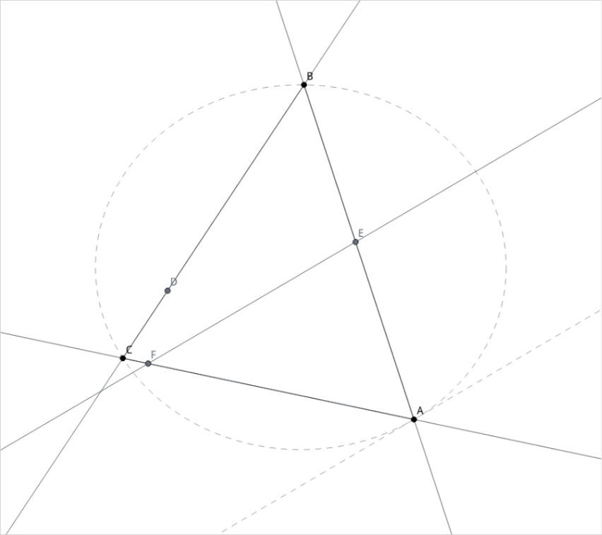

# DataFlow-MM-Agent showcases

These are GitHub-native walkthroughs of real multimodal trajectories. Each page
contains the natural task prompt, selected visual checkpoints, every tool action
inside a folded section, the final answer, Judge results, and ReplayVerify status.
Compact JSON is provided separately without system prompts, credentials, local
workspace paths, or embedded base64 images.

> **Refine comparisons are never shown as final-only results.** Every page marked
> as refined opens with an explicit notice and includes the complete original
> trajectory, its Judge/ReplayVerify diagnosis, and the complete refined
> trajectory. Refine creates a new rollout and does not overwrite the original.

<table>
  <tr>
    <td align="center" width="42%">
      <a href="01_geometry_proof.md"></a><br>
      <sub>Progressive Euclidean construction</sub>
    </td>
    <td align="center" width="58%">
      <a href="04_diagram.md"></a><br>
      <sub>Two runbook pages synthesized into an editable flow</sub>
    </td>
  </tr>
</table>

## Walkthroughs

| # | Capability | Trajectory coverage | Evaluation |
| ---: | --- | --- | --- |
| 1 | [Image-grounded olympiad geometry](01_geometry_proof.md) | 12-step progressive construction and proof | ReplayVerify passed · Judge 1.00 |
| 2 | [Visual planning in a Pyxel game](02_pixel_game.md) | five gems and goal within a 40-move budget | ReplayVerify passed · Judge 0.85 |
| 3 | [Editable PowerPoint reconstruction](03_pptx.md) | original 64 actions → refined 60 actions | Judge 0.35 → 0.98 |
| 4 | [Document pages to an editable diagram](04_diagram.md) | runbook synthesis with observation-driven layout repair | Judge 0.98 |
| 5 | [Why a deterministic verifier is necessary](05_why_deterministic_verifier.md) | original 8 actions → refined 4 actions, both replayed | Judge 0.30 → 1.00; verifier still failed |

The PPT and diagram cases are open-ended authoring tasks. Their
ReplayVerify status is `not_applicable`; this is intentional rather than a
missing implementation. Geometry and game tasks have meaningful exact state
contracts and therefore use deterministic replay verification.

## Output artifacts

- [Editable PowerPoint deck](assets/outputs/northstar_board_update.pptx)
- [Editable Draw.io source](assets/outputs/lighthouse_incident_response.drawio)
- [Incident-flow PNG](assets/outputs/lighthouse_incident_response.png)
- [Final geometry construction](assets/outputs/geometry_tangent_theorem.png)

The reference deck and runbook pages are original repository fixtures; these
showcases do not redistribute a third-party presentation or document.

## Format

Markdown is the published representation because GitHub renders it directly.
The source pipeline still stores canonical JSONL trajectories with full image
content. `export_showcases.py` converts selected rows into:

```text
showcases/
├── 01_...md ... 05_...md     # human-readable walkthroughs
├── assets/                    # referenced PNGs and editable outputs
└── trajectories/              # compact, machine-readable JSON
```

The exporter intentionally selects representative visual checkpoints instead
of duplicating every rendered frame in every page. All actions and textual tool
observations remain in the compact trajectory JSON. Refined cases use a paired
JSON document with separate `original` and `refined` records.
